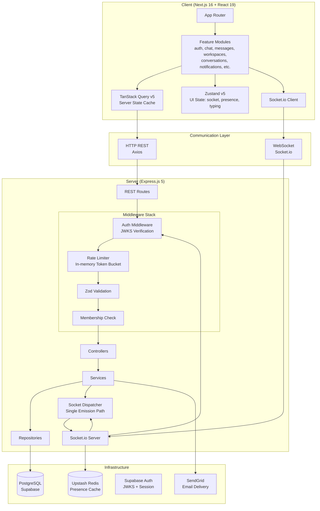
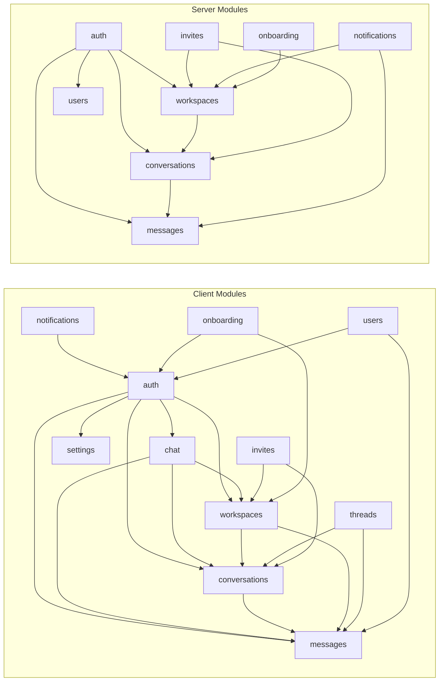
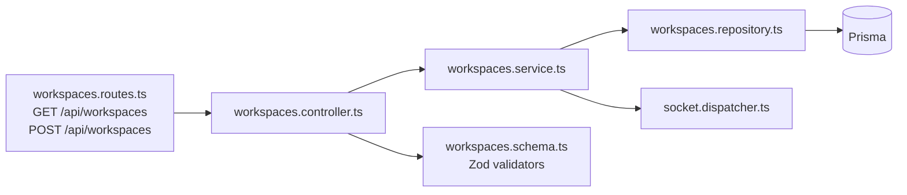
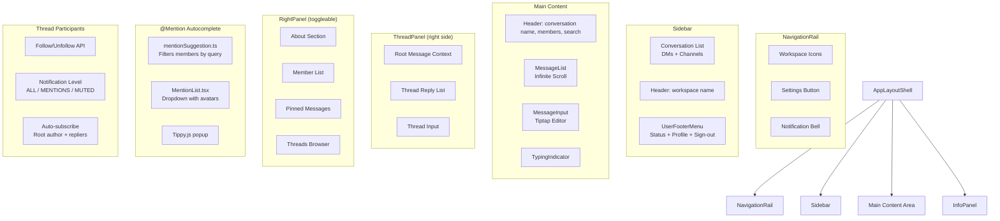
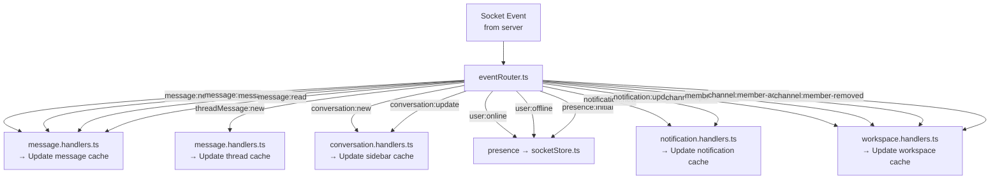

# Nexus — System Architecture

> **Last Updated:** 2026-06-29
> **Purpose:** Visual and textual description of system architecture, component relationships, and communication patterns.

---

## 1. Layered Architecture



---

## 2. Module Dependency Graph



---

## 3. Communication Patterns

### REST API Flow (CRUD)

```
Client (TanStack Query) → Axios → Express Route → Auth Middleware → Controller → Service → Repository → Prisma → PostgreSQL
                                                                                                              │
                                                                                                     socket.dispatcher
                                                                                                              │
                                                                                                       Socket.io broadcast
```

- **Optimistic updates**: TanStack Query mutates the cache immediately, then reconciles with server response
- **Cache invalidation**: On mutation success, related queries are invalidated (e.g., sending a message invalidates the conversation list query)
- **Error handling**: Server returns `{ error: string }`; client `friendlyError()` maps to user-friendly messages

### Real-Time Flow (WebSocket)

```
Client A → emit("message:send", payload) → Socket.io Server → Auth Middleware → Handler → Prisma Transaction → socket.dispatcher → Client B
                                                                                      │                       │
                                                                                 callback({success, data})    Client A (ack: tempId → real ID)
```

- **Dual delivery**: Both the sender (via ack callback) and other clients (via room broadcast) receive the event
- **Room isolation**: Events are scoped to `conversation:<id>` rooms — users only receive events for conversations they're members of

### Presence Flow

```
Client connects → Auth middleware (verify JWT) → PresenceStore.addSocket(userId, socketId)
    → Redis SADD → is first connection? → broadcast "user:online" → all connected clients
```

- **Multi-tab aware**: A user only appears "offline" when ALL their sockets disconnect
- **Dual-write**: Redis + in-memory Map for resilience
- **On disconnect**: Last seen timestamp written to Redis

---

## 4. Server Module Pattern

Every REST module follows a consistent layered architecture:

```
routes.ts       → HTTP route definitions + Zod validation schemas
controller.ts   → Request handling, response formatting, error mapping
service.ts      → Business logic, authorization, orchestrates repositories
repository.ts   → Prisma queries (data access layer)
types.ts        → TypeScript interfaces
schema.ts       → Zod validation schemas
```

**Example — Workspaces module:**



---

## 5. Client Application Shell



---

## 6. State Management Strategy

```mermaid
flowchart LR
    subgraph ServerState["Server State (TanStack Query)"]
        Q_CONV[conversations]
        Q_MSG[messages]
        Q_USR[users]
        Q_WS[workspaces]
        Q_NOT[notifications]
    end

    subgraph UIState["UI State (Zustand)"]
        Z_SOCK[socketStatus<br/>onlineUsers<br/>typingUsers]
        Z_CHAT[activeConversation<br/>activeWorkspace<br/>mode: DM | WORKSPACE]
        Z_THREAD[threadStore<br/>activeThread<br/>threadMessages]
    end

    subgraph SocketUpdates["Socket Event Handlers"]
        S_CONV[conversation.handlers]
        S_MSG[message.handlers]
        S_WS[workspace.handlers]
        S_NOT[notification.handlers]
        S_PRES[presence]
    end

    S_CONV -->|setQueryData| Q_CONV
    S_MSG -->|setQueryData| Q_MSG
    S_WS -->|setQueryData| Q_WS
    S_NOT -->|setQueryData| Q_NOT
    
    S_PRES -->|update| Z_SOCK
    S_MSG -->|update typing| Z_SOCK

    ServerState --> AppLayoutShell
    UIState --> AppLayoutShell
```

---

## 7. Socket Event Router (Client)



---

## 8. Key Architecture Principles

| # | Principle | Rationale |
|---|-----------|-----------|
| 1 | **Channels reuse Conversation model** | A channel is a `Conversation` with `type: CHANNEL`. All message infrastructure (CRUD, pagination, pins) works identically for DMs and channels. |
| 2 | **Single socket emission path** | `socket.dispatcher.ts` is the only module that emits Socket.io events. Controllers never import `io` directly. |
| 3 | **UUIDv7 for all IDs** | Time-ordered for efficient cursor pagination. Generated in the app layer using the `uuidv7` npm package. |
| 4 | **Local JWKS verification** | Zero network calls for auth on each request. JWKS is cached on server start using the `jose` library. |
| 5 | **Dual-write presence** | Redis for production scale; in-memory Map for offline development and resilience against Redis failures. |
| 6 | **Soft deletes** | Messages use `deletedAt` rather than hard deletion. All queries filter `deletedAt: null`. |
| 7 | **Slug-based routing** | Workspaces use human-readable slugs: `/workspaces/{slug}/channels/{id}`. |
| 8 | **Repository pattern** | Services never call Prisma directly — all data access is abstracted behind repository functions. |
| 9 | **Navigation derived from URL** | Sidebar reads `mode`, `activeWorkspaceId` from URL params via `useRouteState` hook, not from Zustand store. Chat store still tracks `activeConversationId`. |
| 10 | **Threads as sub-messages** | Thread replies are `Message` records with `threadRootId` set. They share the same CRUD infrastructure as top-level messages but are queried via `threadRootId` index. |
