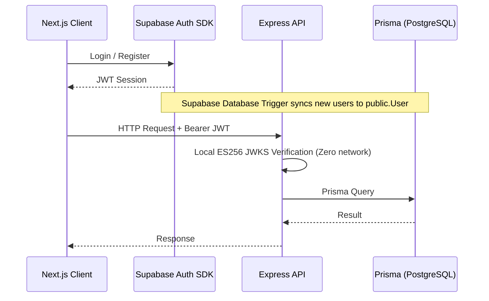
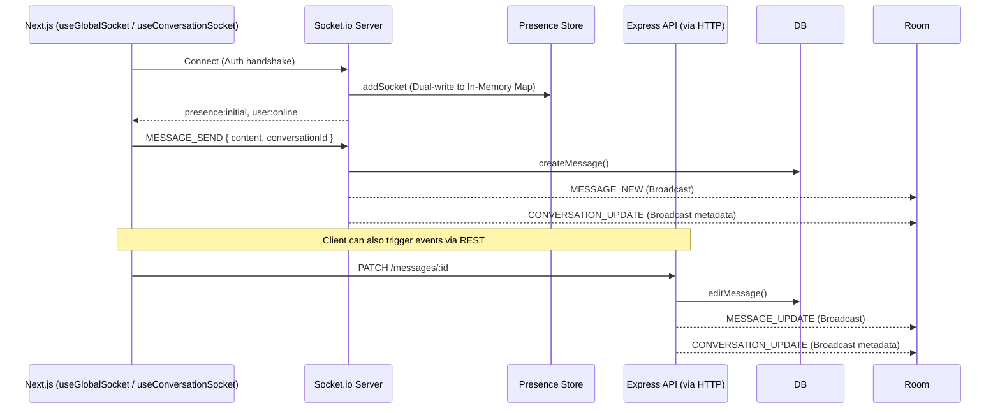

# AS-IS System Architecture (Nexus Phase 1)

> **WARNING: This document represents the *actual* implemented reality of the Nexus platform. Do not assume idealized architectural paradigms.**

## 1. Request Flow (HTTP & REST)

Nexus uses Express.js for the REST API.

### Deviations & Flaws:
- **Overloaded Controllers**: `messages.controller.ts` intercepts HTTP requests for `POST /`, `PATCH /:messageId`, and `DELETE /:messageId`. It calls the database service layer (`messages.service.ts`), but then *manually imports `socket.io`* to broadcast `MESSAGE_NEW`, `MESSAGE_UPDATE`, and `MESSAGE_DELETE`. This breaks MVC encapsulation.

## 2. Real-Time Flow (WebSocket)

Nexus uses Socket.io to push real-time updates.

### Deviations & Flaws:
- **Presence Scaling Trap**: The presence system uses a dual-write mechanism: Upstash Redis + In-Memory `Map`. While resilient for a single Node.js instance (shielding from Redis timeouts), the in-memory map lacks a Pub/Sub adapter to sync across multiple backend instances. **Nexus cannot scale horizontally** without fracturing presence state.
- **Decoupled Metadata Update**: The frontend relies entirely on the server explicitly emitting `CONVERSATION_UPDATE` to update sidebar previews (`latestMessage`) and timestamps. The client does *not* derive this from `MESSAGE_*` payloads.

## 3. Data Integrity & Transaction Boundaries

The backend uses Prisma, but transaction boundaries are frequently broken.

### Deviations & Flaws:
- **Non-Transactional Reads**: In `messages.service.ts` -> `editMessage` and `deleteMessage`, the service executes isolated reads (e.g., `getMessageById`) to perform authorization and logic branching *outside* of the `$transaction`.
- **Race Condition in `deleteMessage` (CRITICAL)**: When deleting the `latestMessage`, the service fetches the next-most-recent message ID *before* the transaction starts. Concurrent deletions of the two newest messages will result in a corrupted `Conversation.latestMessageId`.
- **Soft-Delete Leakage**: The schema uses `deletedAt` for soft deletes, but `getMessages` does *not* apply a `where: { deletedAt: null }` filter. Deleted messages are sent to the client.
- **Pagination Ordering Defect**: Messages use `UUIDv7` for clustered chronological indexing, but `getMessages` paginates using `orderBy: { createdAt: "desc" }`. This breaks monotonic safety if messages share identical timestamps.

## 4. Frontend State Strategy

The frontend relies heavily on TanStack Query cache mutation.

### Deviations & Flaws:
- **Aggressive Optimistic Updates**: `useMessages.ts` injects `pending: true` payloads and creates a `tempId` upon sending. It directly mutates the query cache to swap the `tempId` with the final payload.
- **Cache Fragility**: Because the backend leaks soft-deleted messages, the frontend handles deletions optimistically (using `markMessageDeletedInCache`) but is completely reliant on manual DOM/cache updates rather than clean server reconciliation.
