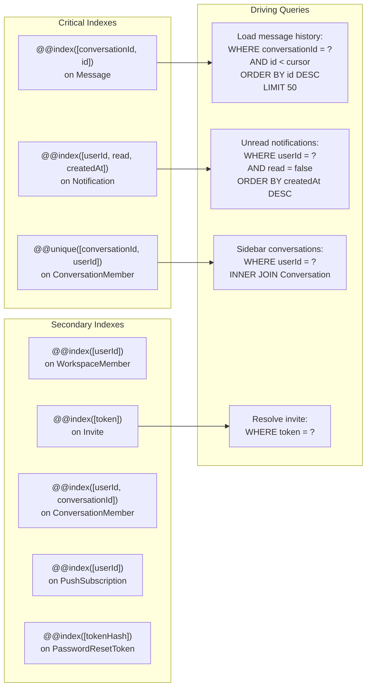

# Nexus — Database Reference

> **Last Updated:** 2026-06-24
> **Purpose:** Database schema, entity relationships, access patterns, and performance considerations. Uses Mermaid ER diagrams instead of raw schema tables.

---

## 1. Entity Relationship Diagram

```mermaid
erDiagram
    User {
        string id PK "UUIDv7"
        string email UK
        string username UK
        string fullName "nullable"
        string avatarUrl "nullable"
        string avatarPath "nullable"
        string bio "nullable"
        enum status "AVAILABLE | AWAY | DND | INVISIBLE"
        string statusText "nullable"
        boolean isOnboarded
        datetime createdAt
        datetime updatedAt
    }

    Workspace {
        string id PK "UUIDv7"
        string name
        string slug UK
        string description "nullable"
        string imageUrl "nullable"
        string iconPath "nullable"
        string ownerId FK
        datetime createdAt
        datetime updatedAt
    }

    WorkspaceMember {
        string workspaceId PK, FK
        string userId PK, FK
        enum role "OWNER | ADMIN | MEMBER"
        datetime joinedAt
    }

    Conversation {
        string id PK "UUIDv7"
        enum type "DM | CHANNEL"
        string name "nullable"
        string description "nullable"
        string workspaceId FK "nullable"
        string dmPair UK "nullable"
        enum visibility "PUBLIC | PRIVATE"
        string latestMessageId FK "nullable"
        string createdBy FK "nullable"
        datetime createdAt
        datetime updatedAt
    }

    ConversationMember {
        string id PK "cuid"
        string conversationId FK
        string userId FK
        string lastReadMessageId FK "nullable"
        datetime joinedAt
    }

    Message {
        string id PK "UUIDv7"
        string content
        string conversationId FK
        string userId FK
        string replyToId FK "nullable"
        string threadRootId FK "nullable"
        int threadReplyCount "default 0"
        datetime lastThreadReplyAt "nullable"
        boolean isThreadBroadcast "default false"
        boolean isEdited
        datetime deletedAt "nullable"
        datetime createdAt
        datetime updatedAt
    }

    MessageMention {
        string id PK "cuid"
        string messageId FK
        string userId FK
        datetime createdAt
    }

    MessageReaction {
        string id PK "cuid"
        string messageId FK
        string userId FK
        string emoji
        datetime createdAt
    }

    PinnedMessage {
        string id PK "cuid"
        string messageId FK, UK
        string conversationId FK
        string pinnedBy FK
        datetime createdAt
    }

    Invite {
        string id PK "cuid"
        enum type "USER | CONVERSATION | WORKSPACE | CHANNEL"
        string entityId
        string token UK "32-byte random hex"
        string createdBy FK
        int maxUses "nullable"
        int usedCount
        boolean revoked
        datetime expiresAt "nullable"
        datetime lastUsedAt "nullable"
        datetime createdAt
    }

    Notification {
        string id PK "cuid"
        string userId FK
        enum type "INVITE_RECEIVED | INVITE_ACCEPTED | INVITE_DECLINED | MEMBER_JOINED | CHANNEL_CREATED | CHANNEL_MEMBER_ADDED | CHANNEL_MEMBER_REMOVED | MEMBER_REMOVED | MESSAGE_REPLIED | ROLE_CHANGED | WORKSPACE_DELETED | MENTIONED_IN_MESSAGE | THREAD_REPLY"
        string title
        string body "nullable"
        string link "nullable"
        string imageUrl "nullable"
        boolean read
        json metadata "nullable"
        datetime createdAt
    }

    PushSubscription {
        string id PK "cuid"
        string userId FK
        string endpoint UK
        string p256dh
        string auth
        string userAgent "nullable"
        datetime createdAt
        datetime updatedAt
    }

    PasswordResetToken {
        string id PK "cuid"
        string userId FK
        string tokenHash
        datetime expiresAt
        datetime usedAt "nullable"
        datetime createdAt
    }

    User ||--o{ WorkspaceMember : "is member of"
    User ||--o{ ConversationMember : "participates in"
    User ||--o{ Message : "sends"
    User ||--o{ Invite : "creates"
    User ||--o{ Notification : "receives"
    User ||--o{ PushSubscription : "registers"
    User ||--o{ PasswordResetToken : "requests"
    User ||--o{ PinnedMessage : "pins"
    User ||--o{ MessageMention : "mentioned in"
    User ||--o{ MessageReaction : "reacts"

    Workspace ||--o{ WorkspaceMember : "has members"
    Workspace ||--o{ Conversation : "contains channels"
    Workspace ||--|| User : "owned by"

    Conversation ||--o{ ConversationMember : "has members"
    Conversation ||--o{ Message : "contains"
    Conversation ||--o{ PinnedMessage : "has pinned"
    Conversation }o--|| Workspace : "belongs to workspace"
    Conversation }o--|| Message : "latest message"

    Message ||--|| User : "authored by"
    Message ||--o{ Message : "replies to"
    Message ||--o{ Message : "thread replies"
    Message ||--o{ MessageMention : "has mentions"
    Message ||--o{ MessageReaction : "has reactions"
    Message ||--o| PinnedMessage : "pinned state"
    Message }o--|| Conversation : "part of conversation"

    MessageMention }o--|| Message : "belongs to message"
    MessageMention }o--|| User : "mentions user"

    MessageReaction }o--|| Message : "belongs to message"
    MessageReaction }o--|| User : "reacted by user"

    PinnedMessage ||--|| Message : "references"
    PinnedMessage }o--|| Conversation : "belongs to conversation"
    PinnedMessage ||--|| User : "pinned by user"
```



---

## 2. Core Relationships — Details

### Workspace Membership

```
User ──< WorkspaceMember >── Workspace
       (composite PK: workspaceId, userId)
```

- **Cardinality**: A user can be in many workspaces; a workspace has many users.
- **Role-based access**: `WorkspaceMember.role` determines what the user can do (OWNER > ADMIN > MEMBER).
- **Composite primary key**: `@@id([workspaceId, userId])` — a user can only have one role per workspace.
- **Cascade**: Deleting a Workspace cascades to WorkspaceMember, Conversation (channels), and all messages.

### Message Threading

```
Message ──< Message (self-referencing via threadRootId)
```

- **threadRootId**: Self-referencing FK to `Message.id`. When set, the message is a reply within a thread rather than a top-level conversation message.
- **threadReplyCount**: Denormalized counter updated on each new thread reply. Used for display in the main timeline without querying the full thread.
- **lastThreadReplyAt**: Timestamp of the most recent reply. Enables sorting and cutoff decisions.
- **isThreadBroadcast**: When true, the reply also appears in the main conversation timeline.
- **Index**: `@@index([threadRootId, createdAt])` — efficient thread reply loading.

### Message Mentions

```
Message ──< MessageMention >── User
       (unique [messageId, userId])
```

- **Join table**: Tracks which users are mentioned in a message.
- **Unique constraint**: A user can only be mentioned once per message.
- **Index**: `@@index([userId, createdAt])` — for "messages where I was mentioned" queries.

### Message Reactions

```
Message ──< MessageReaction >── User
       (unique [messageId, userId, emoji])
```

- **Join table**: Tracks emoji reactions on messages.
- **Unique constraint**: A user can only react once per emoji per message.
- **Schema exists but no endpoints or UI yet** — data model is ready for future implementation.

### Conversations (DMs + Channels)

```
Conversation ──< ConversationMember >── User
     │
     └──< Message ── (optional) PinnedMessage
```

- **Polymorphic design**: `Conversation.type` distinguishes DMs (`DM`) from channels (`CHANNEL`).
- **dmPair deduplication**: Sorted user IDs (e.g., `"alice:bob"`) prevent duplicate DMs. Unique constraint enforces this at the database level.
- **Channel workspace relationship**: When `type: CHANNEL`, `workspaceId` links to the parent Workspace.
- **Soft deletes for messages**: `Message.deletedAt` preserves data while filtering from queries.

### Message Pinning

```
Message ──< PinnedMessage >── Conversation
         (1:0..1 — unique on messageId)
```

- One pin per message (enforced by `@@unique([messageId])`).
- Pins survive message edits but are cascade-deleted with the message or conversation.

---

## 3. Indexing Strategy



---

## 4. Access Patterns by Model

| Model | Primary Read Pattern | Primary Write Pattern | Typical Volume |
|-------|---------------------|----------------------|----------------|
| **User** | By ID (profile load) | On registration, profile edit | Reads >> writes |
| **Workspace** | By slug (routing), by ID (settings) | Create, update settings | 1 per user |
| **Conversation** | By user ID (sidebar load) | Create DM, create channel | 1-50 per user |
| **Message** | Cursor pagination per conversation | Send, edit, delete | Reads >> writes |
| **Notification** | By user ID (paginated) | Create on events, mark read | Reads >> writes |
| **Invite** | By token (resolution) | Generate, consume | 1-5 per user |
| **PinnedMessage** | By conversation ID (panel load) | Pin, unpin | Low |
| **PushSubscription** | By user ID (send push) | Subscribe, unsubscribe | 1-3 per user |

---

## 5. Performance Characteristics

### Critical Query: Message History

```sql
-- Generated by Prisma:
SELECT * FROM Message
WHERE conversationId = $1
  AND deletedAt IS NULL
  AND id < $2
ORDER BY id DESC
LIMIT 50;
```

- **Index**: `@@index([conversationId, id])` — covers the WHERE and ORDER BY clauses.
- **UUIDv7 ordering**: `id < cursor` works because UUIDv7 encodes time monotonically.
- **Expected performance**: O(log n) per query via B-tree index. Sub-ms for conversation sizes under 10K messages.

### Potential Bottlenecks

| Query | Pattern | Concern | Mitigation |
|-------|---------|---------|------------|
| Message search | `WHERE content CONTAINS %query%` | Full table scan at scale | Add GIN index on `to_tsvector(content)` |
| Conversation sidebar | JOIN with `latestMessage` | N+1 if not eager-loaded | Always use Prisma `include: { latestMessage: true }` |
| Push notification dispatch | Per-member queries | N+1 per message send | Batch with `findMany` (WHERE userId IN (...)) |
| Notification page | Cursor pagination with read filter | Large unread sets | Composite index `(userId, read, createdAt)` already in place |

---

## 6. Enum Reference

| Enum | Values | Usage |
|------|--------|-------|
| `ConversationType` | `DM`, `CHANNEL` | Discriminator for conversation behavior |
| `ChannelVisibility` | `PUBLIC`, `PRIVATE` | Channel access control |
| `WorkspaceRole` | `OWNER`, `ADMIN`, `MEMBER` | Hierarchical permissions (OWNER > ADMIN > MEMBER) |
| `InviteType` | `USER`, `CONVERSATION`, `WORKSPACE`, `CHANNEL` | Target entity type for invites |
| `NotificationType` | `INVITE_RECEIVED`, `INVITE_ACCEPTED`, `INVITE_DECLINED`, `MEMBER_JOINED`, `CHANNEL_CREATED`, `CHANNEL_MEMBER_ADDED`, `CHANNEL_MEMBER_REMOVED`, `MEMBER_REMOVED`, `MESSAGE_REPLIED`, `ROLE_CHANGED`, `WORKSPACE_DELETED`, `MENTIONED_IN_MESSAGE`, `THREAD_REPLY` | Notification event types |
| `UserStatus` | `AVAILABLE`, `AWAY`, `DND`, `INVISIBLE` | Presence status |

---

## 7. Migration Rules

1. **All migrations must be purely additive**: `CREATE TABLE`, `ADD COLUMN`, `CREATE INDEX` only.
2. **No destructive operations**: Never `DROP TABLE`, `DROP COLUMN`, or `ALTER COLUMN ... DROP NOT NULL` in a migration.
3. **Idempotent execution**: Use `IF NOT EXISTS` and PL/pgSQL `DO $$ ... EXCEPTION` blocks for safe re-runs.
4. **Backward compatibility**: New columns must have defaults or be nullable to avoid breaking running instances.
5. **Testing**: Every migration must be verified against the test database before merging.
