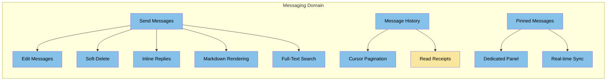
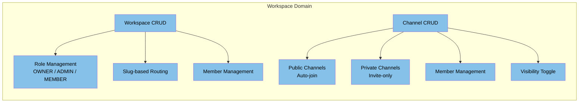
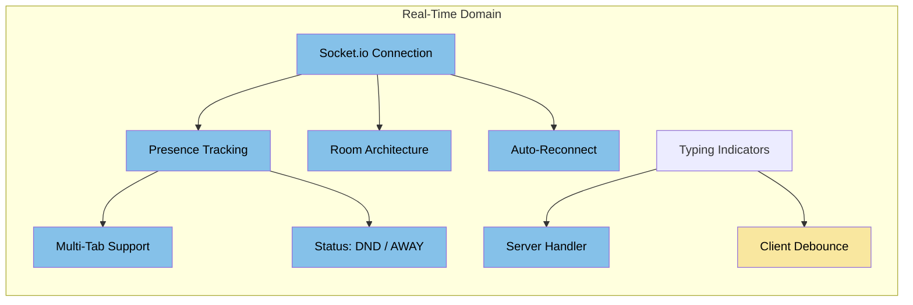
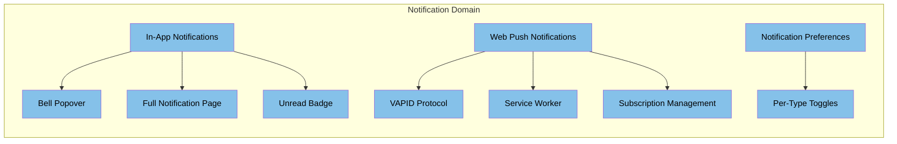

# Nexus — Feature Capability Map

> **Last Updated:** 2026-06-22
> **Purpose:** Strategic inventory of features by domain capability, implementation status, and dependencies.

---

## 1. Core Messaging

| Feature | Status | Notes |
|---------|--------|-------|
| Send Messages | ✅ Complete | Optimistic UI via Socket.io |
| Edit Messages | ✅ Complete | REST + socket broadcast |
| Delete Messages (Soft) | ✅ Complete | `deletedAt` field, filtered from queries |
| Inline Replies | ✅ Complete | `replyToId` foreign key |
| Markdown Rendering | ✅ Complete | react-markdown + remark-gfm |
| Message History | ✅ Complete | Cursor-based pagination with UUIDv7 |
| Pinned Messages | ✅ Complete | Dedicated panel, real-time sync |
| Read Receipts (DMs) | ✅ Complete | Single/double checkmark |
| Read Receipts (Channels) | 🟡 Partial | `partnerLastReadMessageId` undefined for channels |
| Message Search | ✅ Complete | `contains` query — no full-text index |

---

## 2. Workspaces & Channels

| Feature | Status | Notes |
|---------|--------|-------|
| Workspace CRUD | ✅ Complete | Create, read, update, delete |
| Workspace Roles | ✅ Complete | Hierarchical: OWNER > ADMIN > MEMBER |
| Slug-based Routing | ✅ Complete | `/workspaces/{slug}/channels/{id}` |
| Member Management | ✅ Complete | Add, remove, change roles |
| Channel CRUD | ✅ Complete | Create, rename, delete |
| Public Channels | ✅ Complete | Auto-join all workspace members |
| Private Channels | ✅ Complete | Explicit member addition |
| Channel Member Management | ✅ Complete | Dedicated `ManageChannelMembersModal` |
| Visibility Toggle | ✅ Complete | PUBLIC ↔ PRIVATE (with confirmation) |
| Channel List Polling | 🟡 Partial | Uses 5s interval instead of socket events |

---

## 3. Real-Time Infrastructure

| Feature | Status | Notes |
|---------|--------|-------|
| Socket.io Connection | ✅ Complete | Auth middleware, room joining |
| Presence Tracking | ✅ Complete | Redis + in-memory dual-write |
| Multi-Tab Support | ✅ Complete | Set-based socket tracking |
| Room Architecture | ✅ Complete | `user:` / `workspace:` / `conversation:` rooms |
| Auto-Reconnect | ✅ Complete | Exponential backoff |
| Status (DND / AWAY) | ✅ Complete | Server-side + broadcast |
| Typing Server Handler | ✅ Complete | Broadcasts to conversation room |
| Typing Client Debounce | 🟡 Partial | Missing — fires on every keystroke |
| Socket Room Optimization | ✅ Complete | `io.in().socketsJoin()` replacing per-socket iteration |

---

## 4. Notifications

| Feature | Status | Notes |
|---------|--------|-------|
| In-App Notifications | ✅ Complete | Socket-delivered, persisted |
| Bell Popover | ✅ Complete | Accept/Decline invite actions |
| Notification Page | ✅ Complete | Infinite scroll, cursor pagination |
| Unread Badge | ✅ Complete | Real-time count |
| Web Push Notifications | ✅ Complete | VAPID-based |
| Service Worker | ✅ Complete | Push event handling |
| Subscription Management | ✅ Complete | Subscribe/unsubscribe API |
| Notification Preferences | ✅ Complete | Per-type toggles |
| Push Lifecycle | 🟡 Partial | No `pushsubscriptionchange` handler |

---

## 5. Auth & Users

| Feature | Status | Notes |
|---------|--------|-------|
| Email/Password Login | ✅ Complete | Supabase Auth |
| GitHub OAuth | ✅ Complete | Supabase Auth |
| Username OR Email Login | ✅ Complete | Server resolves username → email |
| Password Reset | ✅ Complete | Custom server-side flow |
| Session Persistence | ✅ Complete | Supabase SSR cookies |
| Edge Middleware Protection | ✅ Complete | Next.js middleware |
| JWKS Token Verification | ✅ Complete | Zero network calls |
| Profile Editing | ✅ Complete | Username, full name, bio |
| Avatar Upload | ✅ Complete | Supabase Storage |
| User Search | ✅ Complete | By username or full name |
| Status (AVAILABLE/AWAY/DND/INVISIBLE) | ✅ Complete | Presence-aware |

---

## 6. Invites

| Feature | Status | Notes |
|---------|--------|-------|
| Invite Link Generation | ✅ Complete | Token-based (32-byte random hex) |
| Invite Resolution | ✅ Complete | Token consume → entity join |
| Batch Invite | ✅ Complete | By user IDs |
| Email Invite (SendGrid) | ✅ Complete | HTML email with branded template |
| Multi-type Invites | ✅ Complete | USER, CONVERSATION, WORKSPACE, CHANNEL |
| Socket Room Join on Accept | ✅ Complete | Dynamic join, no reconnect needed |
| 24h Token Rotation | ✅ Complete | `lastUsedAt` tracking |

---

## 7. UI & Experience

| Feature | Status | Notes |
|---------|--------|-------|
| Responsive Layout | ✅ Complete | Mobile-first with md: breakpoints |
| Dark/Light/System Theme | ✅ Complete | `next-themes` |
| Settings Modal | ✅ Complete | Profile, appearance, notifications |
| Onboarding Flow | ✅ Complete | Multi-step wizard |
| Landing Page | ✅ Complete | Marketing site |
| Emoji Picker | ✅ Complete | `emoji-picker-react` |
| Markdown Rendering | ✅ Complete | Bold, italic, code, lists, tables |
| Tiptap Editor | ✅ Complete | Rich text + markdown message input |
| AlertDialog Confirmations | ✅ Complete | Replaced `window.confirm` |
| InfoPanel (Members/Pins) | ✅ Complete | Toggleable right panel |

---

## 8. Planned (Not Started)

| Feature | Priority | Effort | Notes |
|---------|----------|--------|-------|
| Emoji Reactions | Medium | Medium | Schema exists — no endpoints or UI |
| @Mentions | Medium | Medium | No detection or autocomplete |
| File Uploads | Low | Large | No S3/cloud storage integration |
| Global Search (Cmd+K) | Low | Medium | No implementation |
| Message Threads | Low | Large | Nested replies, separate view |
| URL Unfurling | Low | Medium | No link preview |
| Keyboard Shortcuts | Low | Small | Cmd+K, Cmd+, |
| i18n Support | Low | Large | Hardcoded English throughout |
| E2E Tests | Medium | Large | Playwright — not started |
| Load Testing | Low | Medium | No k6/artillery scripts |
