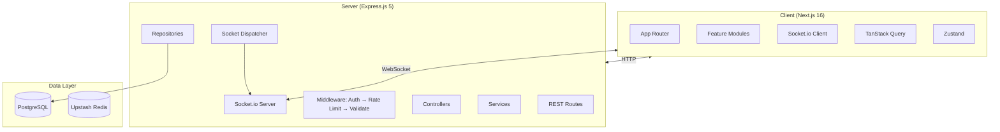
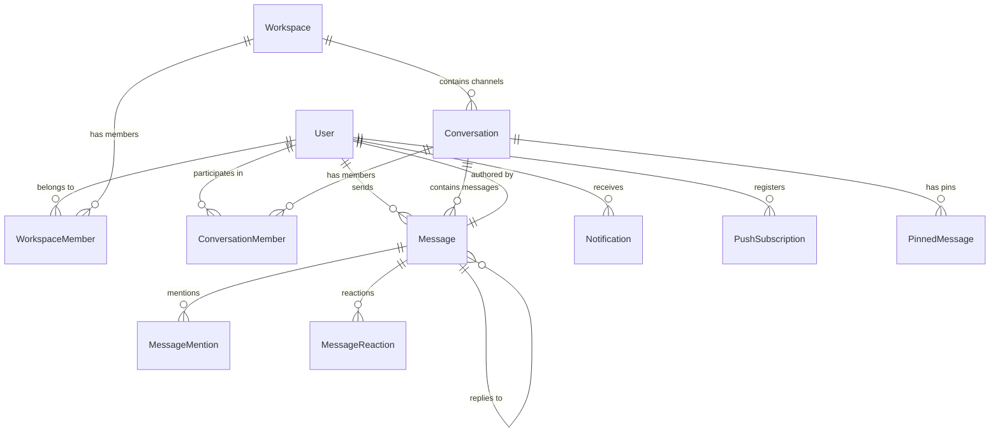
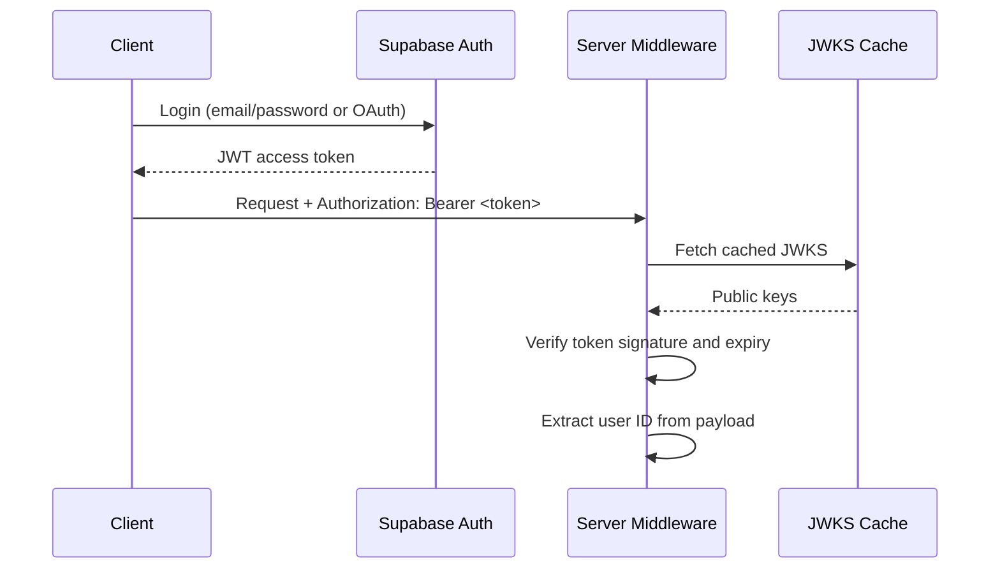

# Nexus — Project Overview

> **Version:** 0.1.0 | **Date:** 2026-06-26
> **Purpose:** A comprehensive technical reference for engineers working on Nexus. Covers architecture, design decisions, current state, and known limitations.

---

## Overview

Nexus is a real-time messaging platform — workspaces, channels, DMs, message threads, mentions, presence tracking, push notifications, invites, message pinning, and reactions (schema). It's built as a TypeScript monorepo with two applications:

- **Client** — Next.js 16 frontend running on port 3001
- **Server** — Express.js 5 backend running on port 4000

Communication happens over HTTP (REST via Axios) and WebSockets (Socket.io).

---

## Architecture

### High-Level Layout



### Request Flow

```
Client (TanStack Query) → Axios → Express Route → Middleware → Controller → Service → Repository → Prisma → PostgreSQL
                                                                                                              │
                                                                                                      Socket Dispatcher
                                                                                                              │
                                                                                                       Socket.io broadcast
```

TanStack Query handles caching and optimistic updates on the client. Mutations update the cache immediately and reconcile with the server response when it arrives.

### Real-Time Flow

```
Client A → emit("message:send") → Socket.io Server → Auth → Handler
    → Prisma transaction → Dispatcher → Client B (via room broadcast)
    → Dispatcher → Client A (ack: tempId → real ID)
```

The dispatcher pattern is intentional: `socket.dispatcher.ts` is the single module that emits events. Controllers and services never import Socket.io directly, which keeps them testable and makes emission paths easy to trace.

### Server Module Pattern

Each feature module follows the same structure:

```
routes.ts       → Route definitions + Zod validation
controller.ts   → Request handling, response formatting
service.ts      → Business logic, authorization
repository.ts   → Prisma queries (data access)
types.ts        → TypeScript interfaces
schema.ts       → Zod validation schemas
```

---

## Technology Stack

### Client

| Technology | Purpose | Notes |
|-----------|---------|-------|
| Next.js 16 | Application framework | App Router, edge middleware for auth, React Server Components |
| TanStack Query v5 | Server state management | Caching, request deduplication, optimistic UI updates |
| Zustand v5 | Client state management | Used for UI-only state: socket status, online users, typing indicators |
| Socket.io v4 | Real-time transport | WebSocket with long-polling fallback, room semantics, auto-reconnect |
| Tailwind CSS v4 + shadcn/ui | Styling and components | Utility-first CSS with copy-pasteable component primitives |
| react-hook-form + Zod | Form management | Schema-based validation with zodResolver integration |
| Tiptap | Message editor | ProseMirror-based, handles markdown and rich text input |

### Server

| Technology | Purpose | Notes |
|-----------|---------|-------|
| Express.js 5 | HTTP framework | Well-understood, extensive middleware ecosystem |
| Socket.io v4 | Real-time server | Rooms, namespaces, callback acknowledgements |
| Prisma v7 | ORM | Type-safe queries, auto-generated client from schema |
| jose | JWT/JWKS verification | Local token verification — zero network calls per request |
| web-push | Push notifications | VAPID-based browser push protocol |

### Infrastructure

| Technology | Purpose | Notes |
|-----------|---------|-------|
| PostgreSQL (Supabase) | Primary database | Managed Postgres with built-in auth and storage |
| Upstash Redis | Presence cache | Serverless Redis, HTTP-based, no persistent connection |
| Supabase Auth | Authentication | Handles OAuth, session management, user lifecycle |
| SendGrid | Email delivery | Transactional email for invites and password resets |

---

## Technology Decisions

This section documents the rationale for each major technology choice, including alternatives considered and their evaluation.

### Framework: Express.js 5

**Purpose.** HTTP server and routing layer.

**Why Express.js 5.** Maturity, middleware ecosystem, low learning curve. Express 5 provides native async error handling via `async route handlers`, eliminating the wrapper functions required in Express 4. For a messaging application where the bottleneck is database I/O and real-time event delivery, HTTP framework throughput is not a differentiating factor.

**Alternatives considered.**

- **Fastify** — Faster JSON serialization and schema-based validation. Rejected because Zod handles validation at the route layer already. Fastify's plugin system would add complexity without measurable benefit at current request volumes.
- **NestJS** — Opinionated framework with dependency injection. Rejected because the project's layered architecture (routes → controller → service → repository) achieves the same separation without decorator-based metaprogramming, which adds compile-time overhead and implicit behavior.
- **Hono** — Ultralight, strong TypeScript support. Evaluated but lacked middleware ecosystem maturity at the time of selection. Better suited for edge-runtime deployments.

### Real-time Transport: Socket.io 4

**Purpose.** Bidirectional, event-based communication between client and server.

**Why Socket.io.** Provides automatic reconnection with exponential backoff, room-based broadcast, multiple transport fallbacks (WebSocket → long-polling), and callback acknowledgements out of the box. These features are required for a messaging application.

**Alternatives considered.**

- **Native WebSocket (`ws`)** — Requires manual implementation of rooms, reconnection, and fallback transports. Appropriate when network conditions are controlled (e.g., internal tools) but not for a general-purpose web application.
- **Pusher** — Managed WebSocket service. Rejected because per-connection costs become significant at scale. Self-hosting Socket.io removes this constraint.
- **Ably** — Enterprise-grade real-time platform. Rejected due to cost and infrastructure dependency overhead.

### ORM: Prisma 7

**Purpose.** Database access, schema management, and migration tooling.

**Why Prisma.** Generates TypeScript types from the schema automatically — eliminating manually maintained type definitions. The migration system handles schema evolution declaratively. The client API enforces type-safe queries at compile time.

**Alternatives considered.**

- **Drizzle ORM** — SQL-like query builder with better performance and a smaller bundle. Evaluated but at the time of selection had weaker support for composite primary keys, compound indexes, and transaction callbacks that this application relies on. Drizzle has since matured and would receive stronger consideration in a greenfield project today.
- **TypeORM** — Decorator-based entities mix schema concerns with application code. Historically prone to breaking changes between versions.
- **Kysely** — Type-safe SQL builder without an ORM layer. Rejected because it requires manual migration management and doesn't provide the schema-first workflow.
- **Raw SQL (`pg`)** — Maximum control. Rejected because it shifts type safety, migration management, and query construction entirely to the developer, slowing iteration.

### Server State Management: TanStack Query 5

**Purpose.** Client-side caching, deduplication, and synchronization of server data.

**Why TanStack Query.** Provides caching, request deduplication, background refetching, optimistic updates, and cursor-based pagination. The `setQueryData` API is essential for real-time features — socket event handlers update the query cache directly without a network round-trip.

**Alternatives considered.**

- **RTK Query** — Ties server state to Redux. Rejected because the application doesn't use Redux, and adopting RTK Query would introduce boilerplate for no additional benefit.
- **SWR** — Lightweight but has weaker mutation support. The `useSWRMutation` API is less ergonomic for optimistic update patterns.
- **Manual fetch + state** — Would reimplement the same request lifecycle logic in every feature module.

### Client State Management: Zustand 5

**Purpose.** UI-only state that doesn't benefit from server caching — socket status, presence, typing indicators, active conversation.

**Why Zustand.** Minimal API, no provider wrappers, no boilerplate. Stores are plain objects with mutating actions. Frequent updates (typing indicators, presence) don't trigger unnecessary re-renders.

**Alternatives considered.**

- **Redux Toolkit** — Action/reducer boilerplate for what amounts to a few small stores. Middleware patterns (thunks, sagas) would be overkill when Socket.io handlers can update stores directly.
- **React Context + useReducer** — Triggers re-renders on all consumers when any value changes — problematic for frequently updated state. Requires provider nesting.
- **Jotai / Recoil** — Atomic state management. Evaluated but Zustand's simpler API and smaller bundle (1.2 KB gzipped vs 3.4 KB for Jotai) made it the practical choice.

### Styling: Tailwind CSS 4 + shadcn/ui

**Purpose.** UI component styling and design system.

**Why Tailwind + shadcn.** Utility-first CSS with a defined design system. shadcn/ui provides copy-pasteable React components built on Radix primitives. This avoids dependency risk of a paid library while providing accessible, themed, customizable elements.

**Alternatives considered.**

- **Material UI** — Comprehensive library but customization requires theme overrides. Bundle size is larger. Visual identity would be difficult to differentiate.
- **Chakra UI / Radix Themes** — Similar to shadcn but distributed as packages. Rejected in favor of the copy-paste model, which allows full control over every component.
- **CSS Modules + custom components** — Would require reimplementing accessible dropdowns, modals, and popovers from scratch.

### Rich Text: Tiptap 3 (ProseMirror)

**Purpose.** Message input editor and markdown serialization.

**Why Tiptap.** Built on ProseMirror, which provides a stable, extensible document model. The extension system enables selective feature enabling (bold, lists, code blocks). The `tiptap-markdown` extension provides markdown serialization for message storage.

**Alternatives considered.**

- **Slate.js** — More flexible but requires building editing experience from primitives. Slower development velocity.
- **Quill.js** — Simpler API but harder to customize beyond the toolbar. Document model is less predictable.
- **Lexical (Meta)** — Modern, well-architected. Evaluated but had a smaller extension ecosystem. Tiptap's markdown extension was a deciding factor.

### Primary Database: PostgreSQL via Supabase

**Purpose.** Primary data store for all persistent state.

**Why PostgreSQL + Supabase.** PostgreSQL provides transactional integrity, relational modeling, and the richest query capabilities of any open-source database. Supabase provides a managed instance with built-in authentication and storage, consolidating three infrastructure needs.

**Alternatives considered.**

- **Firebase Firestore** — NoSQL document database. Rejected because the data model is fundamentally relational (users ↔ workspaces ↔ conversations ↔ messages). Modeling this in Firestore would require denormalization, duplicated data, and application-level consistency enforcement.
- **MySQL (PlanetScale)** — Relational but lacks PostgreSQL's enum types, composite primary key support, and full-text search capabilities that this application uses.
- **SQLite (Turso)** — Edge-friendly but write concurrency is insufficient for a chat application.

### Authentication: Supabase Auth + Local JWKS

**Purpose.** User authentication, session management, OAuth, password reset.

**Why Supabase Auth + local JWKS verification.** Supabase Auth handles OAuth, sessions, and user lifecycle. The JWKS is fetched on server startup and cached — every subsequent request verifies the JWT locally via `jose`, eliminating network calls (which would add 50–200ms per request).

**Alternatives considered.**

- **Auth0** — More enterprise features at significantly higher cost. Overkill for current requirements.
- **Clerk** — Developer-friendly with pre-built UI. Would add a third-party dependency for the entire auth UI layer, limiting customization.
- **Custom auth (bcrypt + sessions)** — Implementing OAuth, session rotation, password reset, and email verification correctly is time-consuming and security-critical. Supabase provides this with minimal configuration.
- **NextAuth.js (Auth.js)** — Good Next.js integration but requires a database adapter. Since the server is a separate Express application, Supabase SSR cookies provided cleaner integration.

### Email: SendGrid

**Purpose.** Transactional email for invites and password resets.

**Why SendGrid.** Established deliverability, template management, straightforward API.

**Alternatives considered.**

- **Resend** — Modern API and React email support. Less established deliverability reputation at the time of integration.
- **Postmark** — Faster delivery, better analytics. Per-email pricing is less cost-effective for batch invites.
- **Amazon SES** — Lower cost but requires additional infrastructure (verified domains, DKIM) and lacks delivery analytics without add-on services.

### Presence Cache: Upstash Redis

**Purpose.** Shared presence state across server instances.

**Why Upstash.** Serverless Redis with an HTTP API — no persistent TCP connection needed. Presence is dual-written to Redis (cross-instance durability) and an in-memory Map (low-latency local reads).

**Alternatives considered.**

- **Redis Cloud** — More features (persistence, replication) but requires VPC peering. Higher operational overhead.
- **ElastiCache** — Adds AWS dependency. Not suitable for multi-provider deployments.
- **In-memory only** — Currently used as a fallback but prevents horizontal scaling.

### Markdown Rendering: react-markdown + remark-gfm

**Purpose.** Render message content as formatted text.

**Why react-markdown.** React-native rendering pipeline. `remark-gfm` adds GitHub Flavored Markdown (tables, task lists, strikethrough).

**Alternatives considered.**

- **`marked`** — Synchronous, faster parsing but no React-native pipeline. Would require manual `dangerouslySetInnerHTML` usage, which bypasses React's escaping and is a security concern for user-generated content.
- **Server-side rendering (e.g., unified + rehype)** — More control over the parsing pipeline. Rejected because the application renders messages on the client for real-time updates; server-side rendering would add latency to the message display path.

### Form Validation: Zod 4 + react-hook-form

**Purpose.** Schema validation and form state management.

**Why Zod + react-hook-form.** Zod generates TypeScript types from schemas — single source of truth. react-hook-form minimizes re-renders by isolating field-level updates.

**Alternatives considered.**

- **Yup** — Similar API but slower validation performance and less flexible type inference into TypeScript.
- **Formik** — More boilerplate (manual `onChange`, `onBlur` handlers per field). Triggers re-renders on the entire form tree rather than individual fields.
- **Native HTML validation + manual state** — Insufficient for complex forms with cross-field validation rules (e.g., password confirm match).

### Push Notifications: Web Push API (VAPID)

**Purpose.** Browser push notifications for messages and invites.

**Why Web Push API.** W3C standard supported by all major browsers. VAPID provides cryptographic identity, removing the need for a centralized push service account. The `web-push` library handles encryption and delivery.

**Alternatives considered.**

- **Firebase Cloud Messaging** — Works natively on Android but requires Google Play Services and a Firebase project. VAPID avoids vendor lock-in and works on all platforms without native dependencies.
- **OneSignal** — Managed push service with segmentation and analytics. Rejected because the application only sends transactional notifications, not marketing campaigns. The overhead of a third-party push service is not justified for simple message alerts.

---

## Key Design Decisions

Beyond library and service choices, several architectural patterns shaped the codebase. Technology-specific rationale is covered in [Technology Decisions](#technology-decisions) above.

**UUIDv7 over auto-increment or UUIDv4.** Auto-increment IDs expose message counts and create merge conflicts in distributed development. UUIDv4 is randomly ordered, requiring a separate `createdAt` sort column. UUIDv7 encodes a Unix millisecond timestamp in its most significant bits, enabling cursor-based pagination directly on the ID field — `WHERE id < cursor ORDER BY id DESC` — with no separate index needed and no timestamp collision issues under concurrency.

**Socket dispatcher pattern over direct `io` imports.** Controllers and services call dispatcher functions (`dispatchMessageNew`, `dispatchMemberUpdate`) rather than importing the Socket.io server instance directly. This keeps services testable without mocking WebSocket connections, makes all emission paths discoverable in a single module (`socket.dispatcher.ts`), and prevents accidental coupling between business logic and transport.

**Soft deletes for messages over hard deletion.** Messages are marked with `deletedAt` rather than removed. All queries filter `WHERE deletedAt IS NULL`. This preserves referential integrity (pinned messages, reply chains), allows potential undo functionality, and avoids cascade complications when deleting messages that are referenced by other records.

**Cursor-based pagination over offset-based.** Offset pagination becomes unstable when new records are inserted — offsets shift, causing duplicates or gaps. Cursor pagination using UUIDv7 IDs provides a stable ordering surface regardless of concurrent inserts.

**Composite primary key for workspace membership.** `@@id([workspaceId, userId])` on `WorkspaceMember` enforces one role per user per workspace at the database level, eliminating application-level deduplication logic.

---

## Project Layout

```
nexus/
├── client/                          # Next.js frontend
│   ├── src/
│   │   ├── app/                     # App Router pages
│   │   ├── modules/                 # Feature modules
│   │   │   ├── auth/                # Login, register, session management
│   │   │   ├── chat/                # ActiveConversation orchestrator, socket hooks
│   │   │   ├── conversations/       # Sidebar, DM list, conversation creation
│   │   │   ├── messages/            # Message list, input, search, pinned messages
│   │   │   ├── threads/             # Thread panel, thread input, thread store
│   │   │   ├── workspaces/          # Workspace and channel CRUD, member management
│   │   │   ├── notifications/       # Bell popover, push subscriptions, preferences
│   │   │   ├── invites/             # Invite modal, link generation and resolution
│   │   │   ├── users/               # Profiles, search, status selector
│   │   │   ├── settings/            # Profile editing, appearance, about page
│   │   │   ├── onboarding/          # New user wizard
│   │   │   └── landing/             # Public marketing page
│   │   └── socket/                  # Socket.io client, event router, per-feature handlers
│
├── server/
│   ├── src/
│   │   ├── modules/                 # Same feature split as client
│   │   ├── socket/                  # Socket.io server, dispatcher, presence store, handlers
│   │   ├── middlewares/             # Auth, rate limiting, validation, error handler
│   │   ├── lib/                     # Prisma client, Redis, email, transaction helpers
│   │   └── services/                # Push notification service
│   └── prisma/                      # Schema and migrations
│
├── .docs/                           # Project documentation
└── work/                            # Session logs, notes, audits
```

---

## Database

### Entity Relationships



### Design Decisions

**Channels as Conversations.** A channel is a `Conversation` record with `type: CHANNEL` and a `workspaceId`. This means DMs and channels share all message infrastructure — CRUD, cursor pagination, pins, socket events. No duplicated code paths.

**UUIDv7 primary keys.** IDs encode a Unix millisecond timestamp in their most significant bits. This enables cursor-based pagination with a simple `WHERE id < cursor ORDER BY id DESC` — no separate `createdAt` sort needed, no timestamp collision issues under concurrency.

**Soft deletes for messages.** Messages are marked with a `deletedAt` timestamp rather than removed. All queries filter `WHERE deletedAt IS NULL`. This preserves data integrity and allows for potential undo functionality.

**Composite primary key for workspace membership.** `@@id([workspaceId, userId])` enforces one role per user per workspace at the database level.

### Critical Index

```sql
@@index([conversationId, id])  -- Message table
```

This index powers all message history queries. Without it, every conversation load would require a full table scan.

### Known Gaps

- No full-text search index. Message search uses Prisma's `contains` (SQL `LIKE %query%`). This will degrade at scale. The fix is a GIN index on `to_tsvector(content)`.
- Push notifications query members individually rather than batching with `WHERE userId IN (...)`.

---

## Authentication and Authorization

### Auth Flow



Token verification happens entirely locally using a JWKS fetched from Supabase on server startup. This means zero network calls per authentication check — the server can verify tokens even if Supabase is unreachable.

### Roles and Permissions

| Role | Scope |
|------|-------|
| OWNER | Full workspace control: delete, manage all members, transfer ownership |
| ADMIN | Channel management, member management (except admins), workspace settings |
| MEMBER | Send messages, create channels, invite members |

Channel access: PUBLIC channels auto-join all workspace members. PRIVATE channels require explicit addition. DMs are restricted to participants.

Security is enforced at three layers: route middleware (`requireConversationMember` checks the database), service logic (role verification in workspace code), and socket level (room membership is server-enforced).

---

## Real-Time Infrastructure

### Connection Lifecycle

When a client connects:
1. Server verifies the JWT from the connection handshake
2. The socket is registered in the presence store (Redis + in-memory)
3. If this is the user's first connection (not just another tab), `user:online` is broadcast to all clients
4. The client joins relevant rooms: personal (`user:<id>`), workspace, and conversation rooms

### Room Architecture

| Room Pattern | Scope |
|-------------|-------|
| `user:<userId>` | Private channel for notifications and presence |
| `workspace:<workspaceId>` | Workspace-wide broadcasts |
| `conversation:<conversationId>` | Message delivery within a conversation |

### Presence Tracking

Presence state is dual-written to Redis and an in-memory Map. Every socket connect/disconnect updates both stores. A user is considered offline only when all their sockets have disconnected (multi-tab support). If Redis becomes unavailable, the in-memory store continues operating, though state may become inconsistent across server restarts.

**Limitation:** The in-memory Map prevents horizontal scaling — each server instance only knows about its own connected sockets. A Redis adapter for Socket.io is needed before deploying multiple instances.

---

## Message Lifecycle

1. User sends a message from the client
2. **Optimistic update:** The message appears immediately in the UI with a `pending` flag
3. The client emits `message:send` via Socket.io with a temporary ID
4. The server handler saves the message to PostgreSQL and updates the conversation's `latestMessageId`
5. Push notifications are sent (currently in the same request path — adds 50-150ms latency)
6. The server acknowledges with the permanent message ID
7. The message is broadcast to all clients in the conversation room
8. Other clients update their TanStack cache
9. The sender's client replaces the optimistic message with the confirmed data

---

## Current State (June 26)

| Check | Result |
|-------|--------|
| Client TypeScript | 0 errors |
| Server TypeScript | 0 errors |
| Client ESLint | 0 errors (17 pre-existing warnings) |
| Client tests | 179/179 passing |
| Server tests | 155/155 passing |

Threads feature has been merged into `development` with workspace-level threads view, channel thread browser, message actions on thread replies, formatting toolbar in edit mode, and comprehensive UI polish (Discord-style thread icons, connector line improvements, z-index refactor).

### Known Issues

**Production blockers:**
- Presence tracking uses an in-memory Map, preventing multi-instance deployment
- Rate limiter is in-memory (per-instance, not shared)
- Socket.io lacks a Redis adapter — rooms aren't shared across instances
- Push notifications are synchronous in the request path, adding latency to every message send

**Should be addressed:**
- Channel read receipts don't display (double checkmark never shows for channels)
- Message search uses `LIKE %query%` with no full-text index
- Channel list polls every 5 seconds instead of using socket events
- No `React.memo` usage — message list re-renders entirely on parent state changes
- TanStack Query has no `staleTime` configured, causing refetches on every navigation
- Typing indicators lack client-side debounce
- Thread subscriptions have no explicit follow/unfollow UI
- Reactions and mentions have schema only — no endpoints or UI

---

## Testing

- **Client:** 175 tests via Vitest — socket handlers, stores, utilities, and schemas
- **Server:** 155 tests via Vitest + Supertest — services, middleware, schema validation, API integration

The test infrastructure uses a Docker PostgreSQL container and a typed mock Prisma client for service-level tests.

**Gaps:** No E2E tests (Playwright/Cypress), no socket integration tests spanning client and server, no load or performance testing.

---

## Deployment

Target infrastructure: Render (server) and Vercel (client). All changes are on the `development` branch.

Required configuration:
- Supabase project (URL + service role key + anon key)
- SendGrid API key + from-email
- VAPID public/private key pair
- PostgreSQL connection string
- Redis URL (Upstash)

For a complete list of environment variables, see [`ENVIRONMENT_VARIABLES.md`](./ENVIRONMENT_VARIABLES.md).

---

## What's Next

1. **Fix single-instance bottlenecks** — Redis adapter for Socket.io, distributed rate limiter, move presence to Redis-only
2. **Background push notifications** — decouple from the request path using a job queue
3. **Thread subscriptions** — explicit follow/unfollow UI, per-thread unread indicators
4. **E2E test coverage** — critical user flows (login, message send, channel navigation)
5. **Performance** — React.memo for message list, staleTime for queries, dynamic imports for heavy components
6. **Product features** — emoji reactions UI, @mention autocomplete, file uploads, global search

---

*For current project status, see [`PROJECT_CONTEXT.md`](./PROJECT_CONTEXT.md). For the complete API reference, see [`API_REFERENCE.md`](./API_REFERENCE.md). For feature inventory, see [`FEATURES.md`](./FEATURES.md).*
