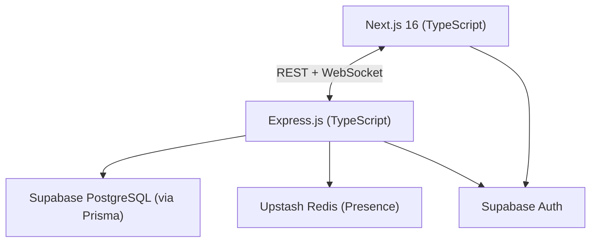
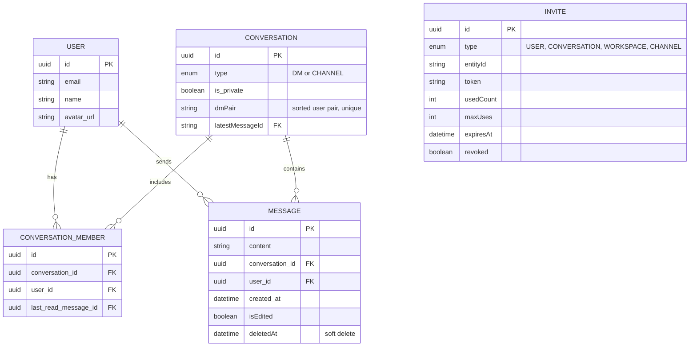

# Nexus: System Architecture

> **Last Updated:** 2026-06-11
> **Status:** Active. Phase 1 core features are complete. Presence (Redis) integration is fully implemented with dual-write to Redis + in-memory fallback. Socket architecture comprehensively documented in [socket.md](./socket.md).

---

## 1. System Overview

Nexus is a real-time messaging platform built as a monorepo with a Next.js 16 frontend and an Express.js backend. The client and server communicate over REST (for data operations) and WebSockets (for real-time events).

---

## 2. Layer Summary

### Client: Next.js 16 (implemented)
- App Router for routing and SSR
- Edge Middleware (`proxy.ts`) for route protection and auth redirects
- TanStack Query for server state (REST)
- Zustand for UI/local state (socket status, online users, drafts)
- Socket.io client for real-time events
- Modular structure (`modules/`, `shared/`, `providers/`) for scalable code organization

### Server: Express.js (implemented)
- Auth middleware validates Supabase JWTs locally using ES256 JWKS crypto (zero network overhead)
- REST routes: `/conversations`, `/messages`, `/users`, `/invites`
- Socket.io server with auth middleware, rate limiting, room management, and typed dispatcher
- Socket event handlers: message send, presence connect/disconnect

### Data Layer (implemented)
- **Supabase PostgreSQL:** primary data store, accessed via Prisma ORM
- **Upstash Redis:** ✅ fully integrated for presence — `presenceStore.ts` uses Redis with in-memory fallback, dual-writes on every connect/disconnect
- **Supabase Auth:** handles session management and JWT issuance

### Infrastructure (implemented)
- **Server:** Hosted on Render (manual web service, free tier)
- **Client:** Hosted on Vercel (git-integrated deployment)
- **Presence:** Redis key-value service (optional, falls back to in-memory)
- **Deploy:** Manual via Render Dashboard + Vercel git integration

---

## 3. Socket Architecture

See [socket.md](./socket.md) for the complete documentation, including:

- All 11 socket events with payloads, sources, and consumers
- Message send/edit/delete flows with sequence diagrams
- Presence connect/disconnect flow
- Read receipt flow
- Conversation update flow
- Invite system socket events
- Room joining strategy
- Socket middleware (auth + rate limiting)
- Dispatcher architecture
- Known issues and technical debt

---

## 4. Database Schema

Core entities and their relationships:

> Phase 2 will add: `Workspace`, `WorkspaceMember`, `Reaction` tables.

---

## 5. Key Architectural Decisions

| Decision | Choice | Rationale |
|---|---|---|
| Unified conversation model | Single `Conversation` entity for DMs and Channels (Phase 1) | Avoids schema duplication; DM logic extends cleanly to Channels |
| Read receipts | `lastReadMessageId` on `ConversationMember` (Phase 1) | O(1) writes; no per-message read-status rows |
| Auth | Supabase Auth (Phase 1) | Delegated session security, no custom token infrastructure |
| Presence store | Upstash Redis (Phase 1) | ✅ Fully integrated — `presenceStore.ts` with dual-write to Redis + in-memory fallback, multi-tab support via socket ID sets |
| Real-time transport | Socket.io (Phase 1) | Rooms, auto-reconnect, better DX than raw WebSockets |
| Decoupled conversation metadata | `CONVERSATION_UPDATE` socket event | Server owns metadata; client never infers from message payloads |
| Message sending | Socket.io primary + REST fallback | Socket for real-time; REST ensures delivery if socket fails |
| Invite system | Unified invite pipeline with domain resolvers | One system handles USER, CONVERSATION, WORKSPACE, CHANNEL invites |
| Active link rotation | 24-hour window before new invites replace old ones | Prevents link abuse while allowing reuse within a reasonable timeframe |

---

## 6. Phase Roadmap

| Phase | Focus |
|---|---|
| Phase 1 | Auth, Direct Messaging, real-time via Socket.io, presence, read receipts, message edit/delete, invite system |
| Phase 2 | Workspaces, Channels, RBAC, emoji reactions, rich text |
| Phase 3 | File uploads, full-text search, background jobs, voice/video (WebRTC) |

---

> **Note:** Documentation updated on 2026-06-11 to include socket architecture reference, invite system, and message edit/delete flows.
