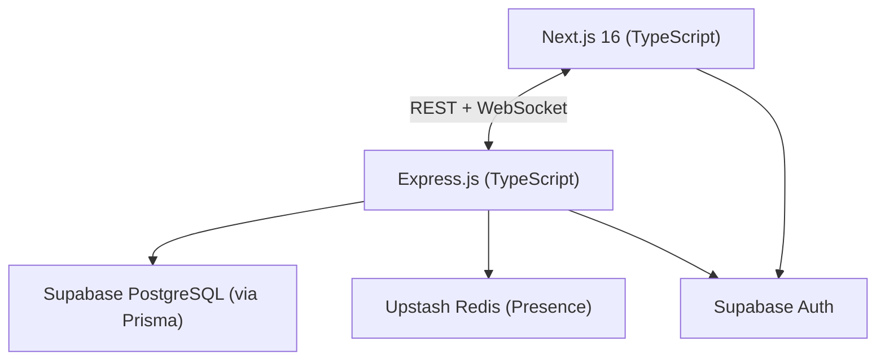
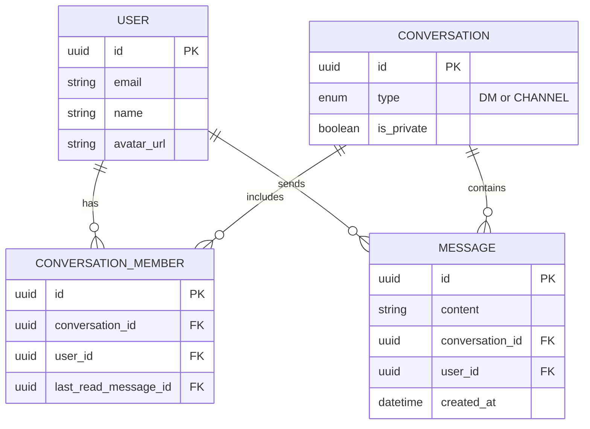

# Nexus: System Architecture

> **Last Updated:** 2026-06-09
> **Status:** Active. Phase 1 core features are complete. Presence (Redis) integration is fully implemented with dual-write to Redis + in-memory fallback.

---

## 1. System Overview

Nexus is a real-time messaging platform built as a monorepo with a Next.js frontend and an Express backend. The client and server communicate over REST (for data operations) and WebSockets (for real-time events).

---

## 2. Layer Summary

### Client: Next.js 16 (implemented)
- App Router for routing and SSR
- Edge Middleware (`proxy.ts`) for route protection and auth redirects
- TanStack Query for server state (REST)
- Zustand for UI/local state
- Socket.io client for real-time events
- Modular structure (`modules/`, `shared/`, `providers/`) for scalable code organization

### Server: Express.js (implemented)
- Auth middleware validates Supabase JWTs locally using ES256 JWKS crypto (zero network overhead)
- REST routes: `/conversations`, `/messages`, `/users`
- Socket.io server handles real-time events and room-based broadcasting

### Data Layer (implemented)
- **Supabase PostgreSQL:** primary data store, accessed via Prisma ORM
- **Upstash Redis:** ✅ fully integrated for presence — `presenceStore.ts` uses Redis with in-memory fallback, dual-writes on every connect/disconnect
- **Supabase Auth:** handles session management and JWT issuance

### Infrastructure (implemented)
- Hosted on Render (frontend + backend as separate web services)
- CI/CD via GitHub Actions (lint, typecheck, deploy)

---

## 3. Database Schema

Core entities and their relationships:

> Phase 2 will add: `Workspace`, `WorkspaceMember`, `Reaction` tables.

---

## 4. Key Architectural Decisions

| Decision | Choice | Rationale |
|---|---|---|
| Unified conversation model | Single `Conversation` entity for DMs and Channels (Phase 1) | Avoids schema duplication; DM logic extends cleanly to Channels |
| Read receipts | `lastReadMessageId` on `ConversationMember` (Phase 1) | O(1) writes; no per-message read-status rows |
| Auth | Supabase Auth (Phase 1) | Delegated session security, no custom token infrastructure |
| Presence store | Upstash Redis (Phase 1) | ✅ Fully integrated — `presenceStore.ts` with dual-write to Redis + in-memory fallback, multi-tab support via socket ID sets |
| Real-time transport | Socket.io (Phase 1) | Rooms, auto-reconnect, better DX than raw WebSockets |

---

## 5. Phase Roadmap

| Phase | Focus |
|---|---|
| Phase 1 | Auth, Direct Messaging, real-time via Socket.io, presence, read receipts |
| Phase 2 | Workspaces, Channels, RBAC, emoji reactions, rich text |
| Phase 3 | File uploads, full-text search, background jobs, voice/video (WebRTC) |

> **Note:** Documentation updated on 2026-06-10 to reflect UI improvements: feat(ui): Added an explicit 'Message' button in the NewConversationModal when searching for users, replacing the full-row clickable area for better UX.
