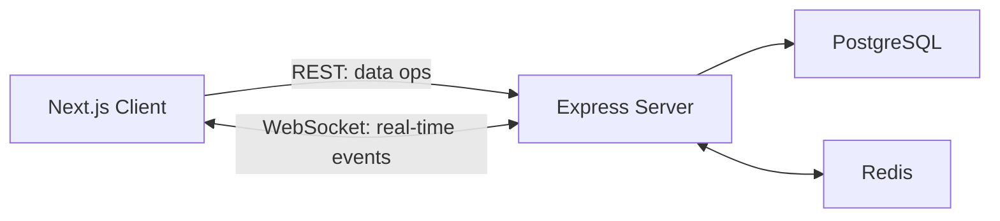

# Nexus: Data Flow

> **Last Updated:** 2026-06-09
> **Status:** Active (Phase 1 core features complete)

---

## 1. Overview

All client-server communication falls into two categories:

- **REST (HTTP):** for data operations (create, read, update, delete). Managed by TanStack Query on the client.
- **WebSocket (Socket.io):** for real-time events (new messages, presence, read receipts). Managed by the Socket.io client.

---

## 2. REST vs Socket.io Split

| Concern | Transport | Example |
|---|---|---|
| Send a message | Socket event (fallback REST) | `message:send` (`POST /messages`) |
| Fetch message history | REST GET | `GET /messages?conversationId=...` |
| Receive a new message in real-time | Socket event | `message:new` |
| Mark conversation as read | REST PATCH + Socket event | `PATCH /conversations/:id/read` → `message:read` |
| User comes online / goes offline | Socket event | `user:online`, `user:offline` |
| New conversation notification | Socket event | `conversation:new` (emitted to `user:<userId>` room) |

---

## 3. Authentication Flow

1. Client submits login/register form (or OAuth).
2. Supabase Auth returns a JWT access token stored securely via cookies.
3. Next.js Edge Middleware checks the cookie to protect client-side routes.
4. Client includes the JWT as a `Bearer` token on all API requests.
5. Express auth middleware verifies the JWT locally using cached ES256 JWKS public keys.
6. On successful verification, the server upserts the user into the Prisma `User` table to sync with Supabase Auth.

---

## 4. Send Message Flow

1. User sends a message in the UI.
2. Client generates a deterministic `tempId` (UUIDv7) and instantly updates the local cache (Optimistic UI) with `pending: true`.
3. Client emits a WebSocket event `message:send` with `{ tempId, conversationId, content }`.
4. Server socket handler receives the event, authenticates the user, and persists the message to PostgreSQL via Prisma inside a `$transaction` (also updates conversation `updatedAt`).
5. After a successful DB write, the server emits `message:new` to the Socket.io room for that conversation.
6. The server acknowledges the sender via the Socket callback, returning the official persisted message.
7. The sender's client replaces the optimistic `tempId` message with the official message (updates query cache).
8. *(Fallback)*: `POST /messages` REST endpoint also persists + broadcasts `message:new` to room.

---

## 5. Presence Flow

> ✅ Fully implemented. Redis-backed with in-memory fallback.

1. **On WebSocket connect:**
   - `presenceStore.addSocket(userId, socketId)` dual-writes to Redis (`SADD user:presence:{userId} {socketId}`) + in-memory Map
   - If this is the user's first active socket (memory Set was empty), broadcasts `user:online` to all other clients
   - Sends `presence:initial` with all online user IDs back to the connecting socket

2. **On WebSocket disconnect:**
   - `presenceStore.removeSocket(userId, socketId)` removes from Redis + in-memory Map
   - If no more sockets remain (all tabs closed), broadcasts `user:offline` to all other clients
   - Redis keys `user:presence:{userId}` and `presence:users` are cleaned up
   - Sets `user:lastSeen:{userId}` timestamp in Redis

3. **Multi-tab handling:** A user only appears offline when ALL their socket connections are closed. Each tab gets a unique socket ID stored in the Redis Set.

4. **Client side:**
   - `usePresence` hook listens for `presence:initial`, `user:online`, `user:offline`
   - Updates Zustand `chatStore.onlineUsers` (Set of string userIds)
   - `PresenceIndicator` component reads from `onlineUsers` and renders green/gray dot

---

## 6. Read Receipt Flow

1. Client calls `PATCH /api/conversations/:id/read` with `{ messageId }` when the user opens a conversation.
2. Server validates the message exists and belongs to the conversation via `getMessageById`.
3. Server updates `lastReadMessageId` on the `ConversationMember` row via Prisma.
4. Server broadcasts `message:read` to the `conversation:{id}` room so other participants can update the "seen" indicator.
5. Client-side `useConversationSocket` receives `message:read` and updates both the conversation list cache and single conversation cache in TanStack Query.

---

## 7. Room Strategy

| Room Pattern | Purpose | Example |
|---|---|---|
| `conversation:{id}` | Broadcasting messages and read receipts to participants | `conversation:abc123` |
| `user:{userId}` | Targeted server-to-client messages (e.g., new conversation notification) | `user:uuid-xyz` |

**Room joining:**
- **On connect:** Server auto-joins socket to all conversation rooms the user is a member of (queried from `ConversationMember`).
- **On new DM creation:** Server dynamically iterates active sockets and calls `socket.join()` for participants, then emits `conversation:new` to `user:<userId>` rooms.
- **Authorization:** Socket auth middleware validates JWT on handshake. Room membership is based on DB `ConversationMember` records.
