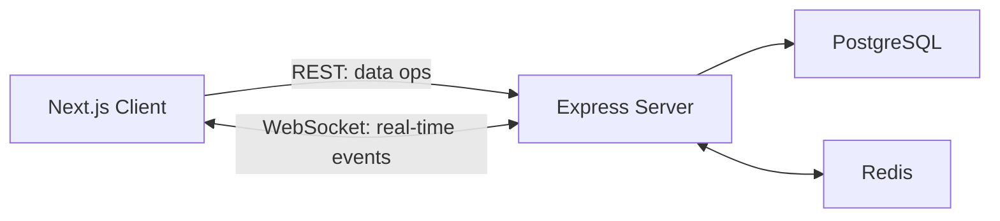

# Nexus: Data Flow

> **Last Updated:** 2026-06-11
> **Status:** Active (Phase 1 core features complete)

---

## 1. Overview

All client-server communication falls into two categories:

- **REST (HTTP):** for data operations (create, read, update, delete). Managed by TanStack Query on the client.
- **WebSocket (Socket.io):** for real-time events (new messages, presence, read receipts, conversation metadata). Managed by the Socket.io client.

---

## 2. REST vs Socket.io Split

| Concern | Transport | Example |
|---|---|---|
| Send a message | Socket event (primary) + REST fallback | `message:send` (socket) / `POST /messages` (REST) |
| Fetch message history | REST GET | `GET /messages?conversationId=...&cursor=...` |
| Receive a new message in real-time | Socket event | `message:new` |
| Edit a message | REST PATCH + Socket broadcast | `PATCH /messages/:id` → `message:update` |
| Delete a message | REST DELETE + Socket broadcast | `DELETE /messages/:id` → `message:delete` |
| Mark conversation as read | REST PATCH + Socket broadcast | `PATCH /conversations/:id/read` → `message:read` |
| User comes online / goes offline | Socket event | `user:online`, `user:offline` |
| Initial presence snapshot | Socket event | `presence:initial` (sent on connect) |
| New conversation notification | Socket event | `conversation:new` (emitted to `user:<userId>` rooms) |
| Conversation metadata update | Socket event | `conversation:update` (emitted alongside message events) |
| Resolve an invite | REST POST + Socket broadcast | `POST /invites/resolve` → domain events via socket |

---

## 3. Authentication Flow

1. Client submits login/register form (or OAuth).
2. Supabase Auth returns a JWT access token stored securely via cookies.
3. Next.js Edge Middleware checks the cookie to protect client-side routes.
4. Client includes the JWT as a `Bearer` token on all API requests and socket handshakes.
5. Express auth middleware verifies the JWT locally using cached ES256 JWKS public keys.
6. Socket auth middleware uses the same verification on connection.
7. On successful verification, the server upserts the user into the Prisma `User` table to sync with Supabase Auth.

---

## 4. Send Message Flow (Comprehensive)

1. User sends a message in the `MessageInput` UI component.
2. Client generates a deterministic `tempId` and instantly adds an optimistic message to the TanStack Query cache with `pending: true`.
3. Client emits `message:send` via Socket.io with `{ tempId, conversationId, content }`.
4. Server's `message.handler.ts` receives the event, validates auth and payload, then calls `createMessage()`.
5. `createMessage` runs a Prisma `$transaction` that atomically:
   - Creates the message record with UUIDv7 ID
   - Updates conversation `updatedAt` and `latestMessageId`
   - Updates the sender's `lastReadMessageId` on their `ConversationMember`
6. Server calls `dispatchMessageEvent("NEW", ...)` which:
   - Emits `message:new` to the conversation room (message payload)
   - Emits `conversation:update` to the conversation room (metadata)
7. Server acknowledges the sender via Socket callback with the persisted message.
8. Sender's `useMessages.ts` replaces the optimistic `tempId` message with the real message.
9. Receiver's `useConversationSocket.ts` receives `message:new` → appends to message cache.
10. Receiver's `useGlobalSocket.ts` receives `message:new` → increments unread count.
11. Receiver's `useGlobalSocket.ts` receives `conversation:update` → updates sidebar metadata and re-sorts.

---

## 5. Presence Flow

> ✅ Fully implemented. Redis-backed with in-memory fallback. See [socket.md](./socket.md#6-presence-flow) for detailed diagrams.

1. **On WebSocket connect:**
   - `presenceStore.addSocket(userId, socketId)` dual-writes to Redis + in-memory Map
   - If first active socket: broadcasts `user:online` to all other clients
   - Sends `presence:initial` with all online user IDs to the connecting socket

2. **On WebSocket disconnect:**
   - `presenceStore.removeSocket(userId, socketId)` removes from Redis + in-memory Map
   - If no more sockets remain (all tabs closed): broadcasts `user:offline` to all other clients
   - Redis keys `user:presence:{userId}` and `presence:users` are cleaned up
   - Sets `user:lastSeen:{userId}` timestamp in Redis

3. **Multi-tab handling:** A user only appears offline when ALL their socket connections are closed.

4. **Client side:**
   - `SocketProvider` listens for `presence:initial`, `user:online`, `user:offline`
   - Updates Zustand `chatStore.onlineUsers` (Set of string userIds)
   - `PresenceIndicator` component renders green/gray dot

---

## 6. Read Receipt Flow

1. Client calls `PATCH /api/conversations/:id/read` with `{ messageId }` when user opens/conversation is visible.
2. Server validates the message exists and belongs to the conversation.
3. Server updates `lastReadMessageId` on the `ConversationMember` row via Prisma.
4. Server broadcasts `message:read` to the `conversation:{id}` room.
5. Sender's client updates both the conversation list cache and single conversation cache.
6. `MessageStatus` component renders `CheckCheck` (double-check) icon for read messages.

---

## 7. Room Strategy

| Room Pattern | Purpose | Example |
|---|---|---|
| `conversation:{id}` | Broadcasting messages, read receipts, metadata updates to participants | `conversation:abc123` |
| `user:{userId}` | Targeted server-to-client notifications (new conversation, invite events) | `user:uuid-xyz` |

**Room joining:**
- **On connect:** Server auto-joins socket to all conversation rooms the user is a member of (queried from `ConversationMember`).
- **On new DM creation:** Server iterates active sockets and calls `socket.join()` for each participant, then emits `conversation:new` to `user:<userId>` rooms.
- **On invite resolution:** Server dynamically joins the accepting user's sockets to the target conversation room.

---

> **Note:** Documentation updated on 2026-06-11 to include comprehensive socket event documentation, invite system flows, and message edit/delete flows.
