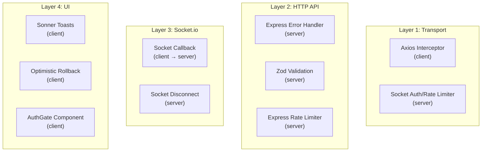
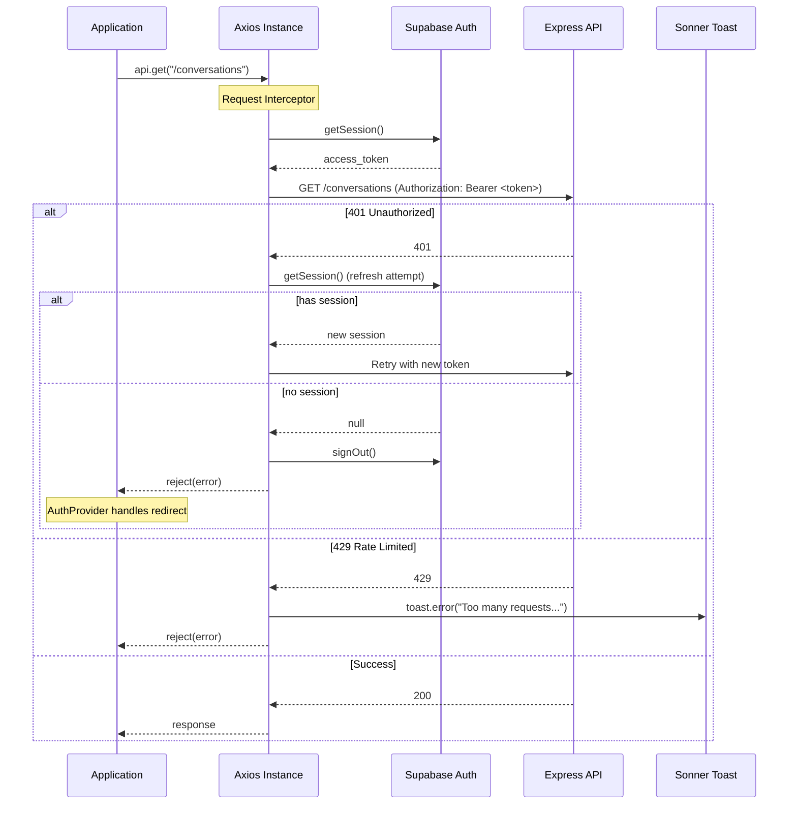

# Nexus — Error Handling Strategy

> **Last Updated:** 2026-06-11

---

## 1. Error Handling Layers

Nexus handles errors at four distinct layers:



---

## 2. Server-Side Error Handling

### 2.1 Express Global Error Handler

File: `server/src/middlewares/errorHandler.ts`

```typescript
export const errorHandler: ErrorRequestHandler = (err, req, res, next) => {
  const statusCode = err.statusCode ?? 500;
  const message = statusCode === 500 ? "Internal server error" : err.message;

  if (statusCode === 500) {
    console.error("[ERROR]", err);
  }

  res.status(statusCode).json({ error: message });
};
```

**Behavior:**
- **500 errors:** Generic message `"Internal server error"` sent to client, full error logged to console
- **Non-500 errors:** Error message sent as-is (used by controllers that throw custom errors)
- This handler is registered last in the middleware chain via `app.use(errorHandler)`

### 2.2 Zod Validation Middleware

File: `server/src/middlewares/validate.ts`

**Request validation flow:**
1. Schemas for `body`, `params`, and `query` are defined per-route
2. Middleware parses each using `zod.parse()`
3. On success: replaces the request's `body`/`params`/`query` with the parsed (and transformed) values
4. On failure (`ZodError`): returns 400 with flattened error details

**Response shape:**
```json
{
  "error": "Validation failed",
  "details": {
    "fieldErrors": {
      "content": ["Message cannot be empty"],
      "email": ["Invalid email format"]
    },
    "formErrors": []
  }
}
```

**Status:** `400 Bad Request`

**Available Zod schemas per module:**

| Module | Schema | Validates |
|---|---|---|
| Conversations | `createConversationSchema` | `targetUserId` (UUID) |
| Conversations | `markReadSchema` | `messageId` (UUID) |
| Messages | `createMessageBodySchema` | `content` (1-2000 chars, trimmed) |
| Messages | `updateMessageBodySchema` | `content` (1-2000 chars, trimmed) |
| Messages | `getMessagesQuerySchema` | `cursor` (UUID optional), `limit` (1-100, default 50) |
| Messages | `messageParamsSchema` | `conversationId` (UUID) |
| Messages | `messageIdParamsSchema` | `conversationId` + `messageId` (UUIDs) |
| Users | `searchUsersQuerySchema` | `q` (0-100 chars) |

### 2.3 Auth Middleware Errors

File: `server/src/middlewares/auth.ts`

| Condition | Status | Response |
|---|---|---|
| No `Authorization` header | 401 | `{ "error": "Missing or invalid authorization header" }` |
| Invalid or expired JWT | 401 | `{ "error": "Invalid or expired token" }` |

### 2.4 Rate Limiter Errors

File: `server/src/middlewares/rateLimiter.ts`

| Condition | Status | Response |
|---|---|---|
| General limit exceeded | 429 | `{ "error": "Too many requests. Please try again later." }` |
| Message limit exceeded | 429 | `{ "error": "You are sending messages too quickly." }` |

**Headers:** `Retry-After: <seconds>` (time until rate limit resets)

**Rate limiter types:**
- `generalLimiter` — 1000 requests / 15 min window (applied to all `/api/*` routes)
- `messageLimiter` — 20 requests / 1 min window (applied to `POST` and `PATCH` message routes)

### 2.5 Conversation Membership Error

File: `server/src/middlewares/requireConversationMember.ts`

| Condition | Status | Response |
|---|---|---|
| User not authenticated | 401 | `{ "error": "User unauthorized" }` |
| Missing parameter | 400 | `{ "error": "Missing or invalid {paramName} parameter in request" }` |
| Not a member | 403 | `{ "error": "Forbidden: You are not an authorised member of this conversation." }` |

---

## 3. Client-Side Error Handling

### 3.1 Axios Interceptor

File: `client/src/shared/lib/api.ts`



**Interceptor behavior:**

| Response | Action |
|---|---|
| **200** | Pass through |
| **401 (no session)** | Call `supabase.auth.signOut()`, reject |
| **401 (has session)** | Refresh token, retry request with new token |
| **429** | Show red toast with `AlertTriangle` icon, reject |
| **Other errors** | Reject (caller handles) |

### 3.2 Socket.io Error Handling

#### Socket Callback Pattern

File: `client/src/modules/chat/hooks/useMessages.ts`

```typescript
// Send message via socket
socket.emit("message:send", payload, (response: SocketResponse<Message>) => {
  if (response?.error) {
    // Error can be a string (rate limiter) or a structured object
    const errorMsg = typeof response.error === 'string'
      ? response.error
      : response.error.message || "Failed to send message";
    reject(new Error(errorMsg));
  } else if (response?.success && response?.data) {
    resolve(response.data);
  } else {
    reject(new Error("Unknown error"));
  }
});
```

**Socket error types:**

```typescript
// Structured error (from message.handler.ts)
interface SocketErrorObject {
  code: string;       // "UNAUTHORIZED", "INVALID_PAYLOAD", "MESSAGE_SEND_FAILED"
  message: string;
  retryable?: boolean; // true for transient errors
}

// Plain string error (from rate limiter middleware)
// "You are sending messages too quickly. Please slow down."
```

#### Socket Connection Errors

File: `client/src/shared/providers/socket-provider.tsx`

```typescript
socket.on("connect_error", (error: Error) => {
  setSocketStatus("disconnected");
  toast.error(`Connection lost: ${error.message}`);
});
```

#### Socket Auth Errors

File: `server/src/socket/middlewares/auth.ts`

```typescript
// Error codes
const SOCKET_AUTH_ERRORS = {
  TOKEN_MISSING: "TOKEN_MISSING",
  TOKEN_INVALID: "TOKEN_INVALID",
  AUTH_SERVICE_ERROR: "AUTH_SERVICE_ERROR",
};
```

| Error Code | Condition |
|---|---|
| `TOKEN_MISSING` | No token in `handshake.auth`, `headers`, or `query` |
| `TOKEN_INVALID` | JWT verification failed (invalid signature or expired) |
| `AUTH_SERVICE_ERROR` | Unexpected error during verification |

#### Socket Rate Limiter Errors

File: `server/src/socket/middlewares/rateLimiter.ts`

| Condition | Action |
|---|---|
| Rate limit exceeded (10 msg/10s) | Packet is dropped. Callback receives `{ error: "You are sending messages too quickly. Please slow down." }` |

### 3.3 Optimistic Update Rollback

File: `client/src/modules/chat/hooks/useMessages.ts`

All message mutations implement optimistic updates with rollback:

```typescript
// Pattern used by all mutations
onMutate: async (vars) => {
  await queryClient.cancelQueries({ queryKey: queryKeys.messages(conversationId) });
  const previousMessages = queryClient.getQueryData(...);
  // Apply optimistic update...
  return { previousMessages }; // Snapshot for rollback
},
onError: (err, vars, context) => {
  if (context?.previousMessages) {
    queryClient.setQueryData(queryKeys.messages(conversationId), context.previousMessages);
  }
  // Show error toast
  toast.error(errorMessage);
},
```

**Scenarios that trigger rollback:**
- Socket callback returns error (rate limited, unauthorized, invalid payload)
- Socket callback never fires (network disconnect, timeout)
- REST API returns error (4xx, 5xx)

### 3.4 Error Toast Styling

Rate limit errors get special styled toasts:

```typescript
if (errorMessage.includes("too quickly")) {
  toast.error(errorMessage, {
    style: { backgroundColor: "#ef4444", color: "white", borderColor: "#ef4444" },
    icon: <AlertTriangle color="#fde047" size={18} />,
    position: "top-right",
  });
} else {
  toast.error(errorMessage); // Default sonner styling
}
```

---

## 4. Controller-Level Error Handling

### 4.1 Conversations Controller

File: `server/src/modules/conversations/conversations.controller.ts`

| Endpoint | Error | Status | Response |
|---|---|---|---|
| `POST /conversations` | Self-DM attempt | 400 | `{ "error": "Cannot create a DM with yourself" }` |
| All endpoints | Unhandled error | 500 | `{ "error": "Internal server error" }` |

### 4.2 Messages Controller

File: `server/src/modules/messages/messages.controller.ts`

| Endpoint | Error | Status | Response |
|---|---|---|---|
| `PATCH /messages/:id` | Not message owner | 403 | `{ "error": "Forbidden" }` |
| `PATCH /messages/:id` | Message not found | 400 | `{ "error": "Message not found." }` |
| `PATCH /messages/:id` | Message deleted | 400 | `{ "error": "Cannot edit a deleted message." }` |
| `DELETE /messages/:id` | Not message owner | 403 | `{ "error": "Forbidden" }` |
| `DELETE /messages/:id` | Message not found | 400 | `{ "error": "Message not found." }` |
| `DELETE /messages/:id` | Already deleted | 400 | `{ "error": "Message is already deleted." }` |

### 4.3 Invites Controller

File: `server/src/modules/invites/invites.controller.ts`

| Endpoint | Error | Status | Response |
|---|---|---|---|
| `POST /invites/resolve` | Invalid/expired invite | 400 | `{ "error": "INVALID_OR_EXPIRED_INVITE" }` |
| `POST /invites/generate` | Conversation not found | 404 | `{ "error": "Conversation not found" }` |
| `POST /invites/generate` | Not authorized | 403 | `{ "error": "Not authorized to generate invite for this entity" }` |
| `POST /invites/generate` | Missing entityId | 400 | `{ "error": "Entity ID is required for this invite type" }` |

---

## 5. Auth Flow Error Handling

### 5.1 Auth Provider

File: `client/src/shared/providers/auth-provider.tsx`

| Supabase Event | Action |
|---|---|
| `INITIAL_SESSION` with no user | `setUser(null)`, `setInitialized(true)` — app renders unauthenticated UI |
| `SIGNED_OUT` | `setUser(null)`, `handleSignOut()`, redirect to login if on protected route |
| `SIGNED_IN` | `setUser(session.user)`, `handleSignIn()` (connects socket) |

### 5.2 AuthGate Component

File: `client/src/shared/providers/AuthGate.tsx`

| State | Rendering |
|---|---|
| Not initialized, on public route | Renders children immediately |
| Not initialized, on protected route | Shows loading spinner + "Authenticating..." |
| Initialized, no user, on protected route | Returns null (middleware handles redirect) |
| Initialized, has user | Renders children |

### 5.3 useAuth Hook Errors

File: `client/src/modules/auth/hooks/useAuth.ts`

| Operation | Error Handling |
|---|---|
| `login()` | Catches `authError`, sets `error` state with message from `err.message` |
| `register()` | Catches `authError`, sets `error` state. Handles both confirmed (has session) and unconfirmed (no session, redirects to login with `?registered=true&confirm=true`) flows. |
| `logout()` | Catches `authError`, sets `error` state. Teardown handled by AuthProvider. |

---

## 6. Error Flow Summary

| Error Type | Where Caught | User Experience |
|---|---|---|
| **Validation error** (bad input) | `validate.ts` middleware | 400 response with field-level error details |
| **Auth error** (no token) | `auth.ts` middleware | Socket: rejected with typed error code. HTTP: 401 with message. Client: axios interceptor attempts refresh, then redirects to login. |
| **Auth error** (invald token) | `auth.ts` middleware / socket middleware | Same as above |
| **Rate limited** (too fast) | `rateLimiter.ts` middleware / socket `rateLimiter.ts` | HTTP: 429 with Retry-After header. Socket: callback receives error string, dropped packet. Client: red toast with AlertTriangle icon. |
| **Not a member** | `requireConversationMember.ts` | 403 Forbidden |
| **Message not found** | Controller logic | 400 with specific message |
| **Not message owner** | Controller logic | 403 Forbidden |
| **Invalid invite** | Transaction logic | 400 with `INVALID_OR_EXPIRED_INVITE` |
| **Socket disconnect** | Socket.io client | Toast: "Connection lost: {message}" |
| **Socket send failure** | Mutation callback | Optimistic update rolled back, toast with error |
| **REST failure (non-401)** | Axios → mutation error | Optimistic update rolled back, toast with error |
| **Unexpected server error** | `errorHandler.ts` | 500 with generic message, full error logged server-side |
| **Network error** | Axios / socket auto-reconnect | TanStack Query retries (up to 2x), socket auto-reconnects |
