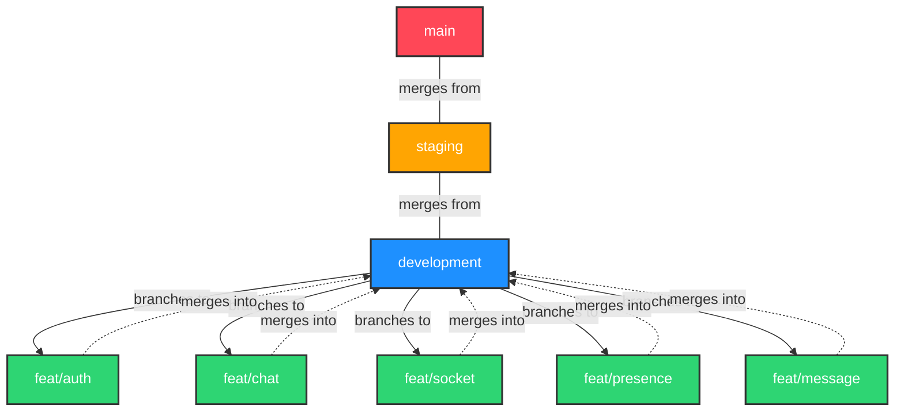
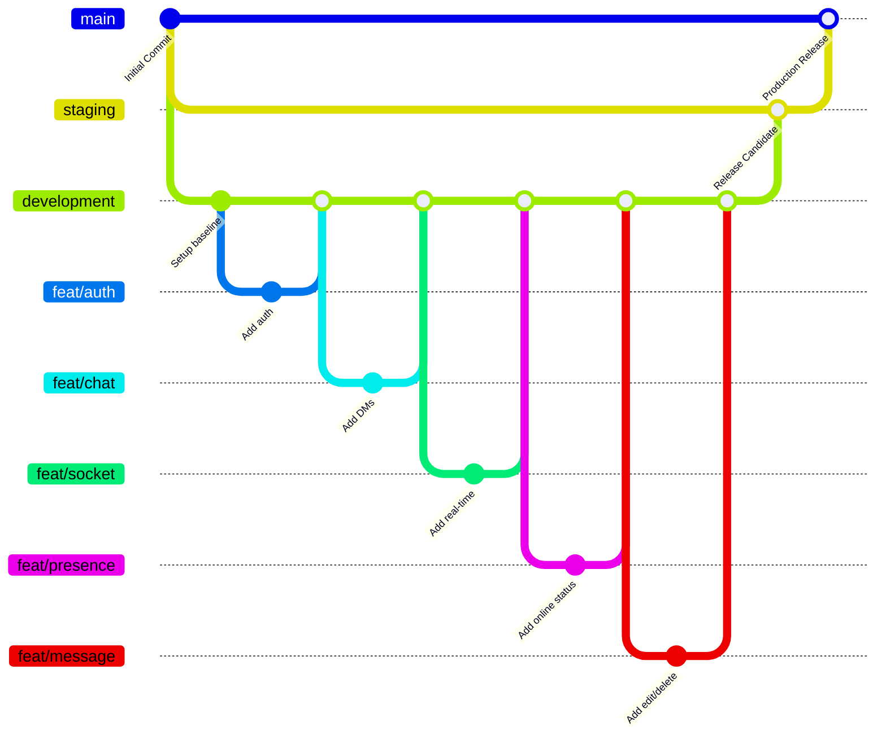

# Git Branch Structure

This document provides a visual representation of the Git branch strategy used in the Nexus repository. 

Our branch hierarchy generally flows as follows:
- **`main`**: The production-ready code.
- **`staging`**: Pre-production environment for final testing.
- **`development`**: The main integration branch for all new features.
- **`feat/*`**: Ephemeral feature branches where individual features are developed before being merged into `development`.

## Branch Relationship Flowchart

## Conceptual Git History Diagram

## Active Branches (As of June 2026)
- `main`
- `staging`
- `development` (HEAD)
- `feat/auth`
- `feat/chat`
- `feat/socket`
- `feat/presence`
- `feat/message`
