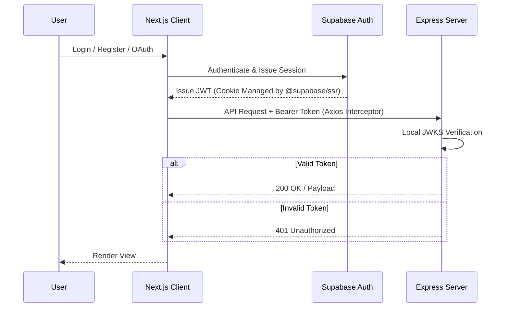
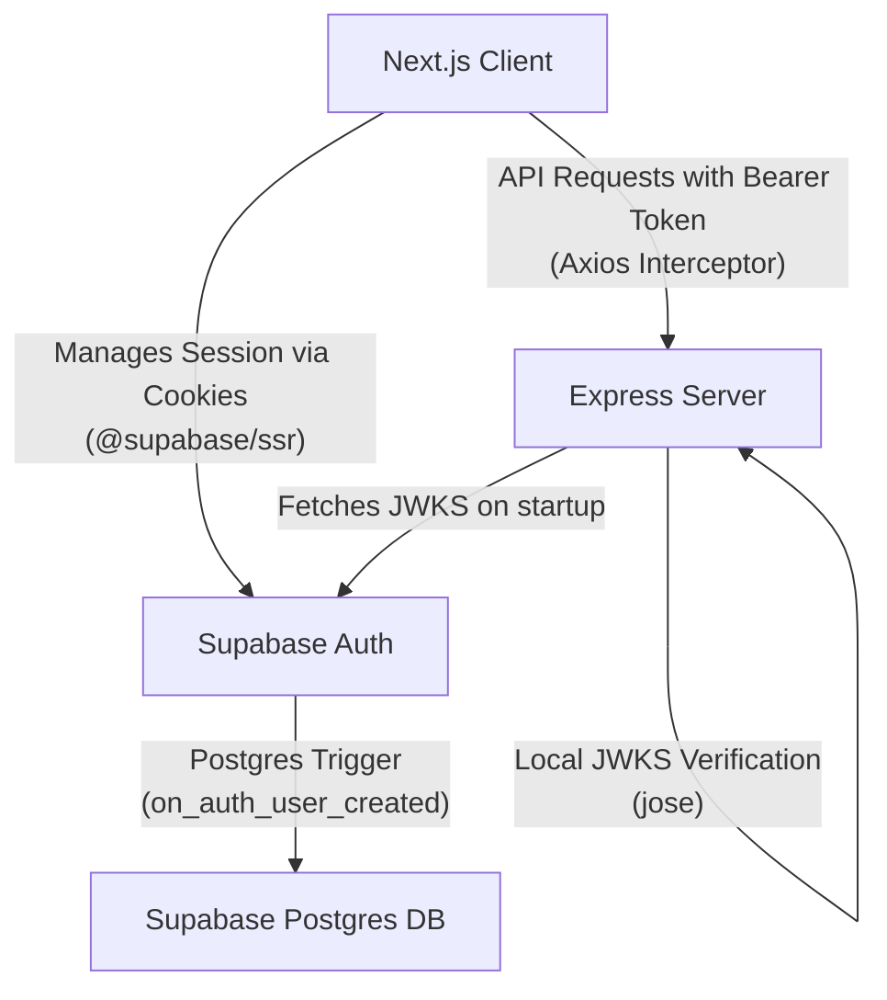
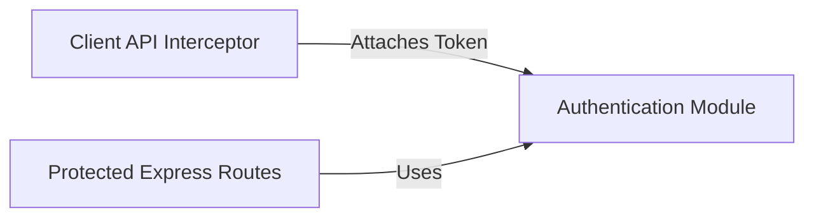

# Module: Authentication

> **Location:** `client/src/middleware.ts`, `server/src/middlewares/auth.ts`, `client/src/hooks/useAuth.ts`, `client/src/lib/api.ts`
> **Type:** Authentication Flow
> **Last Updated:** 2026-06-05
> **Status:** ✅ Active

## Purpose
Provides end-to-end identity management, session handling, and route protection. It leverages Supabase Auth for token issuance and OAuth, while using a decoupled architecture where the Next.js client handles session cookies and the Express backend cryptographically verifies them using local JWKS caching.

## Flow

## Architecture

## Key APIs
| Name | Type | Parameters | Returns | Description |
|---|---|---|---|---|
| `authMiddleware` | Express Middleware | `Request, Response, NextFunction` | `void` | Verifies JWT from header cryptographically, attaches `req.user.id`. |
| `middleware` | Next.js Edge | `NextRequest` | `NextResponse` | Protects `/conversations` routes, redirects to `/login` if no session. |
| `useAuth` | React Hook | - | `{ login, register, loginWithGithub, logout, isLoading, error }` | Manages auth state and Supabase Auth API calls. |
| `api.interceptors` | Axios Interceptor | `AxiosRequestConfig` / `AxiosResponse` | `Promise` | Injects Bearer token on requests; handles 401 globally by redirecting to `/login`. |

## Important Logic
- **Local JWKS Verification:** The Express server caches the Supabase public key set (JWKS) on startup to verify tokens cryptographically. This eliminates the need to call Supabase on every request, ensuring zero network overhead for protected routes.
- **Global API Interceptor:** Client-side Axios interceptor catches `401 Unauthorized` responses and forces a hard redirect to `/login` to clear state and caches.
- **Client-Side Auth State:** Handled by `useAuth` using `@supabase/ssr` to sign in, sign up, and sign out users.
- **Automatic User Sync:** User creation in the Prisma `User` table is handled directly by a Postgres trigger (`SUPABASE_QUERIES.sql`). When a user registers via Supabase Auth, the trigger automatically inserts their profile (including username mapped from metadata) into the public `User` table. The Express server does not need to handle DB upserts.
- **Strict Password Complexity:** Enforced via Zod schemas during registration (min 8 chars, uppercase, number, special character).

## Inputs / Props / Parameters
| Name | Type | Description |
|---|---|---|
| `Authorization` Header | Header | Bearer token sent with API requests. |
| Supabase JWT | Cookie | Session cookie managed by `@supabase/ssr`. |

## Outputs / Events / Return Values
| Name | Type | Description |
|---|---|---|
| `req.user` | Object | Decoded user payload (containing `id` as `sub`) attached to Express request object. |
| `401 Unauthorized` | HTTP Response | Returned if JWT is missing, invalid, or expired. |

## Interactions With Other Modules

## Change Log
| Date | Change |
|---|---|
| 2026-06-05 | Updated flow to reflect removed automatic Prisma DB upsert, added `useAuth` / `api` interceptor info, and improved architecture diagram layout. |
| 2026-06-05 | Standardized doc format and added Mermaid flow/architecture diagrams. |
| 2026-06-04 | Implemented ES256 JWKS local crypto and automatic user upsert (later removed). |
| 2026-06-03 | Initialized Supabase Auth integration. |
