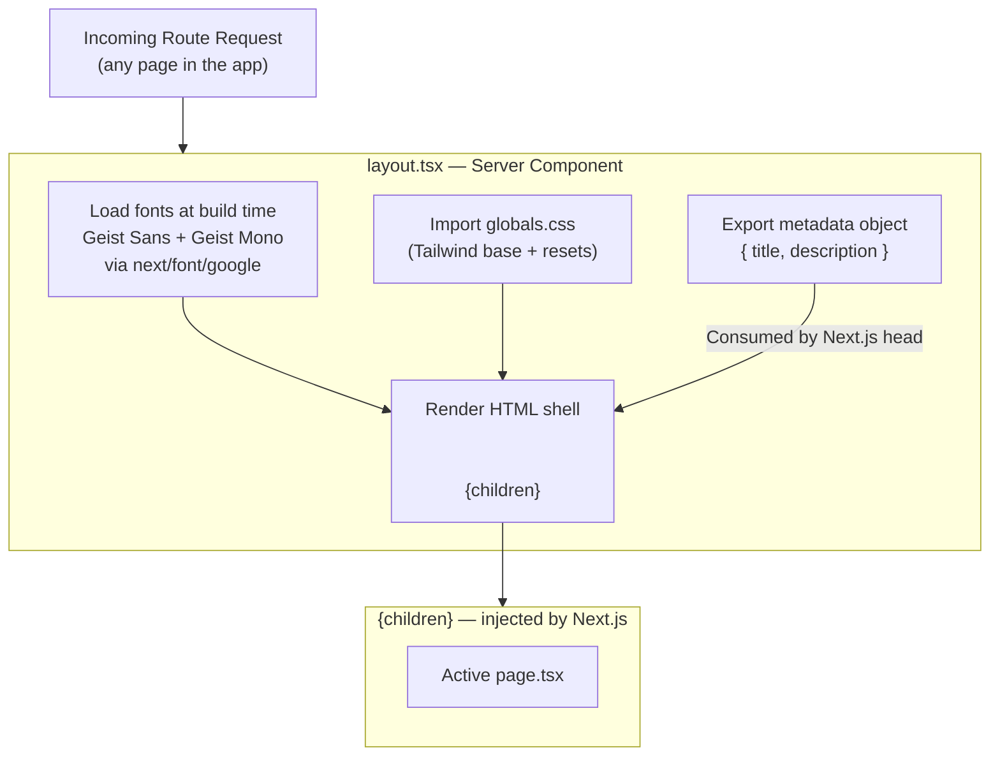
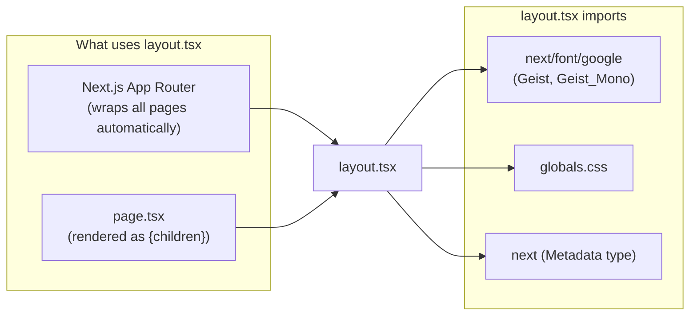

# Module: Root Layout

> **Location:** `client/src/app/layout.tsx`
> **Type:** Next.js App Router — Root Layout (React Server Component)
> **Last Updated:** 2026-06-03
> **Status:** ✅ Active

---

## Purpose

The root layout is the persistent HTML shell that wraps every page in the application. It runs once per navigation session (not re-mounted per route) and is responsible for setting up the document structure (`<html>`, `<body>`), loading the global font system via `next/font`, injecting global CSS, and exporting page-level metadata consumed by Next.js for SEO. Without this file, the app has no HTML document, no fonts, and no shared baseline styles.

---

## Flow

---

## Key APIs

### Exported Symbols

| Name | Type | Description |
|---|---|---|
| `default` (RootLayout) | React Server Component | The layout component — renders `<html>` + `<body>` shell around `{children}` |
| `metadata` | `Metadata` (Next.js) | SEO metadata object injected into `<head>` by Next.js automatically |

### Props

| Prop | Type | Required | Description |
|---|---|---|---|
| `children` | `React.ReactNode` | Yes | The active page or nested layout — injected by the Next.js router |

### Metadata Object

| Key | Current Value | Purpose |
|---|---|---|
| `title` | `"Create Next App"` *(placeholder)* | Sets `<title>` tag — will be updated to `"Nexus"` |
| `description` | `"Generated by create next app"` *(placeholder)* | Sets `<meta name="description">` for SEO |

### CSS Variables Injected

| Variable | Source Font | Used By |
|---|---|---|
| `--font-geist-sans` | Geist (Google Fonts) | Tailwind `font-sans` |
| `--font-geist-mono` | Geist Mono (Google Fonts) | Tailwind `font-mono` |

---

## Important Logic

- **`next/font` zero-CLS guarantee:** Fonts are loaded and subset at build time. The CSS variables are injected directly on the `<html>` element as a `className`, so they are available before any paint — no layout shift.
- **`h-full` on `<html>` + `min-h-full flex flex-col` on `<body>`:** This is a deliberate full-height flexbox setup so that child pages can use `flex-1` to fill the viewport vertically without needing `height: 100vh` hacks.
- **`antialiased` on `<html>`:** Applies `-webkit-font-smoothing: antialiased` globally for consistent font rendering across macOS/iOS/Linux.
- **Metadata is static here:** Because this is the root layout, the `metadata` export applies as a default to all pages. Individual pages can override `title` and `description` by exporting their own `metadata` object — Next.js merges them with root taking lower precedence.
- **This is a Server Component:** No `"use client"` directive. It cannot use hooks, browser APIs, or event handlers. Any interactivity must be in a child Client Component.

---

## Inputs / Props / Parameters

| Input | Type | Source | Notes |
|---|---|---|---|
| `children` | `React.ReactNode` | Next.js App Router | Automatically provided — the active page or nested layout |

*No environment variables, query params, or external data fetching in this module.*

---

## Outputs / Events / Return Values

| Output | Type | Description |
|---|---|---|
| JSX (`<html>…</html>`) | `React.ReactNode` | The full document shell rendered server-side |
| `metadata` export | `Metadata` | Consumed by Next.js to inject `<title>` and `<meta>` tags into `<head>` |

*No events emitted, no mutations, no side effects.*

---

## Interactions With Other Modules

---

## Change Log

| Date | Change |
|---|---|
| 2026-06-03 | Initial creation — Next.js scaffold, Geist fonts, placeholder metadata |
