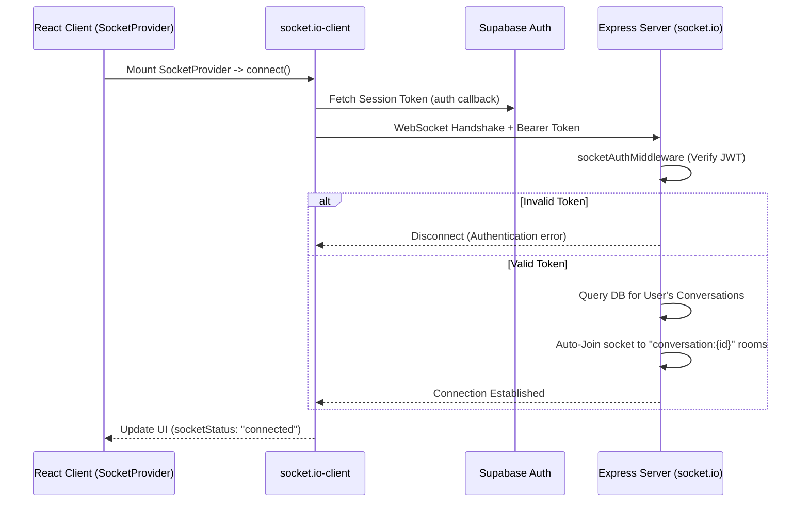
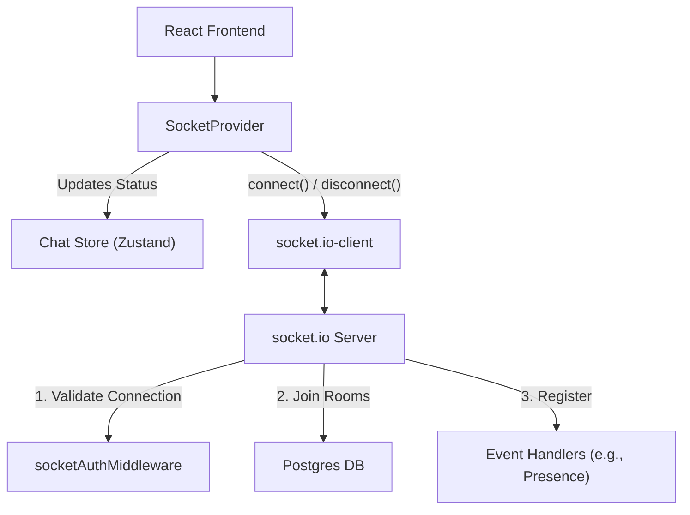

# Module: Socket (Real-time Communication)

> **Location:** `server/src/socket/`, `client/src/shared/lib/socket.ts`, `client/src/shared/providers/socket-provider.tsx`
> **Type:** Real-time Infrastructure
> **Status:** ✅ Active (Phase 1)

## Purpose
Provides the foundational WebSocket infrastructure for real-time features in Nexus, such as live messaging, typing indicators, and user presence. It leverages `socket.io` on the backend and `socket.io-client` on the frontend. The module ensures secure, authenticated connections and handles automatic room assignments for direct messages.

## Flow

## Architecture

## Key Components

### Backend (`server/src/socket/`)
- **`socket.ts`**: The entry point for the Socket.io server. Handles CORS configuration, registers middlewares, and sets up the root `connection` listener. It also manages the logic to automatically join clients into their respective conversation rooms based on DB memberships.
- **`middlewares/auth.ts` (`socketAuthMiddleware`)**: Intercepts the handshake, extracts the JWT from `auth.token` or headers, and cryptographically verifies it using the same logic as the REST API. Attaches the decoded user to `socket.data.user`.
- **`handlers/message.handler.ts`**: Listens for the `message:send` event from clients. Persists messages to the database, broadcasts the `message:new` event to conversation rooms, and acknowledges the sender with the official message to replace their optimistic `tempId`.
- **`handlers/presence.handler.ts`**: Skeleton structure for handling user presence events (online/offline status). Currently logs disconnects, built to be expanded with Redis integration.

### Frontend
- **`shared/lib/socket.ts`**: Configures the `socket.io-client` instance. It is instantiated with `autoConnect: false` to allow controlled mounting. It includes an async `auth` callback that securely retrieves the latest Supabase session token before attempting connection.
- **`shared/providers/socket-provider.tsx`**: A logic-only React component that manages the connection lifecycle. It calls `socket.connect()` on mount and listens for `connect`, `disconnect`, and `connect_error` events to sync the connection state to the global store. It wraps the protected routes.
- **`modules/chat/store/chatStore.ts`**: A Zustand store tracking the `socketStatus` (`connecting`, `connected`, `disconnected`), ensuring the UI can reflect the real-time connectivity status to the user.
- **`modules/chat/hooks/useMessages.ts`**: Hook used to emit `MESSAGE_SEND` events to the server when a user sends a message.
- **`modules/chat/hooks/useConversationSocket.ts`**: Hook used inside the chat interface to listen to `MESSAGE_NEW` events and dynamically update the message list.
- **`modules/auth/hooks/useAuth.ts`**: Handles calling `socket.disconnect()` upon user logout.

## Important Logic
- **Authentication via Handshake**: Socket connections are strictly authenticated. The frontend dynamically fetches the current Supabase token via the `auth` property in the socket options. The backend verifies this token before allowing the connection.
- **Auto-Join Rooms**: Upon a successful connection, the backend queries Prisma for all `ConversationMember` records associated with the user. The socket is then automatically joined to a room for each conversation (format: `conversation:{id}`). This allows targeted broadcasting of messages directly to active participants of a DM without manual room management on the client.
- **Global UI State**: The `SocketProvider` acts as the bridge between the persistent socket instance and the React component tree, updating a lightweight Zustand store so any component can render online/offline indicators.

## Future Upgrades
- **Typing Indicators**: Ephemeral events broadcasted to specific rooms to show "User is typing..." states.
