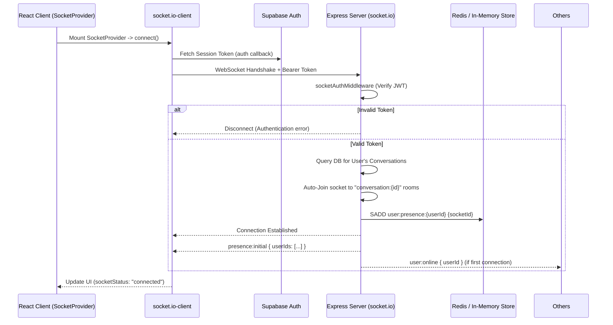
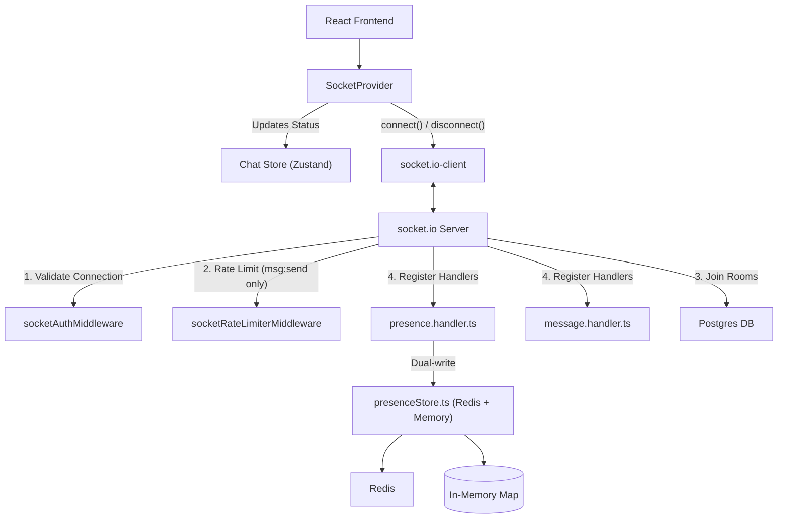

# Module: Socket (Real-time Communication)

> **Location:** `server/src/socket/`, `client/src/shared/lib/socket.ts`, `client/src/shared/providers/socket-provider.tsx`
> **Type:** Real-time Infrastructure
> **Status:** ✅ Active (Phase 1 complete)

## Purpose
Provides the foundational WebSocket infrastructure for real-time features in Nexus, such as live messaging, presence tracking, and read receipts. It leverages `socket.io` on the backend and `socket.io-client` on the frontend. The module ensures secure, authenticated connections and handles automatic room assignments for direct messages. Presence is backed by Redis with an in-memory fallback.

## Flow

## Architecture

## Key Components

### Backend (`server/src/socket/`)
- **`socket.ts`**: The entry point for the Socket.io server. Handles CORS configuration, registers middlewares (`socketAuthMiddleware`), and sets up the root `connection` listener. On connect: validates JWT, auto-joins user to `user:<userId>` room + all conversation rooms, registers presence and message handlers.
- **`middlewares/auth.ts` (`socketAuthMiddleware`)**: Intercepts the handshake, extracts the JWT from `auth.token` or headers/query, and cryptographically verifies it using the same ES256 JWKS logic as the REST API. Attaches the decoded user to `socket.data.user`.
- **`middlewares/rateLimiter.ts`**: Per-socket middleware that only applies to `message:send` events. Window: 10 seconds, Limit: 10 messages. Drops the packet and calls callback with error on breach.
- **`handlers/message.handler.ts`**: Listens for `message:send` events. Validates payload, persists message to DB via `createMessage` service, broadcasts `message:new` to the conversation room, and acknowledges the sender.
- **`handlers/presence.handler.ts`**: Wired and fully functional. On connect: calls `presenceStore.addSocket()` and broadcasts `user:online` if first connection. On disconnect: calls `presenceStore.removeSocket()` and broadcasts `user:offline` if last connection. Sends `presence:initial` snapshot to connecting socket.
- **`presenceStore.ts`**: Singleton store with dual-write to Redis (via `redis` npm client) and in-memory `Map<userId, Set<socketId>>`. Reads prefer Redis, fall back to memory. Handles multi-tab correctly: user only goes offline when ALL sockets disconnect.

### Frontend
- **`shared/lib/socket.ts`**: Configures the `socket.io-client` singleton with `autoConnect: false`. Includes an async `auth` callback that fetches the latest Supabase session token.
- **`shared/providers/socket-provider.tsx`**: Manages the connection lifecycle. Calls `socket.connect()` on mount, listens for `connect`/`disconnect`/`connect_error`, syncs status to Zustand store.
- **`modules/chat/store/chatStore.ts`**: Zustand store tracking `socketStatus` (`connecting`, `connected`, `disconnected`), `onlineUsers` (Set of userIds), `activeConversationId`, and per-conversation `drafts`.
- **`modules/chat/hooks/useMessages.ts`**: Emits `MESSAGE_SEND` events with optimistic UI updates (tempId, pending state). Handles success (swap tempId for real message) and error (rollback + toast).
- **`modules/chat/hooks/useConversationSocket.ts`**: Listens for `MESSAGE_NEW` and `MESSAGE_READ` events scoped to a specific conversation. Injects into TanStack Query cache.
- **`modules/chat/hooks/useGlobalSocket.ts`**: Mounted in sidebar. Listens for `MESSAGE_NEW`, `MESSAGE_READ`, and `CONVERSATION_NEW` events globally. Updates sidebar ordering and unread badges.
- **`modules/users/hooks/usePresence.ts`**: Listens for `presence:initial`, `user:online`, `user:offline`. Updates `chatStore.onlineUsers`.

## Event Contract

### Client → Server
| Event | Payload | Description |
|---|---|---|
| `message:send` | `{ tempId, conversationId, content }` | Send a new message (expects callback ack) |

### Server → Client
| Event | Payload | Description |
|---|---|---|
| `message:new` | `Message` object | New message broadcast to conversation room |
| `message:read` | `{ conversationId, userId, lastReadMessageId }` | Read receipt broadcast to conversation room |
| `user:online` | `{ userId }` | User came online (broadcast, not self) |
| `user:offline` | `{ userId }` | User went offline (broadcast, not self) |
| `presence:initial` | `{ userIds: string[] }` | Initial snapshot of online users (sent to connecting socket) |
| `conversation:new` | `Conversation` object | New conversation notification (sent to `user:<userId>` room) |

## Important Logic
- **Authentication via Handshake**: Socket connections are strictly authenticated. The frontend fetches the current Supabase token via the `auth` property in socket options. The backend verifies this before allowing the connection.
- **Auto-Join Rooms**: On successful connection, the backend queries Prisma for all `ConversationMember` records and auto-joins the socket to `conversation:{id}` rooms.
- **Dynamic Room Joining**: When a new DM is created, the server iterates `io.sockets.sockets` to find and join participants' sockets to the new room, then emits `conversation:new` to each `user:<userId>` room.
- **Presence Dual-Write**: Every addSocket/removeSocket operation writes to both Redis and in-memory Map, ensuring the in-memory fallback is always consistent.
- **Rate Limiting**: Socket-level rate limiter per user per socket, 10 messages per 10 second window. Returns error via callback on rate limit breach.
- **Error Handling**: Structured error objects `{ success: false, error: { code, message, retryable } }` returned via callback for message send failures.

## Future Upgrades
- **Typing Indicators**: `typing:start` / `typing:stop` events reserved in the event contract but not yet implemented.
- **Redis Pub/Sub Adapter**: For horizontal scaling of Socket.io across multiple server instances.
