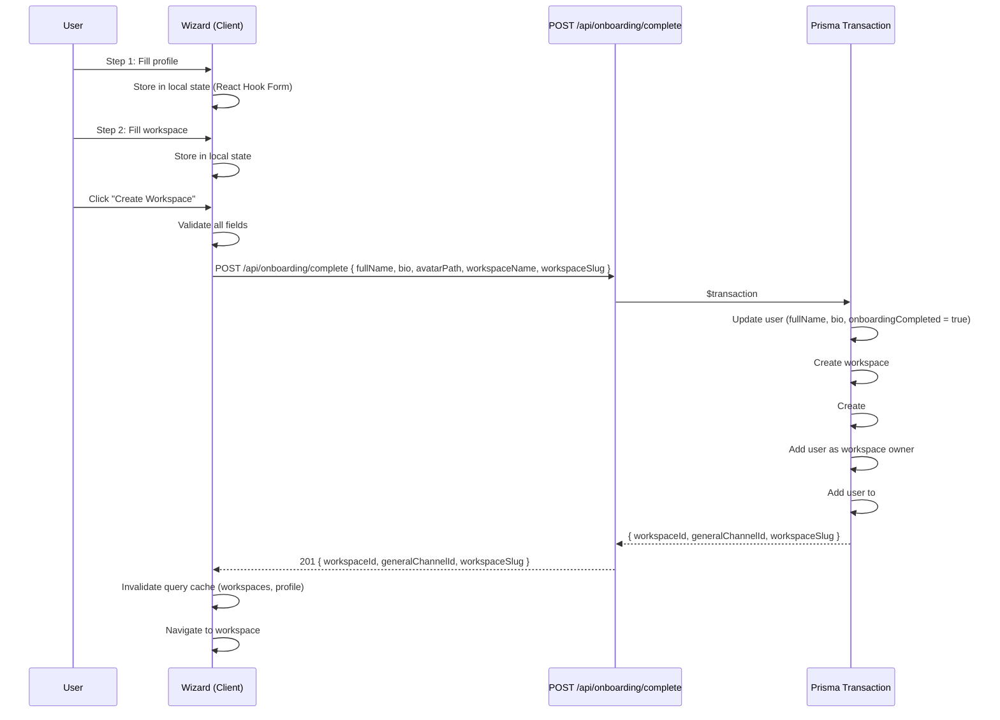

# Global Loading, Error Pages & Onboarding Flow — Implementation Plan

> **Status:** Revised Plan (v2)
> **Last Updated:** 2026-06-16
> **Covers:** Global `loading.tsx` · Global `error.tsx` · Onboarding wizard for new users
> **Prerequisites:** Auth module complete. Workspace module complete (CRUD, channels). Profiles module complete.
> **Revision Note:** This v2 plan incorporates 10 architectural corrections from a thorough code review.
> See [Architectural Decisions & Rationale](#10-architectural-decisions--rationale) for what changed and why.

---

## Table of Contents

1. [Current State Assessment](#1-current-state-assessment)
2. [Architecture Decisions](#2-architecture-decisions)
3. [Global Loading Pages](#3-global-loading-pages)
4. [Global Error Pages](#4-global-error-pages)
5. [Onboarding Flow](#5-onboarding-flow)
6. [Implementation Order](#6-implementation-order)
7. [File Changes Summary](#7-file-changes-summary)
8. [Edge Cases & Risks](#8-edge-cases--risks)
9. [Design Guidelines](#9-design-guidelines)
10. [Architectural Decisions & Rationale](#10-architectural-decisions--rationale)

---

## 1. Current State Assessment

### What Exists Today

| Asset | Location | Status |
|---|---|---|
| Root layout | `client/src/app/layout.tsx` | ✅ Root providers + HTML shell |
| `(auth)` layout | `client/src/app/(auth)/layout.tsx` | ✅ Auth sidebar + form area |
| `(protected)` layout | `client/src/app/(protected)/layout.tsx` | ✅ SocketProvider + AppLayoutShell |
| `not-found.tsx` | `client/src/app/not-found.tsx` | ✅ 404 page (styled with brand colors) |
| AuthGate loading state | `client/src/shared/providers/AuthGate.tsx` | ✅ Inline spinner + "Authenticating..." text |
| EmptyStateSkeleton | `client/src/modules/conversations/components/EmptyStateSkeleton.tsx` | ✅ Basic skeleton for empty state |
| `AppLayoutShell` | `client/src/shared/components/layout/AppLayoutShell.tsx` | ✅ Main app shell with header, sidebar, modals |
| `onboardUserToWorkspaceInTransaction` | `server/src/modules/workspaces/workspaces.repository.ts` | ✅ Server-side onboarding transaction helper |

### What's Missing

| Asset | Impact |
|---|---|
| **No `loading.tsx` anywhere** | Users see blank screens or flash of unstyled content during page transitions |
| **No `error.tsx` anywhere** | Runtime errors cause white screens or unhandled React error boundaries |
| **No onboarding flow** | New users land on empty `/conversations` with no guidance — no workspace creation prompt, no profile setup |
| **No global error boundary** | Uncaught errors bubble up to React's default error overlay (dev) or blank page (prod) |
| **No suspended loading states** | `Suspense` is only used in `login/page.tsx` wrapping `LoginForm` — nowhere else |
| **No `onboardingCompleted` on User model** | Cannot deterministically track onboarding completion |

### Key Observations

1. **AuthGate already handles initialization loading** — spinner + "Authenticating..." on first load. This is a good starting point but lives in a client component, not a Next.js `loading.tsx`.

2. **No route-based loading boundaries** — Next.js supports `loading.tsx` at every route segment level, but none are used. This means all pages must manage their own loading state via `isLoading` checks.

3. **Error states are handled inline** — Every page/component has its own `if (error)` or `if (isError)` handling. There's no centralized error boundary.

4. **After registration, user lands on `/conversations`** — The `auth-provider.tsx` redirects `SIGNED_IN` → `/conversations`. For brand new users with no conversations, workspaces, or profile data, this is a dead end.

5. **Server-side onboarding exists** — `onboardUserToWorkspaceInTransaction` already handles adding a user to a workspace's `#general` channel. This needs a client-facing onboarding flow and a transactional completion endpoint.

---

## 2. Architecture Decisions

### 2.1 Route Segment Design

Next.js supports `loading.tsx` and `error.tsx` at every route segment level. The hierarchy is:

```
app/
├── loading.tsx          ← Root loading (simple — rarely visible)
├── error.tsx            ← Root error boundary (catches unhandled errors)
├── not-found.tsx         ← 404 page (existing)
│
├── (auth)/
│   ├── layout.tsx        ← Auth layout (existing)
│   ├── loading.tsx       ← Auth loading (minimal, shown during auth page transitions)
│   └── error.tsx         ← Auth error boundary
│
├── (protected)/
│   ├── layout.tsx        ← Protected layout with AppLayoutShell (existing — needs Suspense wrapper)
│   ├── loading.tsx       ← Protected loading (wrapped in Suspense inside layout)
│   └── error.tsx         ← Protected error boundary (shown inside AppLayoutShell)
│   │
│   ├── onboarding/       ← NEW: Inside (protected) to reuse AuthGate
│   │   ├── layout.tsx    ← Minimal layout (no sidebar, just header + progress)
│   │   ├── page.tsx      ← Onboarding wizard (client component)
│   │   ├── loading.tsx   ← Onboarding loading skeleton
│   │   └── error.tsx     ← Onboarding error boundary
│   │
│   └── settings/
│       ├── loading.tsx   ← Settings-specific loading skeleton
│       └── error.tsx     ← Settings-specific error boundary
```

**Key decisions:**
- **`loading.tsx` and `error.tsx` at route group level** — best balance of coverage vs. granularity.
- **Onboarding inside `(protected)`** — reuses AuthGate, authenticated user state, prevents anonymous access.
- **Suspense in protected layout** — Without `<Suspense fallback={...}>` inside the layout, the `loading.tsx` may not render as expected. The protected layout must explicitly wrap children in a Suspense boundary.

### 2.2 Loading UX Strategy

| Level | Component | Behavior | Visibility |
|---|---|---|---|
| **Root (`app/`)** | Simple centered spinner | Shown during initial route suspense/streaming | **Rarely visible** — don't invest in elaborate animations |
| **Auth (`(auth)/`)** | Minimal skeleton (sidebar + form placeholder) | Shown during auth page transitions | Occasional |
| **Protected (`(protected)/`)** | Content-area spinner | **Must be wrapped in `<Suspense>` inside the layout** | Common on slow navigation |
| **Settings** | Settings page skeleton | Shown during settings page loads | Occasional |
| **Onboarding** | Minimal skeleton with progress bar | Shown during onboarding load | Rare (one-time) |

### 2.3 Error UX Strategy

| Level | Component | Recovery Actions |
|---|---|---|
| **Root (`app/`)** | Full-screen error with multiple recovery options | **Try Again** · **Go Home** · **Reload Page** |
| **Auth (`(auth)/`)** | Auth-styled error card | **Try Again** · **Back to Login** |
| **Protected (`(protected)/`)** | In-app error card with retry + navigation | **Try Again** · **Go Home** |
| **Settings** | Settings-specific error card | **Retry** |
| **Onboarding** | Onboarding-styled error card | **Try Again** · **Skip to Home** |

Every error page includes navigation recovery options because `reset()` cannot recover from all failures — sometimes only a hard navigation or page reload works.

### 2.4 Onboarding Detection

**Source of truth:** `User.onboardingCompleted` boolean on the Prisma `User` model.

```prisma
model User {
  // ... existing fields
  
  onboardingCompleted Boolean @default(false)
}
```

Alternative (timestamp-based):

```prisma
model User {
  // ... existing fields
  
  onboardingCompletedAt DateTime?
}
```

**Detection logic** (in `AuthGate.tsx` or a dedicated hook):

```typescript
function shouldOnboard(user: User): boolean {
  // Single deterministic check
  return !user.onboardingCompleted;
}
```

**Why not heuristics (`!hasWorkspaces && !hasProfile`):**
- User intentionally deletes all workspaces → shows onboarding again
- User joins via invite and never fills profile → shows onboarding again
- Workspace migration bug → false positive
- Imported users → false positive

A single boolean field avoids all these edge cases.

**Why not localStorage:**
- User switches devices → onboarding shows again
- User clears storage → onboarding shows again
- Difficult to query/administer
- Mobile app/web mismatch later

### 2.5 Onboarding Simplified (MVP)

```
Step 1: Set up your profile    (full name, bio, avatar — username from auth)
Step 2: Create your workspace  (name, slug — required, no skip)
Step 3: Done! 🎉               (redirect to workspace #general)
```

**Removed from MVP:**
- ~~Invite teammates step~~ (invite flow exists elsewhere; adds API complexity; users often skip; friction during first-time activation)
- ~~Tour step~~ (post-MVP)
- ~~Join existing workspace branch~~ (post-MVP)
- ~~Username availability checks~~ (post-MVP)
- ~~Complex resume-progress logic~~ (post-MVP)

### 2.6 Workspace Creation Required (No "Skip")

For MVP, workspace creation is **required** during onboarding. Users cannot skip it.

**Rationale:** Nexus is workspace-centric. Without a workspace, the user has almost nothing to do. "Skip" creates a dead end.

**Default behavior:**
- Auto-generate workspace name from user's name: `"{Full Name}'s Workspace"`
- One-click creation: `[Create Workspace]`
- Creates `#general` channel automatically

This dramatically increases activation by reducing the shortest successful path to:

```
Register → Create workspace → Start using product
```

### 2.7 Transactional Onboarding Completion

**Do NOT make individual API calls per step.** Use a single transactional endpoint.

```http
POST /api/onboarding/complete
```

Payload:

```json
{
  "fullName": "Jane Doe",
  "bio": "Engineer at Acme",
  "avatarPath": "users/uuid/avatar.jpg",
  "workspaceName": "Jane's Workspace",
  "workspaceSlug": "janes-workspace"
}
```

Server transaction (single atomic operation):

```
prisma.$transaction(async (tx) => {
  1. Update user profile (fullName, bio)
  2. Create workspace with owner membership
  3. Create #general channel
  4. Add user to #general
  5. Set onboardingCompleted = true
})
```

**Benefits:**
- One rollback point
- No partially-completed onboarding states
- Much easier to reason about and debug
- The client sends all data at once after collecting it locally

### 2.8 State Management for Wizard

**Do NOT store all wizard state in global Zustand.** Use a lighter approach:

```
React Hook Form          → step-local form state (profile fields, workspace fields)
URL step parameter       → current step (survives refreshes)
Minimal Zustand/state    → createdWorkspaceId (set after API response)
```

**Step as URL parameter:**

```txt
/(protected)/onboarding        → step 1 (profile)
/(protected)/onboarding?step=2 → step 2 (workspace)
/(protected)/onboarding?step=3 → step 3 (done)
```

This survives page refreshes automatically with zero extra code.

**Form state:**
- Step 1 profile fields → local React Hook Form (or simple `useState`)
- Step 2 workspace fields → local React Hook Form (or simple `useState`)
- On "Finish" → collect all local state → send to `POST /api/onboarding/complete`

---

## 3. Global Loading Pages

### 3.1 Root Loading (`app/loading.tsx`)

**Note:** This will rarely appear in practice — `app/loading.tsx` primarily shows during route segment suspension/streaming, not during initial JS evaluation. Keep it simple.

```tsx
// app/loading.tsx
// Simple centered spinner — keep minimal since this is rarely visible

export default function RootLoading() {
  return (
    <div className="min-h-dvh bg-background flex items-center justify-center">
      <div className="flex flex-col items-center gap-3">
        <div className="w-8 h-8 rounded-full border-2 border-border border-t-brand animate-spin" />
        <p className="text-sm text-muted-foreground">Loading Nexus</p>
      </div>
    </div>
  );
}
```

### 3.2 Auth Loading (`app/(auth)/loading.tsx`)

```tsx
// app/(auth)/loading.tsx
// Minimal skeleton matching the auth layout structure

export default function AuthLoading() {
  return (
    <div className="flex min-h-dvh bg-white dark:bg-zinc-950 overflow-hidden">
      {/* Auth sidebar skeleton */}
      <div className="hidden lg:flex w-[480px] bg-zinc-900 flex-col justify-between p-12">
        <div className="space-y-6">
          <div className="w-10 h-10 rounded-lg bg-zinc-700 animate-pulse" />
          <div className="space-y-3">
            <div className="h-8 w-48 bg-zinc-700 animate-pulse rounded" />
            <div className="h-4 w-64 bg-zinc-800 animate-pulse rounded" />
          </div>
        </div>
        <div className="h-4 w-36 bg-zinc-800 animate-pulse rounded" />
      </div>

      {/* Form area skeleton */}
      <div className="flex-1 flex flex-col items-center justify-center p-4 sm:p-8">
        <div className="w-full max-w-[400px] space-y-6 animate-in fade-in">
          <div className="space-y-4">
            <div className="h-8 w-32 bg-muted animate-pulse rounded mx-auto" />
            <div className="space-y-3">
              <div className="h-10 w-full bg-muted animate-pulse rounded-lg" />
              <div className="h-10 w-full bg-muted animate-pulse rounded-lg" />
              <div className="h-10 w-full bg-muted animate-pulse rounded-lg" />
            </div>
            <div className="h-10 w-full bg-muted animate-pulse rounded-lg" />
          </div>
        </div>
      </div>
    </div>
  );
}
```

### 3.3 Protected Loading (`app/(protected)/loading.tsx`)

**⚠️ Important:** This loading state will NOT automatically render inside `AppLayoutShell`. Next.js `loading.tsx` works via Suspense boundaries. The protected layout must explicitly wrap children:

```tsx
// app/(protected)/layout.tsx (MODIFIED)
import { Suspense } from 'react';
import { SocketProvider } from "@/socket/socketProvider";
import { AppLayoutShell } from "@/shared/components/layout/AppLayoutShell";
import ProtectedLoading from './loading';

export default function ProtectedLayout({
  children,
  modal,
}: {
  children: React.ReactNode;
  modal: React.ReactNode;
}) {
  return (
    <>
      <SocketProvider />
      <AppLayoutShell>
        <Suspense fallback={<ProtectedLoading />}>
          {children}
        </Suspense>
      </AppLayoutShell>
      {modal}
    </>
  );
}
```

```tsx
// app/(protected)/loading.tsx
// Loading state shown inside AppLayoutShell via Suspense

export default function ProtectedLoading() {
  return (
    <div className="flex-1 flex items-center justify-center p-8">
      <div className="flex flex-col items-center gap-4">
        <div className="w-10 h-10 rounded-full border-[3px] border-border/50 border-t-brand animate-spin" />
        <p className="text-sm text-muted-foreground animate-pulse">Loading content...</p>
      </div>
    </div>
  );
}
```

### 3.4 Settings Loading (`app/(protected)/settings/loading.tsx`)

```tsx
// app/(protected)/settings/loading.tsx

export default function SettingsLoading() {
  return (
    <div className="flex-1 flex h-full">
      <aside className="w-64 border-r p-4 space-y-2 hidden md:block">
        {[1, 2, 3, 4, 5].map((i) => (
          <div key={i} className="h-9 bg-muted animate-pulse rounded-md" />
        ))}
      </aside>

      <div className="flex-1 p-6 space-y-6">
        <div className="h-8 w-48 bg-muted animate-pulse rounded" />
        <div className="space-y-4">
          <div className="h-12 w-full bg-muted animate-pulse rounded-lg" />
          <div className="h-12 w-full bg-muted animate-pulse rounded-lg" />
          <div className="h-32 w-full bg-muted animate-pulse rounded-lg" />
        </div>
      </div>
    </div>
  );
}
```

### 3.5 Onboarding Loading (`app/(protected)/onboarding/loading.tsx`)

```tsx
// app/(protected)/onboarding/loading.tsx

export default function OnboardingLoading() {
  return (
    <div className="flex-1 flex items-center justify-center p-8">
      <div className="flex flex-col items-center gap-4">
        <div className="w-8 h-8 rounded-full border-2 border-border border-t-brand animate-spin" />
        <p className="text-sm text-muted-foreground">Loading onboarding...</p>
      </div>
    </div>
  );
}
```

---

## 4. Global Error Pages

### 4.1 Root Error (`app/error.tsx`)

Includes multiple recovery options because `reset()` alone cannot recover from all failures.

```tsx
// app/error.tsx
'use client';

import { useEffect } from 'react';
import { AlertTriangle, RefreshCw, Home, RotateCcw } from 'lucide-react';
import Link from 'next/link';

export default function RootError({
  error,
  reset,
}: {
  error: Error & { digest?: string };
  reset: () => void;
}) {
  useEffect(() => {
    console.error('Root error:', error);
  }, [error]);

  return (
    <div className="min-h-dvh bg-background flex flex-col items-center justify-center p-4">
      <div className="max-w-md w-full text-center space-y-8">
        <div className="relative mx-auto w-20 h-20 flex items-center justify-center">
          <div className="absolute inset-0 bg-destructive/20 rounded-full animate-pulse blur-xl" />
          <AlertTriangle className="w-12 h-12 text-destructive relative z-10" />
        </div>

        <div className="space-y-2">
          <h1 className="text-2xl font-bold text-foreground">Something went wrong</h1>
          <p className="text-muted-foreground text-sm">
            An unexpected error occurred. Our team has been notified.
          </p>
          {error.digest && (
            <p className="text-xs text-muted-foreground/50 font-mono mt-2">
              Error ID: {error.digest}
            </p>
          )}
        </div>

        <div className="flex flex-col sm:flex-row gap-3 justify-center">
          <button
            onClick={reset}
            className="inline-flex items-center justify-center h-10 px-6 rounded-md bg-brand text-brand-foreground hover:bg-brand/90 text-sm font-medium shadow transition-colors gap-2"
          >
            <RefreshCw className="w-4 h-4" />
            Try Again
          </button>
          <Link
            href="/"
            className="inline-flex items-center justify-center h-10 px-6 rounded-md border border-border hover:bg-muted text-sm font-medium transition-colors gap-2"
          >
            <Home className="w-4 h-4" />
            Go Home
          </Link>
          <button
            onClick={() => window.location.reload()}
            className="inline-flex items-center justify-center h-10 px-6 rounded-md border border-border hover:bg-muted text-sm font-medium transition-colors gap-2"
          >
            <RotateCcw className="w-4 h-4" />
            Reload Page
          </button>
        </div>
      </div>
    </div>
  );
}
```

### 4.2 Auth Error (`app/(auth)/error.tsx`)

```tsx
// app/(auth)/error.tsx
'use client';

import { AlertCircle, RefreshCw } from 'lucide-react';
import Link from 'next/link';
import { APP_ROUTES } from '@/config/url';

export default function AuthError({
  error,
  reset,
}: {
  error: Error & { digest?: string };
  reset: () => void;
}) {
  return (
    <div className="flex-1 flex flex-col items-center justify-center p-8">
      <div className="max-w-sm w-full bg-card border rounded-xl p-8 text-center space-y-4 shadow-sm">
        <div className="w-12 h-12 rounded-full bg-destructive/10 flex items-center justify-center mx-auto">
          <AlertCircle className="h-6 w-6 text-destructive" />
        </div>
        
        <div className="space-y-1">
          <h2 className="text-lg font-semibold text-foreground">Authentication Error</h2>
          <p className="text-sm text-muted-foreground">
            {error.message || 'An error occurred during authentication.'}
          </p>
        </div>

        <div className="flex flex-col gap-2 pt-2">
          <button
            onClick={reset}
            className="w-full h-9 rounded-md bg-brand text-brand-foreground hover:bg-brand/90 text-sm font-medium transition-colors gap-2 inline-flex items-center justify-center"
          >
            <RefreshCw className="w-4 h-4" />
            Try Again
          </button>
          <Link
            href={APP_ROUTES.AUTH.LOGIN}
            className="w-full h-9 rounded-md border border-border hover:bg-muted text-sm font-medium transition-colors inline-flex items-center justify-center"
          >
            Back to Login
          </Link>
        </div>
      </div>
    </div>
  );
}
```

### 4.3 Protected Error (`app/(protected)/error.tsx`)

```tsx
// app/(protected)/error.tsx
'use client';

import { useEffect } from 'react';
import { AlertTriangle, RefreshCw, Home, RotateCcw } from 'lucide-react';
import Link from 'next/link';
import { APP_ROUTES } from '@/config/url';

export default function ProtectedError({
  error,
  reset,
}: {
  error: Error & { digest?: string };
  reset: () => void;
}) {
  useEffect(() => {
    console.error('Protected route error:', error);
  }, [error]);

  return (
    <div className="flex-1 flex flex-col items-center justify-center p-8">
      <div className="max-w-sm w-full text-center space-y-6">
        <div className="w-16 h-16 rounded-full bg-destructive/10 flex items-center justify-center mx-auto">
          <AlertTriangle className="h-8 w-8 text-destructive" />
        </div>

        <div className="space-y-2">
          <h2 className="text-xl font-semibold text-foreground">Something went wrong</h2>
          <p className="text-sm text-muted-foreground">
            We encountered an error loading this page. Please try again.
          </p>
        </div>

        <div className="flex flex-col sm:flex-row gap-3 justify-center">
          <button
            onClick={reset}
            className="inline-flex items-center justify-center h-9 px-5 rounded-md bg-brand text-brand-foreground hover:bg-brand/90 text-sm font-medium transition-colors gap-2"
          >
            <RefreshCw className="w-4 h-4" />
            Try Again
          </button>
          <Link
            href={APP_ROUTES.CONVERSATIONS.INDEX}
            className="inline-flex items-center justify-center h-9 px-5 rounded-md border border-border hover:bg-muted text-sm font-medium transition-colors gap-2"
          >
            <Home className="w-4 h-4" />
            Go Home
          </Link>
          <button
            onClick={() => window.location.reload()}
            className="inline-flex items-center justify-center h-9 px-5 rounded-md border border-border hover:bg-muted text-sm font-medium transition-colors gap-2"
          >
            <RotateCcw className="w-4 h-4" />
            Reload Page
          </button>
        </div>
      </div>
    </div>
  );
}
```

### 4.4 Settings Error (`app/(protected)/settings/error.tsx`)

```tsx
// app/(protected)/settings/error.tsx
'use client';

import { AlertCircle, RefreshCw } from 'lucide-react';

export default function SettingsError({
  error,
  reset,
}: {
  error: Error & { digest?: string };
  reset: () => void;
}) {
  return (
    <div className="flex-1 flex items-center justify-center p-8">
      <div className="max-w-sm w-full text-center space-y-4">
        <div className="w-12 h-12 rounded-full bg-destructive/10 flex items-center justify-center mx-auto">
          <AlertCircle className="h-6 w-6 text-destructive" />
        </div>
        <div className="space-y-1">
          <h3 className="font-semibold text-foreground">Settings Error</h3>
          <p className="text-sm text-muted-foreground">
            Failed to load settings. Please try again.
          </p>
        </div>
        <button
          onClick={reset}
          className="inline-flex items-center justify-center h-9 px-5 rounded-md bg-brand text-brand-foreground hover:bg-brand/90 text-sm font-medium transition-colors gap-2"
        >
          <RefreshCw className="w-4 h-4" />
          Retry
        </button>
      </div>
    </div>
  );
}
```

### 4.5 Onboarding Error (`app/(protected)/onboarding/error.tsx`)

```tsx
// app/(protected)/onboarding/error.tsx
'use client';

import { AlertCircle, RefreshCw } from 'lucide-react';
import Link from 'next/link';
import { APP_ROUTES } from '@/config/url';

export default function OnboardingError({
  error,
  reset,
}: {
  error: Error & { digest?: string };
  reset: () => void;
}) {
  return (
    <div className="flex-1 flex items-center justify-center p-8">
      <div className="max-w-sm w-full bg-card border rounded-xl p-8 text-center space-y-4 shadow-sm">
        <div className="w-12 h-12 rounded-full bg-destructive/10 flex items-center justify-center mx-auto">
          <AlertCircle className="h-6 w-6 text-destructive" />
        </div>
        <div className="space-y-1">
          <h3 className="font-semibold text-foreground">Something went wrong</h3>
          <p className="text-sm text-muted-foreground">
            We couldn't complete the setup. Please try again.
          </p>
        </div>
        <div className="flex flex-col gap-2 pt-2">
          <button
            onClick={reset}
            className="w-full h-9 rounded-md bg-brand text-brand-foreground hover:bg-brand/90 text-sm font-medium transition-colors gap-2 inline-flex items-center justify-center"
          >
            <RefreshCw className="w-4 h-4" />
            Try Again
          </button>
          <Link
            href={APP_ROUTES.CONVERSATIONS.INDEX}
            className="w-full h-9 rounded-md border border-border hover:bg-muted text-sm font-medium transition-colors inline-flex items-center justify-center"
          >
            Skip to Home
          </Link>
        </div>
      </div>
    </div>
  );
}
```

---

## 5. Onboarding Flow

### 5.1 Architecture

**Route:** `/(protected)/onboarding` — inside protected layout group, reusing AuthGate.

**Layout:** Minimal — overrides the normal `AppLayoutShell` with a simpler shell.

```tsx
// app/(protected)/onboarding/layout.tsx
// Minimal layout — just branding header + progress + content

export default function OnboardingLayout({
  children,
}: {
  children: React.ReactNode;
}) {
  return (
    <div className="min-h-dvh bg-background flex flex-col">
      {/* Top bar with branding */}
      <div className="h-14 border-b flex items-center px-6 shrink-0">
        <div className="flex items-center gap-2">
          <div className="w-8 h-8 rounded-lg bg-brand flex items-center justify-center">
            <MessageSquare className="h-4 w-4 text-brand-foreground" />
          </div>
          <span className="font-bold text-lg">Nexus</span>
        </div>
      </div>

      {/* Step content */}
      <div className="flex-1 overflow-y-auto">
        <div className="max-w-2xl mx-auto p-6 md:p-12">
          {children}
        </div>
      </div>
    </div>
  );
}
```

**State Management:**

Minimal — use URL `?step=` for current step, local `useState`/`React Hook Form` for form data:

```
URL: /(protected)/onboarding          → step 1
URL: /(protected)/onboarding?step=2   → step 2
URL: /(protected)/onboarding?step=3   → step 3 (completion)

State per step:
  Step 1 → useState (fullName, bio, avatarFile)
  Step 2 → useState (workspaceName, workspaceSlug)
  
On "Finish":
  → Collect all data from both steps
  → POST /api/onboarding/complete
  → Redirect to workspace #general
```

No global store needed for MVP. The only piece of persistent state across steps is `createdWorkspaceId` which is set after the API response.

### 5.2 Step Components

#### Step 1: Set Up Your Profile

```
┌──────────────────────────────────┐
│  ● ─── ○ ─── ○                   │
│  Profile  Workspace  Done         │
│                                  │
│  ┌──────────────────────────────┐│
│  │ [Avatar Upload Circle]       ││
│  │    (click to add photo)      ││
│  └──────────────────────────────┘│
│                                  │
│  Welcome to Nexus!               │
│  Let's set up your profile.      │
│                                  │
│  Display Name                    │
│  ┌──────────────────────────────┐│
│  │  e.g. Jane Doe               ││
│  └──────────────────────────────┘│
│                                  │
│  About Me (optional)             │
│  ┌──────────────────────────────┐│
│  │  Tell us about yourself...   ││
│  └──────────────────────────────┘│
│                                  │
│  [Continue →]                    │
└──────────────────────────────────┘
```

**Component:** `SetupProfileStep.tsx`
- Avatar upload (reuses `uploadAvatar` from `@/shared/lib/upload.ts`)
- Full name input (required)
- Bio textarea (optional)
- Username is **not** shown here — it comes from Supabase auth metadata
- "Continue" button only (no skip — workspace is required)

#### Step 2: Create Your Workspace

```
┌──────────────────────────────────┐
│  ○ ─── ● ─── ○                   │
│  Profile  Workspace  Done         │
│                                  │
│  Create Your Workspace            │
│                                  │
│  A workspace is where you and    │
│  your team collaborate.          │
│                                  │
│  Workspace Name                  │
│  ┌──────────────────────────────┐│
│  │  Jane's Workspace            ││
│  └──────────────────────────────┘│
│                                  │
│  Workspace URL                   │
│  ┌──────────────────────────────┐│
│  │  janes-workspace             ││
│  └──────────────────────────────┘│
│                                  │
│  [Create Workspace]              │
└──────────────────────────────────┘
```

**Component:** `CreateWorkspaceStep.tsx`
- Workspace name → auto-generates slug
- Slug input (editable, with uniqueness validation)
- **No "skip" option** — workspace creation is required
- Default name: `"{FullName}'s Workspace"`
- Button: "Create Workspace" (one click)

#### Step 3 (Complete): You're All Set! 🎉

```
┌──────────────────────────────────┐
│  ○ ─── ○ ─── ●                   │
│  Profile  Workspace  Done         │
│                                  │
│  🎉 You're All Set!              │
│                                  │
│  ┌──────────────────────────────┐│
│  │  ✓ Profile created           ││
│  │  ✓ Workspace ready           ││
│  └──────────────────────────────┘│
│                                  │
│  [Start chatting in #general →]  │
└──────────────────────────────────┘
```

**Component:** `OnboardingCompleteStep.tsx`
- Summary of what was set up
- "Start chatting in #general" → redirects to `/(protected)/workspaces/{slug}/channels/{generalId}`
- Single CTA button — no secondary options to reduce decision fatigue

### 5.3 Progress Indicator

```tsx
// Components: StepProgress.tsx

interface StepProgressProps {
  currentStep: number;
  totalSteps: number;
  steps: Array<{ label: string }>;
}
```

Renders as:

```
    ● ─── ○ ─── ○
  Profile  Workspace  Done
```

### 5.4 Onboarding Detection & Redirection

**Location:** `AuthGate.tsx` — after auth is initialized and user is confirmed.

**New client-side API call:** `GET /api/me` should return `onboardingCompleted`.

```typescript
// In AuthGate.tsx

const { data: profile } = useQuery({
  queryKey: ['my-profile'],
  queryFn: () => api.get('/api/me'),
  enabled: isInitialized && !!user,
});

useEffect(() => {
  if (isInitialized && user && profile) {
    if (!profile.onboardingCompleted) {
      router.push('/onboarding');
    }
  }
}, [isInitialized, user, profile]);
```

Alternatively, if `GET /api/me` is already called by the app on load, extend it to include `onboardingCompleted` and use its result directly.

### 5.5 Transactional Completion Flow



### 5.6 Onboarding Module Structure

```
client/src/modules/onboarding/
├── index.ts                               ← Public exports
├── components/
│   ├── OnboardingWizard.tsx                ← Main wizard orchestrator (reads URL step)
│   ├── SetupProfileStep.tsx                ← Step 1: Profile setup
│   ├── CreateWorkspaceStep.tsx             ← Step 2: Workspace creation (required)
│   ├── OnboardingCompleteStep.tsx          ← Step 3 (complete): Celebration + redirect
│   └── StepProgress.tsx                   ← Progress indicator bar
├── api/
│   └── onboarding.api.ts                  ← POST /api/onboarding/complete
└── types/
    └── onboarding.ts                      ← TypeScript types
```

**File count: 7 files** (down from ~18 in v1 — removed unused store, hooks, invite components, user search input, skeleton)

### 5.7 Data Flow

```
User registers → auth callback → AuthGate detects !onboardingCompleted
  → router.push('/onboarding')

OnboardingWizard renders based on URL ?step=:

  Step 1 (?step=1 or no param):
    → SetupProfileStep collects: fullName, bio, avatarFile
    → Upload avatar to Supabase Storage (returns avatarPath)
    → "Continue" → router.push('/onboarding?step=2')

  Step 2 (?step=2):
    → CreateWorkspaceStep collects: workspaceName, workspaceSlug
    → "Create Workspace" → 
        POST /api/onboarding/complete {
          fullName, bio, avatarPath,
          workspaceName, workspaceSlug
        }
    → On success → router.push('/onboarding?step=3')

  Step 3 (?step=3):
    → OnboardingCompleteStep shows summary
    → "Start chatting" → router.push(workspace URL)

  Any refresh during steps → URL preserves step position
  No global state lost because all form data is local
```

---

## 6. Implementation Order

| Step | Feature | Dependencies | Est. Files |
|---|---|---|---|
| 1 | DB migration: add `onboardingCompleted` to `User` model | None | 2 (prisma schema + migration) |
| 2 | Server: `POST /api/onboarding/complete` endpoint | Step 1 | 3-4 (controller, service, route, schema) |
| 3 | Root `loading.tsx` + `error.tsx` | None | 2 new files |
| 4 | Auth `loading.tsx` + `error.tsx` | None | 2 new files |
| 5 | Protected `loading.tsx` + Suspense in layout | None | 2 files (1 new, 1 modified) |
| 6 | Settings `loading.tsx` + `error.tsx` | None | 2 new files |
| 7 | Onboarding layout + page routing | Step 1 | 2 new files |
| 8 | Onboarding `loading.tsx` + `error.tsx` | None | 2 new files |
| 9 | Onboarding API client (`onboarding.api.ts`) | Step 2 | 1 new file |
| 10 | `SetupProfileStep` component | None | 2 new files (component + types) |
| 11 | `CreateWorkspaceStep` component | Step 10 | 1 new file |
| 12 | `OnboardingCompleteStep` component | None | 1 new file |
| 13 | `OnboardingWizard` + `StepProgress` | Steps 10-12 | 2 new files |
| 14 | Detection + redirect in `AuthGate.tsx` | Step 13 | 1 modified file |
| 15 | Testing & review | All above | — |

---

## 7. File Changes Summary

### New Files

| File | Description |
|---|---|
| `server/prisma/schema.prisma` | Add `onboardingCompleted Boolean @default(false)` to User |
| `server/.../onboarding/` | Onboarding module (controller, service, route, schema) |
| `app/loading.tsx` | Root loading — simple spinner |
| `app/error.tsx` | Root error — Try Again + Go Home + Reload Page |
| `app/(auth)/loading.tsx` | Auth loading — sidebar + form skeleton |
| `app/(auth)/error.tsx` | Auth error — card with Try Again + Back to Login |
| `app/(protected)/loading.tsx` | Protected loading — spinner |
| `app/(protected)/error.tsx` | Protected error — Try Again + Go Home + Reload Page |
| `app/(protected)/settings/loading.tsx` | Settings loading — sidebar + content skeleton |
| `app/(protected)/settings/error.tsx` | Settings error — simple retry card |
| `app/(protected)/onboarding/layout.tsx` | Onboarding layout — minimal top bar + content |
| `app/(protected)/onboarding/page.tsx` | Onboarding page — renders OnboardingWizard |
| `app/(protected)/onboarding/loading.tsx` | Onboarding loading |
| `app/(protected)/onboarding/error.tsx` | Onboarding error |
| `modules/onboarding/index.ts` | Onboarding module exports |
| `modules/onboarding/api/onboarding.api.ts` | API client for `POST /api/onboarding/complete` |
| `modules/onboarding/types/onboarding.ts` | TypeScript types |
| `modules/onboarding/components/OnboardingWizard.tsx` | Step orchestrator (reads URL `?step=`) |
| `modules/onboarding/components/SetupProfileStep.tsx` | Step 1: Profile setup |
| `modules/onboarding/components/CreateWorkspaceStep.tsx` | Step 2: Workspace (required, no skip) |
| `modules/onboarding/components/OnboardingCompleteStep.tsx` | Step 3: Completion + celebration |
| `modules/onboarding/components/StepProgress.tsx` | Progress bar |

### Modified Files

| File | Change |
|---|---|
| `server/prisma/schema.prisma` | Add `onboardingCompleted` field |
| `server/src/app.ts` | Register onboarding routes |
| `app/(protected)/layout.tsx` | Add `<Suspense fallback={<ProtectedLoading />}>` wrapper |
| `shared/providers/AuthGate.tsx` | Add onboarding detection + redirect via `onboardingCompleted` |

### Removed from v1 Plan

| Item | Reason |
|---|---|
| `modules/onboarding/store/` | Not needed — URL `?step=` handles step, React Hook Form for local state |
| `modules/onboarding/hooks/` | Not needed — logic lives in wizard component and API client |
| `InviteTeammatesStep` | Deferred — invite flow exists elsewhere; adds complexity to first-time activation |
| `UserSearchInput` | Deferred — only needed for invite step |
| `OnboardingSkeleton` | Not needed — onboarding loading.tsx is sufficient |
| `useShouldOnboard` hook | Logic lives in AuthGate directly |
| localStorage detection | Replaced by server-side `onboardingCompleted` field |
| Heuristic detection (workspaces + profile check) | Replaced by single boolean field |

---

## 8. Edge Cases & Risks

### Edge Cases

| Scenario | Handling |
|---|---|
| **User refreshes on step 2** | URL preserves `?step=2`. Form data is lost — user re-enters fields. Acceptable for MVP. |
| **User navigates away from onboarding** | No warning needed — they can return via `/onboarding` later. `onboardingCompleted` is false until API call succeeds. |
| **User has workspaces but no `onboardingCompleted`** | Rare, but possible if user joined via invite. Detect via server check on `/onboarding` load — if already has workspace, mark onboarding complete and redirect. |
| **User registers via invite link** | Process invite FIRST (existing `handleInviteContinuation`), then check `onboardingCompleted`. |
| **Supabase OAuth callback during onboarding** | AuthGate runs first, `handleInviteContinuation` processes any invite, then onboarding detection fires. |
| **Upload avatar fails** | Continue without avatar. Don't block onboarding for an image upload. |
| **Workspace slug already taken** | Show inline error + suggest alternatives (e.g., `janes-workspace-2`). |
| **`POST /api/onboarding/complete` fails mid-transaction** | Prisma rolls back. User sees error toast + "Try Again" button. No partial state. |
| **User has no workspaces but has DMs** | They're not a "new" user — `onboardingCompleted` should be `true` for existing users via data migration. |
| **Browser back button** | Step goes back if URL step param changes. `router.push` with query param handles this. |

### Risks

| Risk | Likelihood | Mitigation |
|---|---|---|
| **Existing users need `onboardingCompleted = true`** | High (data migration) | Run migration: `UPDATE "User" SET "onboardingCompleted" = true WHERE "fullName" IS NOT NULL OR EXISTS (SELECT 1 FROM "WorkspaceMember" WHERE "userId" = "User"."id")` |
| **AuthGate already has complex redirect logic** | Medium | Add onboarding check AFTER invite continuation check, with clear comment. |
| **Onboarding endpoint creates rate-limit concerns** | Low | Rate-limit `POST /api/onboarding/complete` like other write endpoints. One call per user per lifetime. |
| **Workspace slug collision on auto-generated name** | Low | Try suffix incrementally: `janes-workspace`, `janes-workspace-1`, etc. |

---

## 9. Design Guidelines

### Loading States — Visual Principles

1. **Never show a blank screen** — Always show a skeleton or spinner within 200ms
2. **Match the layout** — Loading skeletons should mirror the final layout structure
3. **Use CSS animations** — `animate-pulse` (opacity fade) or `animate-spin` (rotating circles)
4. **Keep root loading simple** — It's rarely visible; don't invest in elaborate animations
5. **Respect reduced motion** — Use `prefers-reduced-motion: reduce` media query

### Error Pages — Visual Principles

1. **Clear, human-readable message** — No technical jargon
2. **Multiple recovery options** — Try Again + Go Home + Reload Page
3. **On-brand** — Use brand colors, consistent with existing `not-found.tsx`
4. **Error ID for support** — Include `error.digest` for production debugging
5. **Log to console** — Always `console.error` the error

### Onboarding — Visual Principles

1. **Progress visibility** — Always show where the user is and how many steps remain
2. **No dead ends** — Every step leads to the next; onboarding is finite
3. **Celebrate completion** — Final step should feel rewarding
4. **Mobile-first** — Works on small screens (single column, full-width inputs)
5. **Keyboard navigable** — Tab through inputs, Enter to continue
6. **One primary action per step** — Reduce decision fatigue

---

## 10. Architectural Decisions & Rationale

This section summarizes what changed from v1 to v2 and why.

| # | v1 Decision | v2 Decision | Rationale |
|---|---|---|---|
| 1 | localStorage for onboarding detection | `User.onboardingCompleted` DB field | Deterministic, survives device switch & storage clear, queryable/administerable |
| 2 | Heuristic detection (`!workspaces && !profile`) | Single boolean check (`!user.onboardingCompleted`) | Heuristics break for edge cases (deleted workspaces, invite joins, migrations, imports) |
| 3 | `/onboarding` at app root | `/(protected)/onboarding` | Reuses AuthGate, authenticated state, prevents anonymous access, simpler routing |
| 4 | Full Zustand store for wizard state | URL step param + local React Hook Form | Survives refreshes naturally; no global store needed for a 2-step flow |
| 5 | `loading.tsx` automatically renders inside layout | Need explicit `<Suspense>` wrapper in layout | Common Next.js misconception — loading files need a Suspense boundary to trigger |
| 6 | Elaborate root loading animation | Simple spinner | Root `loading.tsx` is rarely visible; don't invest heavily in animations |
| 7 | "Try Again" only on error pages | Try Again + Go Home + Reload Page | `reset()` cannot recover from all failures; navigation options are necessary |
| 8 | 4-step onboarding (Profile → Workspace → Invite → Done) | 3-step (Profile → Workspace → Done) | Invite step adds API complexity; users often skip; invite flow exists elsewhere |
| 9 | "Skip workspace" option available | Workspace creation is required | Nexus is workspace-centric; skipping creates a dead end; one-click default reduces friction |
| 10 | Per-step API calls (PATCH profile, then POST workspace) | Single `POST /api/onboarding/complete` transaction | One rollback point; no partially-completed states; easier to reason about |
| — | ~28 new files | ~22 new files (removed 6) | Removed store, 2 hooks, invite step, user search input, separate skeleton |

### What v2 Ships for MVP

```
Global Loading/Error
├── app/error.tsx                          ← With Try Again + Go Home + Reload Page
├── app/loading.tsx                        ← Simple spinner (rarely visible)
├── (auth)/error.tsx                       ← Card with Try Again + Back to Login
├── (protected)/error.tsx                  ← With Try Again + Go Home + Reload Page
├── (protected)/loading.tsx               ← Spinner (wrapped in Suspense)
├── (protected)/settings/error.tsx         ← Simple retry
└── (protected)/settings/loading.tsx       ← Settings skeleton

Onboarding
├── Step 1: Profile setup (name, bio, avatar)
├── Step 2: Create workspace (name, slug — required)
├── Step 3: Done with redirect to #general

Database
├── User.onboardingCompleted (Boolean, default false)

Server
├── POST /api/onboarding/complete (transactional: profile + workspace + channels + memberships)
├── Data migration for existing users (set onboardingCompleted = true)

Routing
├── (protected)/onboarding/ layout + page + loading + error

Detection
├── AuthGate checks onboardingCompleted from profile query
└── Heuristic-based new-user detection → replaced by DB field
```

### Post-MVP Additions (not in this plan)

| Feature | When |
|---|---|
| Invite teammates step in onboarding | After invite API is stable and tested |
| Interactive tour (highlighting key UI elements) | Post-MVP |
| Join existing workspace via onboarding | Post-MVP |
| Username availability checks during step 1 | Post-MVP |
| Resume-progress on page refresh (persist partial form data to sessionStorage) | Post-MVP |
| Skip workspace option (with fallback to workspace-less view) | If workspace-less flows are added |
