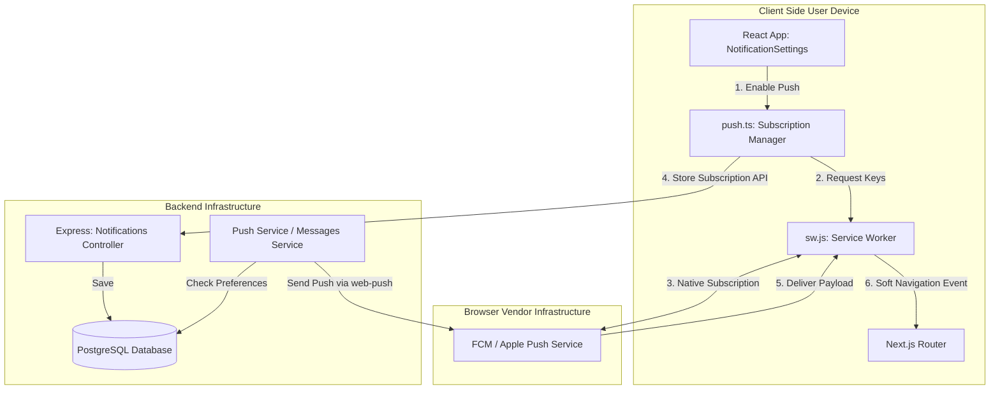

# Nexus Notification Architecture

The Nexus Notification System is designed to deliver a modern, lightning-fast experience comparable to native desktop applications like Slack and Discord. It relies on the industry-standard **Web Push API**, combined with a **Single Page Application (SPA) routing optimization**.

## Component Architecture

## System Flow Diagram

```mermaid
sequenceDiagram
    participant User
    participant Settings as NotificationSettings.tsx
    participant Lib as push.ts
    participant SW as sw.js
    participant Server as push.service.ts
    participant DB as Prisma (DB)
    participant Vendor as Browser Push Service
    participant App as AppLayoutShell.tsx

    %% Subscription Flow
    rect rgb(20, 20, 30)
        Note over User, Server: 1. Subscription Flow
        User->>Settings: Toggles Notifications On
        Settings->>Lib: subscribeToPush()
        Lib->>SW: navigator.serviceWorker.ready.pushManager.subscribe()
        SW-->>Lib: Returns VAPID Subscription Keys
        Lib->>Server: POST /api/notifications/push/subscribe
        Server->>DB: Save PushSubscription
    end

    %% Delivery Flow
    rect rgb(20, 30, 20)
        Note over Server, App: 2. Delivery & UX Flow
        Server->>Server: Event triggers e.g. new message
        Server->>DB: Check if user pushNotificationsEnabled
        Server->>DB: Get user's PushSubscriptions
        Server->>Vendor: webpush.sendNotification()
        Vendor->>SW: Push event arrives via browser
        SW->>SW: self.registration.showNotification()
        
        User->>SW: Clicks OS Notification
        SW->>SW: Finds existing Nexus tab
        SW->>App: client.postMessage({ type: 'NAVIGATE' })
        App->>App: router.push URL Soft Navigation
    end
```

Here is a breakdown of how the system works, referencing the exact files and functions.

---

## 1. Backend: The Push Service
**File:** `server/src/services/push.service.ts`

To send push notifications, the backend needs to securely communicate with browser vendor push services (like Google FCM or Apple Push Notification service). We achieve this using the **VAPID** (Voluntary Application Server Identification) standard.

- **`initPushService()`**: Initializes the `web-push` library using our private and public VAPID keys. This proves to Google/Apple that we are the legitimate server authorized to send notifications to our users.
- **`sendPushNotification(userId, payload)`**: Whenever an event occurs (e.g., someone sends a direct message), the server calls this function. It checks the user's global `pushNotificationsEnabled` flag. If true, it fetches all of the user's devices (PushSubscriptions) and fires off the notification payload concurrently.

## 2. Database Schema
**File:** `server/prisma/schema.prisma`

- **`PushSubscription` Model**: Users can be logged into Nexus from multiple devices (Chrome on Laptop, Safari on iPhone). Each device generates a unique endpoint URL, `p256dh` key, and `auth` secret. We store these in a 1-to-Many relationship with the `User`.
- **`User.pushNotificationsEnabled`**: Rather than iterating through millions of device subscriptions during high load, we keep a master boolean on the `User` model. This allows us to short-circuit the database query entirely if the user has muted notifications.

## 3. Frontend: Device Subscription Management
**File:** `client/src/shared/lib/push.ts`

When a user enables notifications in the settings, we need to register their specific browser with the backend.

- **`subscribeToPush()`**: This function requests native browser permission. Using the `NEXT_PUBLIC_VAPID_PUBLIC_KEY`, it subscribes the user via the `navigator.serviceWorker.ready.pushManager` API. It then sends the resulting cryptographic keys to our backend to be saved in the `PushSubscription` table.
- **`unsubscribeFromPush()`**: Reverses the process, cleanly destroying the subscription on the browser and deleting it from our database.

## 4. The UI & State Synchronization
**File:** `client/src/modules/notifications/components/NotificationSettings.tsx`

We designed the settings UI to be a "pure" React component. It doesn't handle any routing logic itself. Instead, it relies on a React Query hook (`useNotificationPreferences`) to fetch the DB state.
When the user flips the toggle, the component orchestrates two things:
1. Calls `subscribeToPush()` or `unsubscribeFromPush()` to handle the browser's native capabilities.
2. Sends an API request to sync the `pushNotificationsEnabled` boolean in the backend.

## 5. The "Secret Sauce": Service Worker Soft Navigation
**Files:** `client/public/sw.js` & `client/src/shared/components/layout/AppLayoutShell.tsx`

This is where the architecture really shines. 

By default, when a user clicks an OS-level Web Push notification, the browser behaves dumbly: it opens a brand new tab, triggering a full page reload. For a complex app like Nexus, this means re-downloading React, re-establishing WebSocket connections, and losing existing state.

**How we fixed it:**
- **In `sw.js` (The Service Worker)**: When the `notificationclick` event fires, we explicitly override the default browser behavior. The service worker searches memory for *any* currently open Nexus tab (`clients.matchAll`). If it finds one, it immediately brings it to the foreground (`client.focus()`) and sends a silent background message: `client.postMessage({ type: 'NAVIGATE', url })`.
- **In `AppLayoutShell.tsx` (The React App)**: We placed a global `useEffect` listener that listens for the service worker's `message` events. When it receives the `NAVIGATE` command, it executes `router.push(url)`.

**Why we chose this path:**
This creates a **blazing-fast, client-side soft navigation**. Clicking a notification on your desktop instantly warps your already-open app to the correct channel without reloading the page. It feels exactly like a native Electron application (like Discord)!
