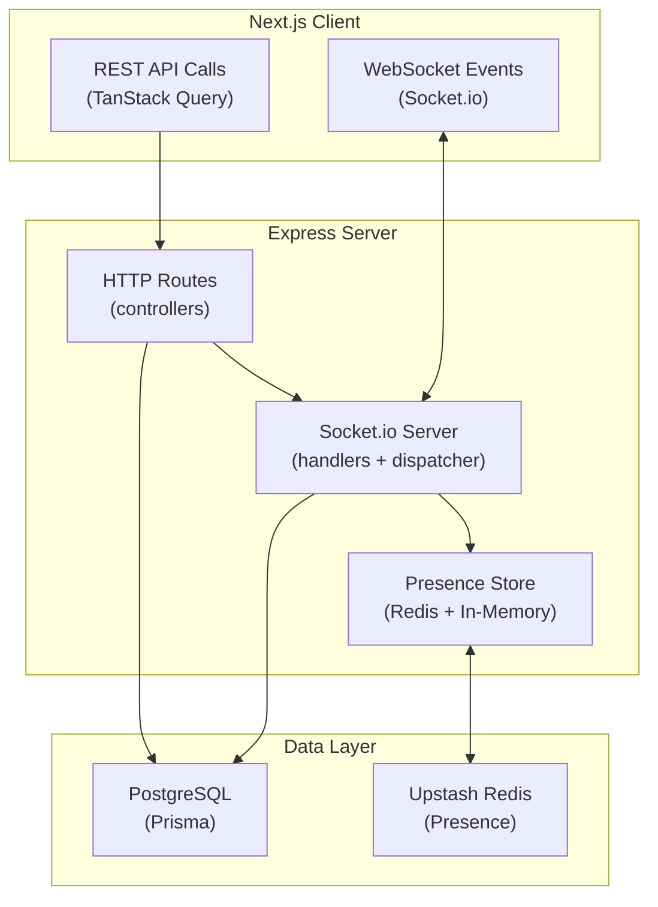
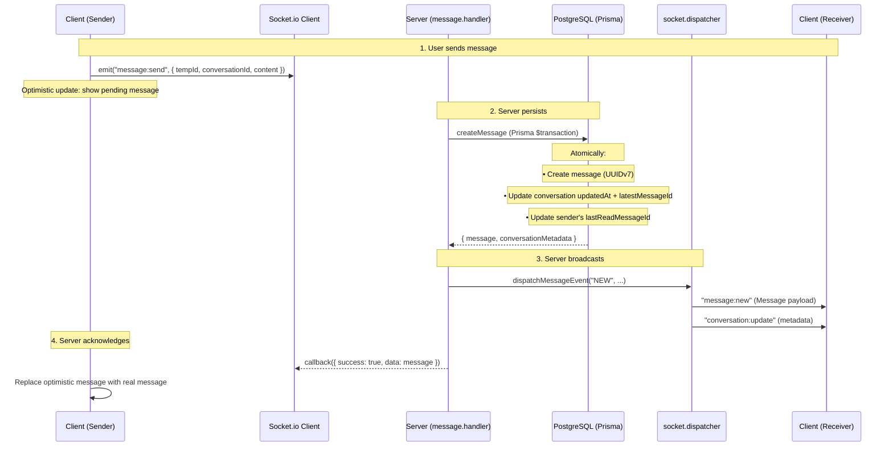
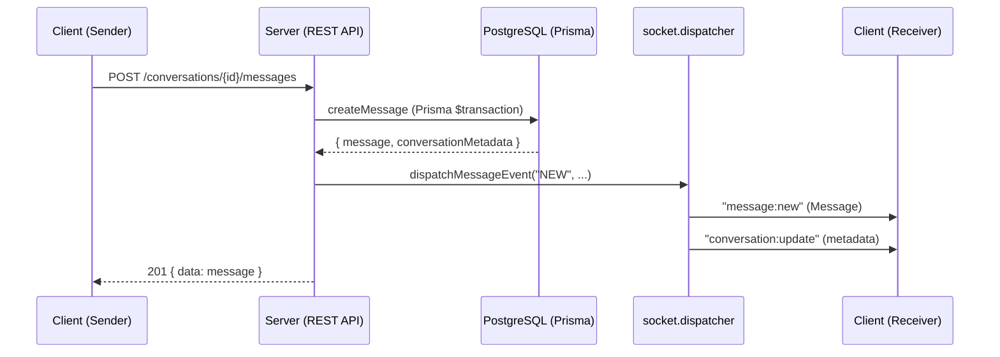
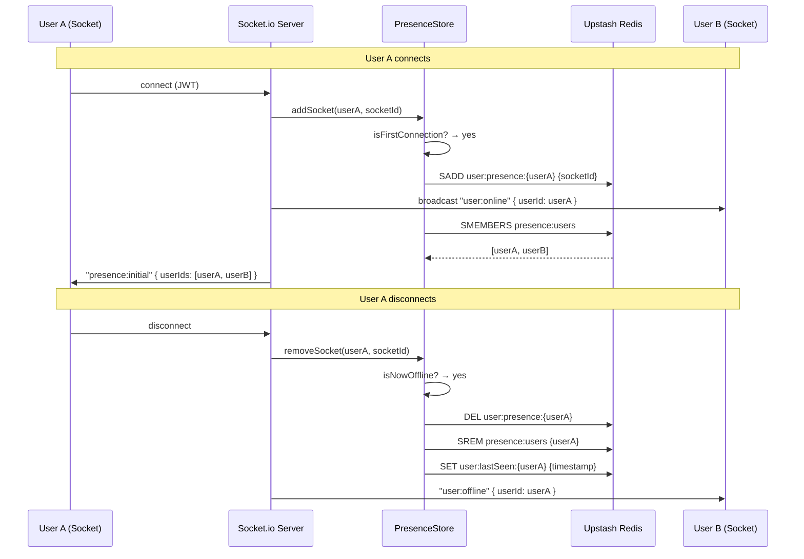
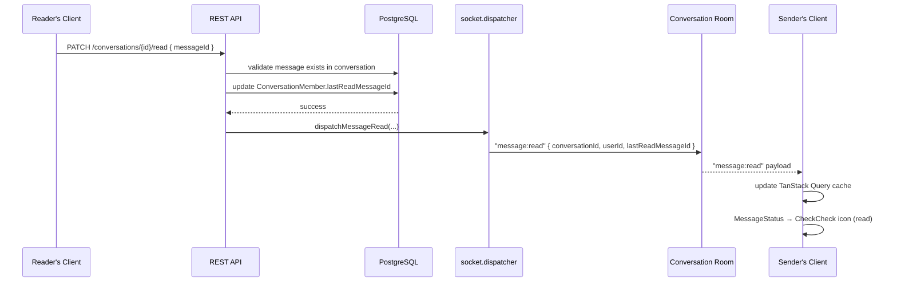
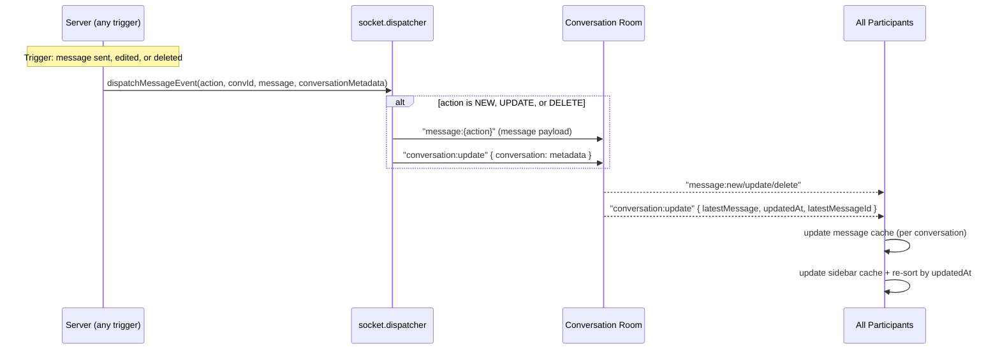

# Application Data Flow

This document outlines the high-level data flow of the Nexus application, focusing on the most critical paths: **Real-Time Messaging**, **Presence**, and **Read Receipts**.

> For comprehensive socket-specific documentation including all event flows, room strategy, and presence architecture, see [socket.md](../socket.md).

## Overall Communication Architecture

## Real-Time Messaging Flow

When a user sends a message in a conversation, the data follows a specific path through the client, server, database, and back to connected clients via WebSockets.

### Primary Flow (Socket.io)

### Fallback Flow (REST)

## Presence Flow

## Read Receipt Flow

## Conversation Update Flow

## Complete Socket Event Catalog

For a complete listing of all socket events with payloads, sources, and client consumers, see the **Socket Events Reference** in [socket.md](../socket.md#2-socket-events-reference).

---

> **Note:** Documentation updated on 2026-06-11 to include comprehensive socket event documentation and data flow diagrams.
