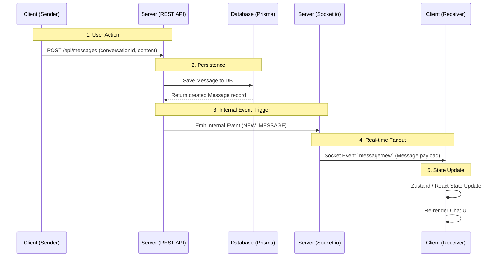
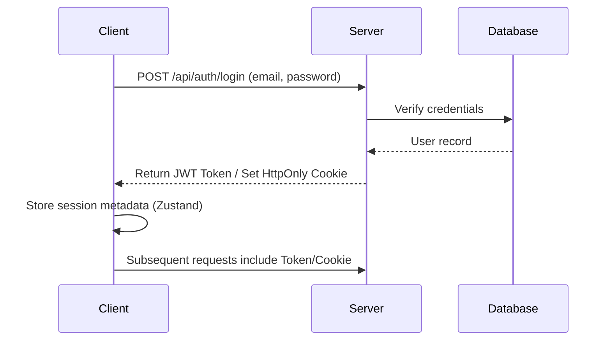

# Application Data Flow

This document outlines the high-level data flow of the Nexus application, specifically focusing on the most critical path: **Sending and Receiving a Real-Time Message**.

## Real-Time Messaging Flow

When a user sends a message in a conversation, the data follows a specific path through the client, server, database, and back to connected clients via WebSockets.

### Data Flow Diagram

### Flow Breakdown

1. **User Action**: The sender submits a message via the chat UI. The frontend (`client/src/modules/chat`) makes an HTTP POST request to the backend's `/api/messages` endpoint containing the message text and conversation ID.
2. **Persistence**: The backend (`server/src/modules/messages/messages.controller.ts`) validates the request and uses Prisma to save the message directly into the database.
3. **Internal Event Trigger**: Once successfully saved, the backend controller triggers the Socket.io service or an internal event emitter to broadcast the new message.
4. **Real-time Fanout**: The Socket.io server identifies all connected clients that are participants in the conversation (except the sender) and emits a `message:new` socket event containing the saved message data.
5. **State Update**: The receiving client listens for `message:new` via `socket.on()`. Upon receiving the payload, it pushes the new message into the local state store (e.g., Zustand or React Context). The UI re-renders chronologically to display the new message bubble.

## Authentication Data Flow

When a user logs in, the flow manages session state across the client and server.

> **Note:** Documentation updated on 2026-06-10 to reflect UI improvements: feat(ui): Added an explicit 'Message' button in the NewConversationModal when searching for users, replacing the full-row clickable area for better UX.
