# Nexus Socket Architecture

> **Last Updated:** 2026-06-11
> **Status:** Active (Phase 1 core features complete)

---

## 1. Overview

Nexus uses [Socket.io](https://socket.io/) v4 for all real-time communication. The socket layer is dual-purpose:
- **Primary transport** for sending and receiving messages in real-time
- **Secondary transport** for presence, read receipts, conversation metadata, and invite notifications

The server runs a single Socket.io instance attached to the Express HTTP server. Client connections are authenticated via JWT during the handshake, and room membership is derived from the user's `ConversationMember` records.

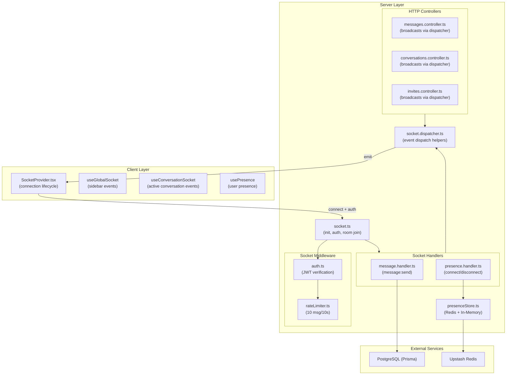

---

## 2. Socket Events Reference

### 2.1 Event Name Constants

Both client and server share identical event name constants via `shared/socket-events.ts`:

```typescript
export const SOCKET_EVENTS = {
  MESSAGE_NEW: "message:new",
  MESSAGE_READ: "message:read",
  MESSAGE_SEND: "message:send",
  TYPING_START: "typing:start",
  TYPING_STOP: "typing:stop",
  USER_ONLINE: "user:online",
  USER_OFFLINE: "user:offline",
  INITIAL_PRESENCE: "presence:initial",
  CONVERSATION_NEW: "conversation:new",
  MESSAGE_UPDATE: "message:update",
  MESSAGE_DELETE: "message:delete",
  CONVERSATION_UPDATE: "conversation:update",
} as const;
```

> **Note:** `TYPING_START` and `TYPING_STOP` are defined in the constants but **not yet implemented** in any handler.

### 2.2 Event Table

| Direction | Event | Payload | Description | Source | Consumers |
|---|---|---|---|---|---|
| **C → S** | `message:send` | `{ tempId, conversationId, content }` | Send a new message via WebSocket | `message.handler.ts` | — |
| **S → C** | `message:new` | `Message` object | New message broadcast to conversation room | `messages.controller.ts` / `message.handler.ts` | `useConversationSocket`, `useGlobalSocket` |
| **S → C** | `message:update` | `Message` object | Updated (edited) message broadcast to conversation room | `messages.controller.ts` | `useConversationSocket` |
| **S → C** | `message:delete` | `Message` object (with `deletedAt`) | Soft-deleted message broadcast to conversation room | `messages.controller.ts` | `useConversationSocket` |
| **S → C** | `message:read` | `{ conversationId, userId, lastReadMessageId }` | Read receipt broadcast to conversation room | `conversations.controller.ts` | `useConversationSocket`, `useGlobalSocket` |
| **S → C** | `user:online` | `{ userId }` | User came online (first socket opened) | `presence.handler.ts` | `SocketProvider` |
| **S → C** | `user:offline` | `{ userId }` | User went offline (all sockets closed) | `presence.handler.ts` | `SocketProvider` |
| **S → C** | `presence:initial` | `{ userIds: string[] }` | Snapshot of all currently online users, sent on connect | `presence.handler.ts` | `SocketProvider` |
| **S → C** | `conversation:new` | `Conversation` object | New conversation created (DM created / invite accepted) | `conversations.controller.ts` / `invites.controller.ts` | `useGlobalSocket` |
| **S → C** | `conversation:update` | `{ conversation }` with metadata | Conversation metadata changed (latestMessage, updatedAt) | `messages.controller.ts` / `messages.service.ts` | `useGlobalSocket` |
| **—** | `typing:start` | *Not implemented* | — | — | — |
| **—** | `typing:stop` | *Not implemented* | — | — | — |

---

## 3. Room Strategy

Nexus uses two room patterns:

| Room Pattern | Format | Purpose | Joined When |
|---|---|---|---|
| **Conversation Room** | `conversation:{conversationId}` | Broadcasting messages, read receipts, and metadata updates to conversation participants | On socket connection (server auto-joins all user's member conversations) and on new conversation creation |
| **User Room** | `user:{userId}` | Targeted server-to-client notifications (e.g., new conversation notification) | On socket connection |

### Room Joining Flow

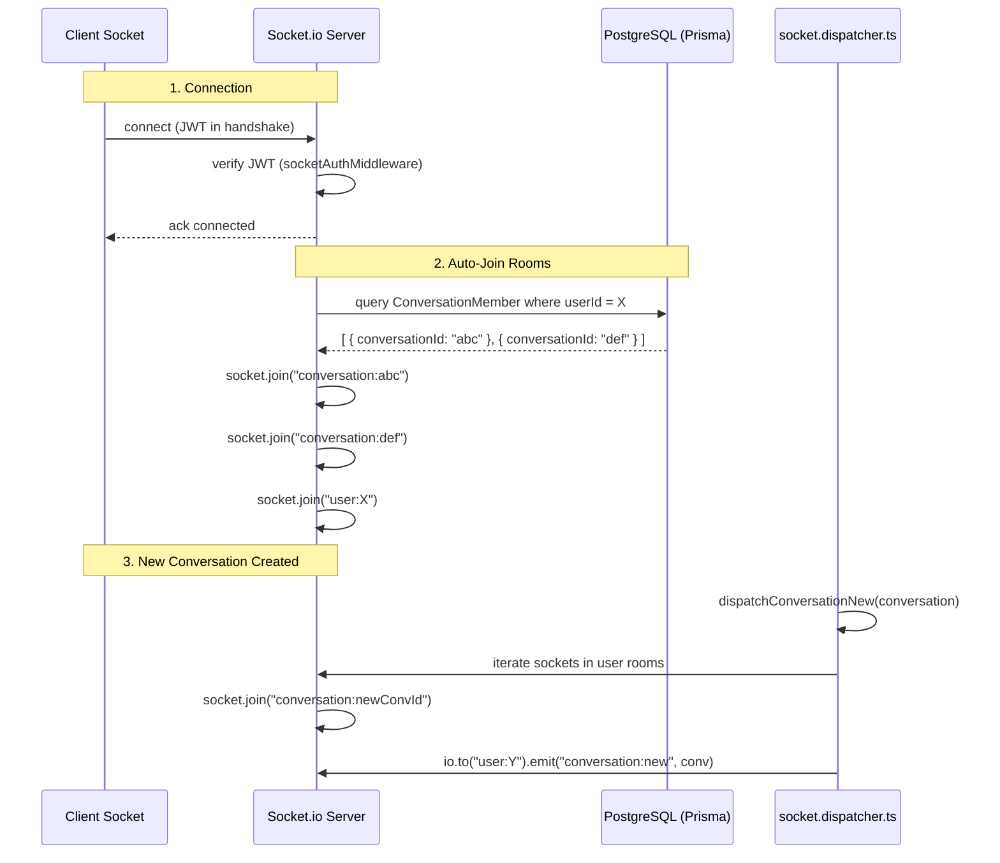

---

## 4. Connection Lifecycle

### 4.1 Client-Side Initialization

The client socket is configured in `client/src/shared/lib/socket.ts`:

```typescript
const socket = io(SOCKET_URL, {
  autoConnect: false,  // Manual connection control
  auth: async (cb) => {
    const { data: { session } } = await supabase.auth.getSession();
    cb({ token: session?.access_token });
  },
});
```

The `SocketProvider` component (`client/src/shared/providers/socket-provider.tsx`) manages the connection lifecycle and presence listeners:

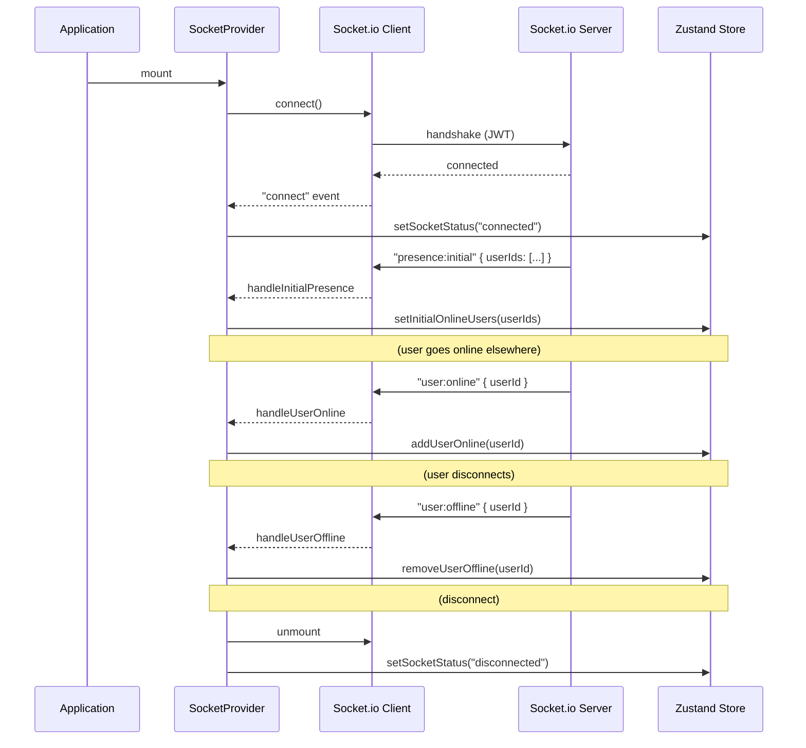

### 4.2 Server-Side Connection Handling

The server initializes Socket.io in `server/src/socket/socket.ts`:

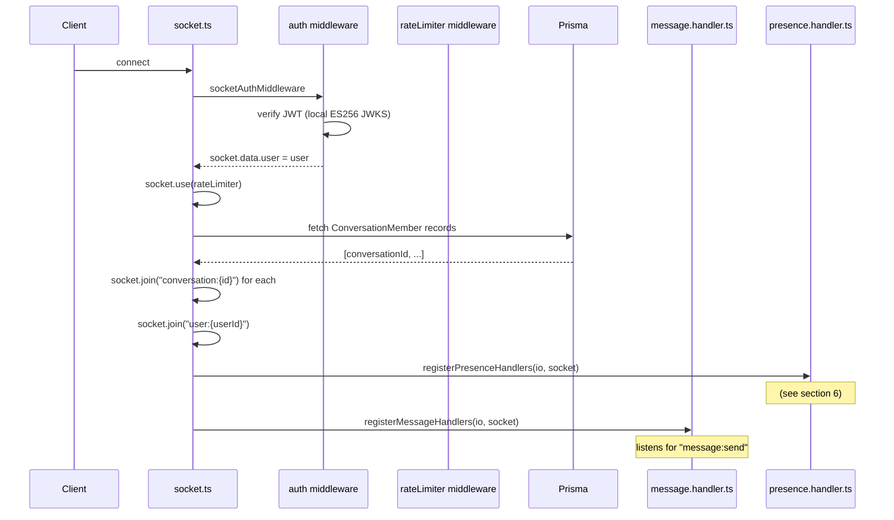

---

## 5. Message Flow

### 5.1 Sending a Message (WebSocket Path)

This is the primary path used by the client when sending a message:

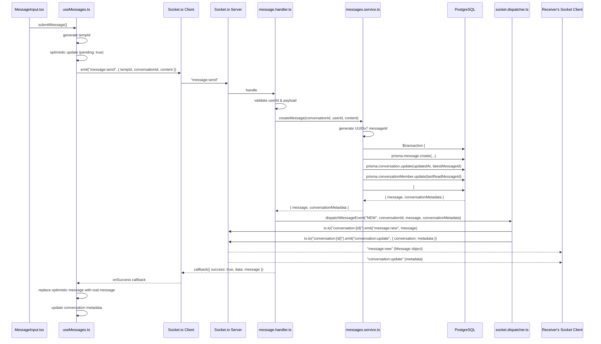

### 5.2 Sending a Message (REST Fallback Path)

The REST endpoint also broadcasts via socket after persisting:

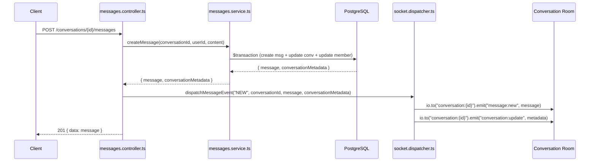

### 5.3 Editing a Message

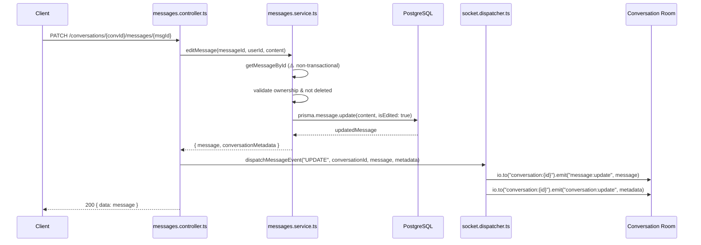

**Client-side handling** (`useConversationSocket.ts`): Receives `message:update`, then dynamically imports `cacheHelpers.ts` → `updateMessageInCache()` to update the TanStack Query cache with the new content and `isEdited: true` flag.

### 5.4 Deleting a Message

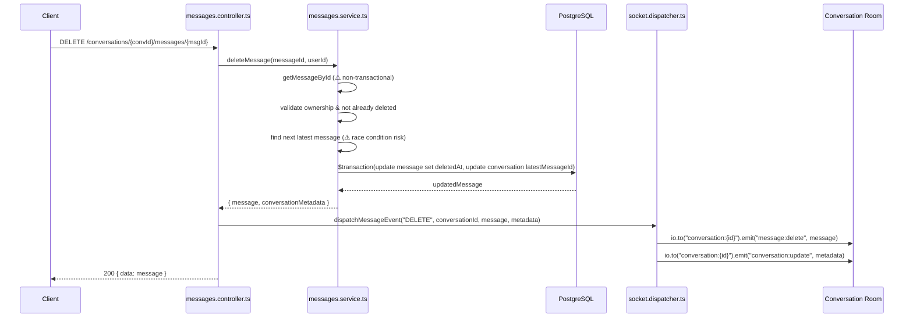

**Client-side handling** (`useConversationSocket.ts`): Receives `message:delete`, then dynamically imports `cacheHelpers.ts` → `markMessageDeletedInCache()` to update the message with a `deletedAt` timestamp in the cache.

### 5.5 Read Receipt Flow

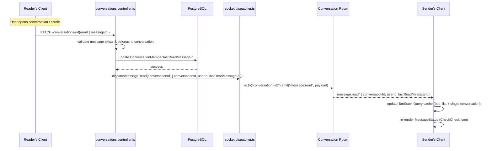

**Client-side handling** (`useConversationSocket.ts`): Updates both `queryKeys.conversations` (list) and `queryKeys.conversation(conversationId)` (single) in the TanStack Query cache by mapping `members` to update `lastReadMessageId` for the reader.

The global handler (`conversation.handlers.ts`) also handles `message:read` to optionally reset `unreadCount` if the reader is the current user.

---

## 6. Presence Flow

### 6.1 Architecture

The presence system uses `PresenceStore` (`server/src/socket/presenceStore.ts`) — a singleton with a **dual-write strategy**:

- **Always writes to in-memory Map** (fast, always works)
- **Best-effort writes to Upstash Redis** (persistent, cross-instance)
- **Reads prefer Redis, fall back to in-memory**

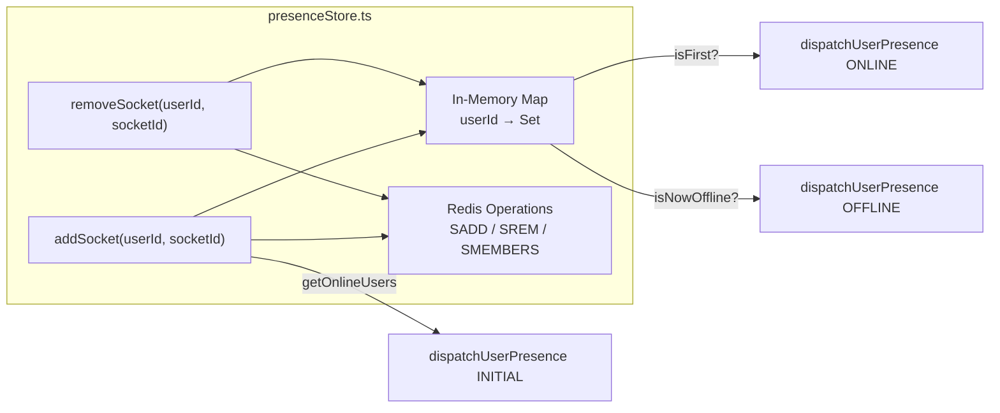

### 6.2 Connect/Disconnect Flow

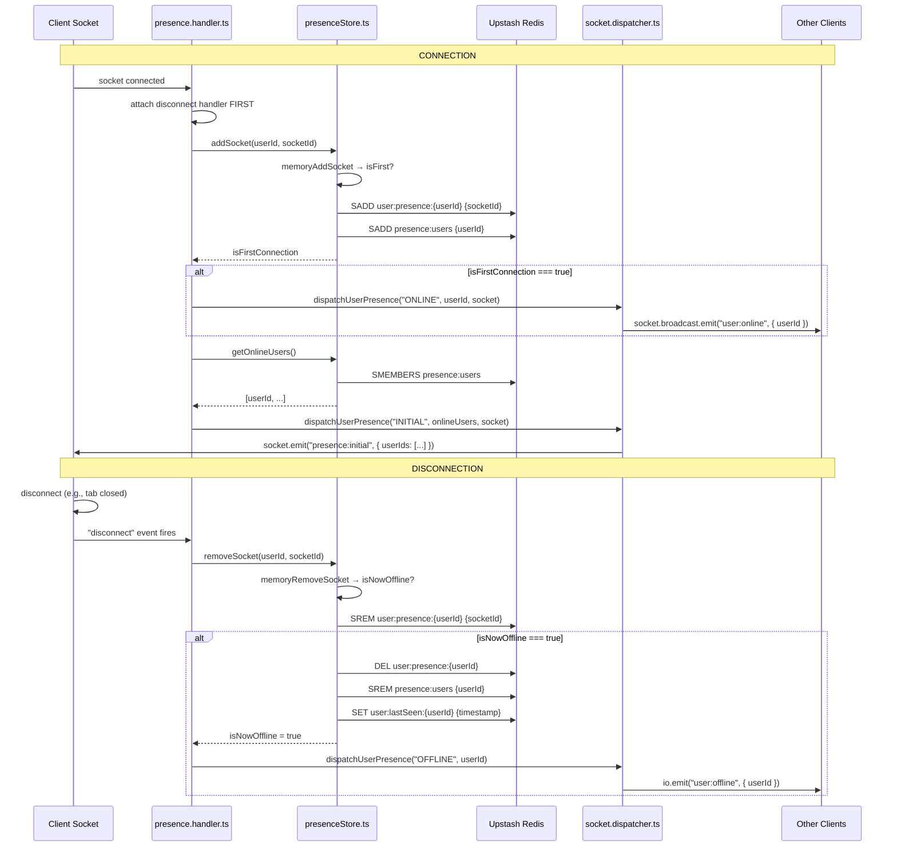

### 6.3 Client-Side Presence

Presence state is managed by `useChatStore` (Zustand):

```typescript
// Store state
onlineUsers: Set<string>  // Set of userIds currently online

// Actions
setInitialOnlineUsers: (users: string[]) => void  // From "presence:initial"
addUserOnline: (userId: string) => void            // From "user:online"
removeUserOffline: (userId: string) => void        // From "user:offline"
```

**Components consuming presence:**
- `SocketProvider.tsx` — registers listeners for `presence:initial`, `user:online`, `user:offline`
- `PresenceIndicator.tsx` — renders green/gray dot based on `onlineUsers.has(userId)`
- `usePresence` hook (in `client/src/modules/users/hooks/usePresence.ts`) — *reserved for future use*

---

## 7. Conversation Update Flow

The `conversation:update` event is a **decoupled metadata event** that the server emits whenever conversation-level information changes. The client does **not** infer this metadata from `message:*` events.

### Trigger Points

| Trigger | Source | `conversation:update` Payload |
|---|---|---|
| New message created | `messages.service.ts` (via `$transaction`) | `{ id, name, updatedAt, latestMessageId, latestMessage }` |
| Message edited | `messages.service.ts` (if editing the latest message) | `{ id, name, updatedAt, latestMessageId, latestMessage }` |
| Message deleted | `messages.service.ts` (if deleting the latest message) | `{ id, name, updatedAt, latestMessageId, latestMessage }` |
| Invite accepted (member joined) | `invites.controller.ts` | `{ id, updatedAt }` |

### Client-Side Handling

The global event router (`conversation.handlers.ts` → `handleConversationUpdate`) updates the sidebar list:

```typescript
// Updates conversation in cache with new metadata
queryClient.setQueryData<Conversation[]>(queryKeys.conversations, (oldData) => {
  // Maps over conversations, replaces matching conversation
  // Then sorts by updatedAt descending
});
```

---

## 8. Invite System Socket Events

When an invite is resolved (`POST /api/invites/resolve`), the server may emit socket events depending on the invite type:

### 8.1 User Invite (DM Creation)

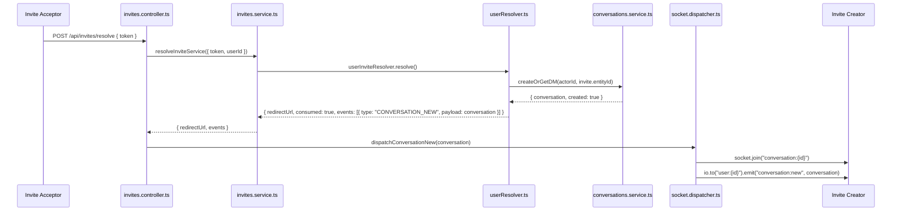

### 8.2 Conversation Invite (Group Membership)

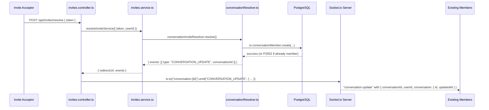

---

## 9. Dispatcher Architecture

The `socket.dispatcher.ts` module provides typed helpers for emitting socket events. It centralizes emission logic that is called from both socket handlers and HTTP controllers.

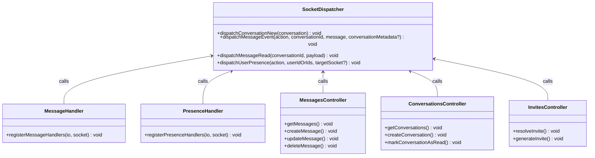

---

## 10. Socket Middleware

### 10.1 Auth Middleware (`server/src/socket/middlewares/auth.ts`)

- Extracts JWT from `handshake.auth.token`, `handshake.headers.authorization`, or `handshake.query.token`
- Verifies using local ES256 JWKS crypto (zero network calls)
- On success: populates `socket.data.user` with the decoded user
- On failure: returns a typed error (`TOKEN_MISSING`, `TOKEN_INVALID`, `AUTH_SERVICE_ERROR`)

### 10.2 Rate Limiter (`server/src/socket/middlewares/rateLimiter.ts`)

- Per-user in-memory rate limiting (no Redis sync)
- Only applies to the `message:send` event
- **Limits:** 10 messages per 10-second window
- **Action:** Drops the packet and returns an error to the callback

---

## 11. Known Issues & Technical Debt

| Issue | Description | Impact |
|---|---|---|
| **No Redis Pub/Sub Adapter** | Socket.io is not configured with a Redis adapter. The presence store's in-memory fallback prevents horizontal scaling. | Multiple backend instances would fragment presence state. |
| **Overloaded Controllers** | `messages.controller.ts` and `conversations.controller.ts` directly import and call socket dispatchers, mixing HTTP and WebSocket concerns. | Makes testing harder and couples REST logic to socket infrastructure. |
| **TYPING events not implemented** | `typing:start` and `typing:stop` are defined but have no handlers. | Feature gap — users cannot see typing indicators. |
| **Invite socket events use string literals** | `invites.controller.ts` emits `"CONVERSATION_UPDATE"` as a raw string rather than using `SOCKET_EVENTS.CONVERSATION_UPDATE`. | Fragile — renaming the constant won't update this emission. |

---

## 12. File Reference

| File | Role |
|---|---|
| `server/src/shared/socket-events.ts` | Event name constants and shared types |
| `server/src/socket/socket.ts` | Server initialization, auth middleware, room joining, handler registration |
| `server/src/socket/socket.dispatcher.ts` | Typed emitter helpers for all socket events |
| `server/src/socket/socketErrors.ts` | Error code constants |
| `server/src/socket/handlers/message.handler.ts` | Handles `message:send` from clients |
| `server/src/socket/handlers/presence.handler.ts` | Handles connect/disconnect for presence |
| `server/src/socket/middlewares/auth.ts` | JWT verification on socket handshake |
| `server/src/socket/middlewares/rateLimiter.ts` | Rate limiter for `message:send` |
| `server/src/socket/presenceStore.ts` | Redis + in-memory presence store |
| `server/src/modules/messages/messages.controller.ts` | REST controller that dispatches socket events |
| `server/src/modules/conversations/conversations.controller.ts` | REST controller that dispatches socket events |
| `server/src/modules/invites/invites.controller.ts` | REST controller that dispatches socket events |
| `client/src/shared/lib/socket.ts` | Socket.io client singleton |
| `client/src/shared/providers/socket-provider.tsx` | Connection lifecycle + presence listeners |
| `client/src/modules/chat/hooks/useConversationSocket.ts` | Active conversation socket listeners |
| `client/src/modules/chat/hooks/useGlobalSocket.ts` | Global socket listeners (sidebar) |
| `client/src/modules/chat/realtime/index.ts` | Event router factory |
| `client/src/modules/chat/realtime/conversation.handlers.ts` | Handlers for conversation-level socket events |
| `client/src/modules/chat/realtime/message.handlers.ts` | Handlers for message-level socket events |
| `client/src/modules/chat/store/chatStore.ts` | Zustand store for socket status + online users |
| `client/src/modules/chat/types/socket.ts` | Socket payload TypeScript interfaces |
| `client/src/modules/chat/utils/cacheHelpers.ts` | Helper functions for TanStack Query cache updates |
