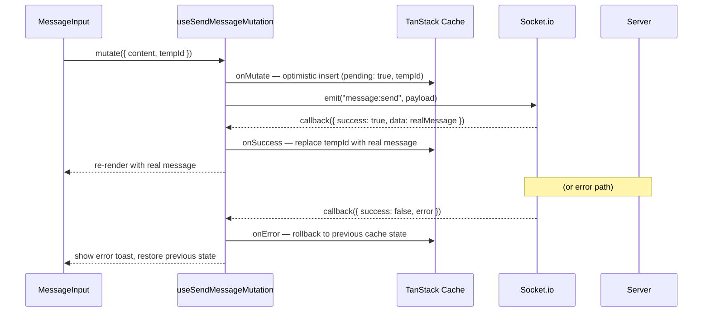
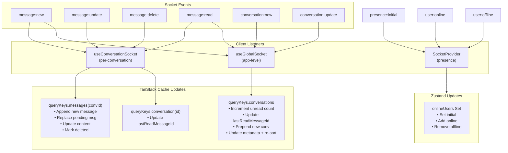

# Nexus — Client State Architecture

> **Last Updated:** 2026-06-11
> **Libraries:** TanStack Query ^5 (server state), Zustand ^5 (UI state)

---

## 1. State Management Philosophy

Nexus uses a strict **dual-store** pattern with clear boundaries:

```
┌─────────────────────────────────────────────────────┐
│                    TanStack Query                    │
│  Everything that originates from the server          │
│  • Messages, conversations, user profiles           │
│  • Fetched via REST, mutated via REST or Socket.io  │
│  • Automatically cached, deduplicated, invalidated  │
└─────────────────────────────────────────────────────┘

┌─────────────────────────────────────────────────────┐
│                      Zustand                         │
│  Purely local UI state with no server equivalent     │
│  • Socket connection status                          │
│  • Online users Set (from socket presence events)    │
│  • Active conversation ID                            │
│  • Per-conversation draft text                       │
└─────────────────────────────────────────────────────┘
```

**Golden rule:** If it exists on the server, it lives in TanStack Query. If it's purely local UI state, it lives in Zustand.

---

## 2. TanStack Query Architecture

### 2.1 Query Key Factory

All query keys are defined centrally in `client/src/shared/constants/queryKeys.ts`:

```typescript
export const queryKeys = {
  conversations: ["conversations"] as const,
  conversation: (id: string) => ["conversations", id] as const,
  messages: (conversationId: string) => ["messages", conversationId] as const,
  usersSearch: (query: string) => ["users", "search", query] as const,
};
```

**Key structure:**

| Key | Cache Scope | Example |
|---|---|---|
| `["conversations"]` | Single entry for sidebar list | `queryKeys.conversations` |
| `["conversations", id]` | One entry per conversation | `queryKeys.conversation("abc")` |
| `["messages", convId]` | Infinite query, one per conversation | `queryKeys.messages("abc")` |
| `["users", "search", query]` | One entry per search query | `queryKeys.usersSearch("alice")` |

### 2.2 Query Configuration

Configured in `QueryProvider` (`client/src/shared/providers/query-provider.tsx`):

```typescript
new QueryClient({
  defaultOptions: {
    queries: {
      retry: (failureCount, error) => {
        // Don't retry on 4xx errors (auth, not-found, validation)
        // Only retry on 5xx / network errors
        const status = error?.response?.status;
        if (status && status >= 400 && status < 500) return false;
        return failureCount < 2;
      },
    },
  },
});
```

**Retry behavior:**
- **4xx errors:** No retry (these are client errors — auth, validation, not-found)
- **5xx errors / network failures:** Retry up to 2 times

### 2.3 Infinite Query (Messages)

Message history uses `useInfiniteQuery` for cursor-based pagination:

```typescript
const query = useInfiniteQuery({
  queryKey: queryKeys.messages(conversationId),
  queryFn: ({ pageParam }) => messagesApi.getMessages(conversationId, pageParam),
  getNextPageParam: (lastPage) => lastPage.nextCursor,
  initialPageParam: null as string | null,
  enabled: !!conversationId,
});
```

**Data structure:**
```typescript
interface MessagePage {
  data: Message[];
  nextCursor: string | null;
}

// Cached as InfiniteData<MessagePage>
// {
//   pages: [
//     { data: [msg5, msg4, msg3, msg2, msg1], nextCursor: "msg1-id" },
//     { data: [msg0, msg-1, msg-2], nextCursor: null }
//   ],
//   pageParams: [null, "msg1-id"]
// }
```

---

## 3. Mutations

### 3.1 Send Message (Socket.io Primary)

The send message flow uses a **Socket.io `message:send` event** wrapped in a TanStack Query mutation:



**Optimistic update pattern:**

| Phase | Action |
|---|---|
| `onMutate` | 1. Cancel in-flight queries. 2. Snapshot previous cache. 3. Insert optimistic message with `pending: true`. 4. Bump conversation `updatedAt` in sidebar cache. |
| `onSuccess` | 1. Replace optimistic message's `tempId` with real message in cache. |
| `onError` | 1. Restore previous cache snapshot. 2. Show styled error toast (red with `AlertTriangle` icon for rate limits). |

### 3.2 Edit Message (REST)

```typescript
mutationFn: ({ messageId, content }) => api.editMessage(conversationId, messageId, content)
```

**Optimistic:** Instantly updates the cache via `updateMessageInCache()` helper. Rolls back on error.

### 3.3 Delete Message (REST)

```typescript
mutationFn: ({ messageId }) => api.deleteMessage(conversationId, messageId)
```

**Optimistic:** Instantly marks message as deleted in cache via `markMessageDeletedInCache()` helper. Rolls back on error.

### 3.4 Create Conversation (REST)

```typescript
mutationFn: (targetUserId) => api.createConversation(targetUserId)
```

**On success:** Prepends the new conversation to the sidebar cache. The receiver's sidebar is updated via the `conversation:new` socket event.

---

## 4. Socket.io Cache Integration

Socket events **directly mutate the TanStack Query cache** rather than refetching:



### 4.1 Per-Conversation Listener (`useConversationSocket.ts`)

| Event | Action |
|---|---|
| `message:new` | If message belongs to this conversation: append to page 0 (first page). If an optimistic message with `pending: true` exists, replace it. |
| `message:update` | Import `cacheHelpers.updateMessageInCache()` — update content and set `isEdited: true` |
| `message:delete` | Import `cacheHelpers.markMessageDeletedInCache()` — set `deletedAt` timestamp |
| `message:read` | Update `lastReadMessageId` in both the conversation list cache and single conversation cache |

### 4.2 Global Listener (`useGlobalSocket.ts`)

| Event | Action |
|---|---|
| `message:new` | Increment `unreadCount` for the conversation in the sidebar list (only if message is from another user). Update browser tab title if tab is hidden. |
| `message:read` | Update `lastReadMessageId` in sidebar list. Clear `unreadCount` if the reader is the current user. |
| `conversation:new` | Prepend to sidebar list (avoiding duplicates). |
| `conversation:update` | Update `latestMessage`, `updatedAt`, `latestMessageId` in sidebar. Re-sort sidebar by `updatedAt` descending. |

### 4.3 Socket Provider (`SocketProvider.tsx`)

| Event | Action |
|---|---|
| `connect` | `setSocketStatus("connected")` |
| `disconnect` | `setSocketStatus("disconnected")` |
| `connect_error` | `setSocketStatus("disconnected")` + `toast.error(...)` |
| `presence:initial` | `setInitialOnlineUsers(userIds)` → updates Zustand `onlineUsers` Set |
| `user:online` | `addUserOnline(userId)` → adds to Zustand `onlineUsers` Set |
| `user:offline` | `removeUserOffline(userId)` → removes from Zustand `onlineUsers` Set |

---

## 5. Zustand Store

### 5.1 Store Definition

File: `client/src/modules/chat/store/chatStore.ts`

```typescript
interface UiState {
  socketStatus: "connecting" | "connected" | "disconnected";
  activeConversationId: string | null;
  drafts: Map<string, string>;   // conversationId → draft text
  onlineUsers: Set<string>;      // userIds currently online
}
```

| State | Default | Purpose |
|---|---|---|
| `socketStatus` | `"disconnected"` | Drives connection indicator UI |
| `activeConversationId` | `null` | Currently open conversation |
| `drafts` | `new Map()` | Unsent message text per conversation (survives switching) |
| `onlineUsers` | `new Set()` | Set of online user IDs (from presence events) |

### 5.2 Auth Store

File: `client/src/modules/auth/store/useAuthStore.ts`

```typescript
interface AuthState {
  user: SupabaseUser | null;
  isInitialized: boolean;
}
```

| Selector | Returns | Purpose |
|---|---|---|
| `useUser()` | `SupabaseUser \| null` | Current authenticated user |
| `useIsAuthenticated()` | `boolean` | Whether user is logged in |
| `useAuthInitialized()` | `boolean` | Whether auth state has been resolved |
| `getAuthUser()` | `SupabaseUser \| null` | Synchronous getter (used in socket handlers) |
| `getAuthActions()` | `{ setUser, setInitialized }` | Actions for auth provider |

### 5.3 Store Reset

On logout, all stores are reset via the `storeResetHandlers` pattern:

```typescript
// client/src/shared/lib/store-reset.ts
export const storeResetHandlers = new Set<() => void>();
export const resetAllStores = () => {
  storeResetHandlers.forEach((reset) => reset());
};
```

Each store registers its own reset:
```typescript
storeResetHandlers.add(() => useChatStore.getState().clearAll());
storeResetHandlers.add(() => useAuthStoreBase.getState().clearAuth());
```

Triggered from `auth-orchestrator.ts`:
```typescript
export const handleSignOut = (queryClient: QueryClient) => {
  socket.disconnect();
  resetAllStores();      // Resets Zustand stores
  queryClient.clear();   // Clears TanStack Query cache
};
```

---

## 6. Data Flow Summary

```
User Action → React Component → Hook (useMutation / useQuery)
  │
  ├─→ REST API call (Axios) → Server → DB
  │     └─→ onSuccess: update TanStack Query cache
  │
  └─→ Socket.io emit → Server → DB
        └─→ Server broadcasts via Socket.io to room
              └─→ Client socket listeners
                    ├─→ useConversationSocket: update message cache
                    └─→ useGlobalSocket: update sidebar cache
```

### Auth-triggered flows:
```
Login  → AuthProvider (INITIAL_SESSION/SIGNED_IN) → setUser() → socket.connect()
Logout → AuthProvider (SIGNED_OUT) → setUser(null) → handleSignOut()
  ├─→ socket.disconnect()
  ├─→ resetAllStores()     (Zustand)
  └─→ queryClient.clear()  (TanStack Query)
```
