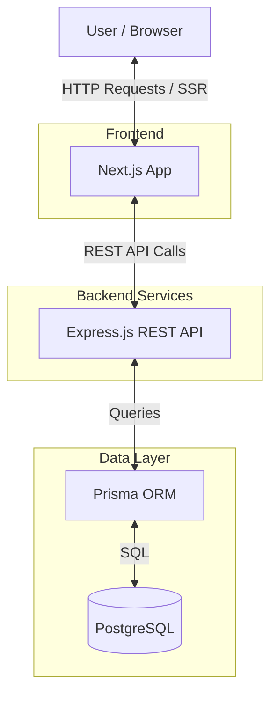
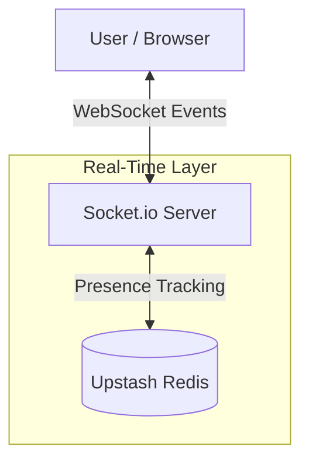
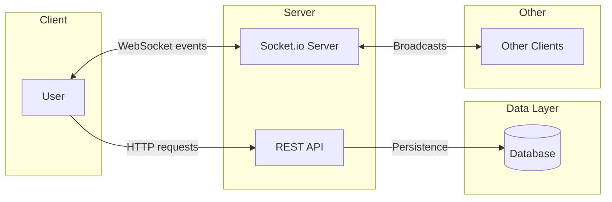
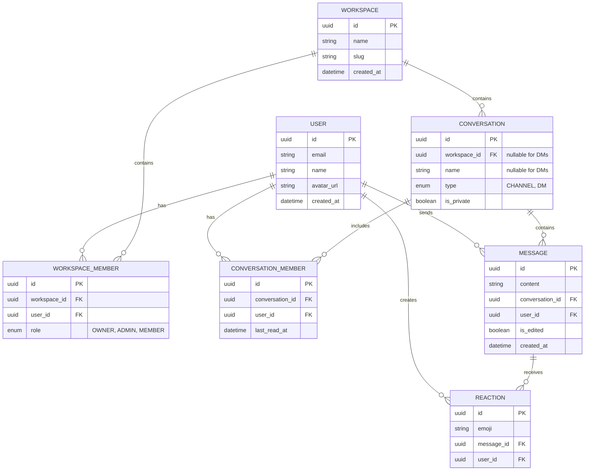

# Nexus

## Project Overview

Nexus is a real-time messaging and collaboration platform.

Phase 1 focuses on building a robust messaging foundation consisting of authentication, direct messaging, message persistence, read receipts, and user presence.

Subsequent phases extend this foundation with workspaces, public channels, private channels, reactions, and advanced collaboration features.

## Tech Stack

| Technology | Purpose |
| :--- | :--- |
| **Frontend** | |
| Next.js | Provides the core React framework with Server-Side Rendering (SSR) for optimal performance and routing. |
| TypeScript | Ensures robust type safety across the application, enhancing maintainability and reducing runtime errors. |
| Tailwind CSS | Enables rapid UI development through a utility-first styling approach for consistent, responsive designs. |
| TanStack Query | Manages asynchronous state, data fetching, caching, and background updates seamlessly. |
| Zustand | Handles global client-side UI state that doesn't require server persistence in a lightweight manner. |
| **Backend** | |
| Express.js | Serves as the robust, minimalist API framework for handling core HTTP requests and middleware logic. |
| TypeScript | Maintains type consistency between the frontend and backend to streamline full-stack development. |
| Socket.io | Powers the real-time communication layer, enabling instant bi-directional messaging and events. |
| **Database & Auth** | |
| Supabase PostgreSQL | Acts as the primary relational database, supporting complex queries and structured data models. |
| Supabase Auth | Provides a secure, ready-to-use authentication system integrated directly with the database. |
| Prisma ORM | Simplifies database interactions and schema migrations through a type-safe, intuitive client. |
| **Infrastructure** | |
| Upstash Redis | Manages user presence tracking for real-time online/offline status. |
| GitHub Actions | Automates the CI/CD pipeline, ensuring consistent testing, linting, and deployment workflows. |
| Render | Hosts the Next.js application and Express backend services on a fully managed cloud platform. |

## High-Level Architecture

Nexus employs a decoupled architecture separating the client application from the core API and real-time services.

### Request Flow



### Real-Time & Presence



## API Overview

Nexus follows a hybrid architecture, utilizing REST APIs for persistence and resource management, and Socket.io for real-time event delivery.

| Endpoint Group | Purpose | Phase |
| :--- | :--- | :--- |
| /auth | Authentication | Phase 1 |
| /conversations | DMs (Phase 1), Channels (Phase 2+) | Phase 1 |
| /messages | Message CRUD | Phase 1 |
| /workspaces | Workspace management | Phase 2 |
| /members | Membership management | Phase 2 |
| /reactions | Emoji reactions | Phase 2 |
| /notifications | Notification preferences | Phase 2 |

### REST vs Socket.io Responsibilities

**REST:**
* Create resources
* Read history
* Update resources
* Delete resources

**Socket.io:**
* New message events
* Presence updates
* Reaction updates
* Read receipts



### Socket.io Event Design

The initial Phase 1 event contract supports real-time messaging, immediate read receipt updates, and presence by directly mapping user actions to socket broadcasts.

**Client → Server:**
* `conversation:join` - Subscribes to a conversation's real-time events.
* `conversation:leave` - Unsubscribes from a conversation.
* `message:send` - Delivers a new message payload to the server.
* `message:read` - Emits a read receipt when the user views messages.

**Server → Client:**
* `message:new` - Broadcasts a new message to conversation participants.
* `message:read` - Broadcasts updated read receipts to conversation participants.
* `user:online` - Broadcasts that a user has connected.
* `user:offline` - Broadcasts that a user has disconnected.

### Socket Room Strategy

* Each Conversation maps directly to a Socket.IO room.
* Room naming convention should follow: `conversation:{conversationId}`
  * Example: `conversation:123`
* When users open a conversation, they join the corresponding room.
* New messages are emitted only to members of that room.
* Read receipt events are emitted only to room participants.
* This architecture naturally scales from Direct Messages to Channels because both are represented by the Conversation entity.

**Example Flow:**
1. User A joins `conversation:123`
2. User B joins `conversation:123`
3. User A sends message
4. Server persists message
5. Server emits `message:new` to room `conversation:123`

## Core Features

### Phase 1: Core Foundation

*   **Authentication**: Secure user registration and login utilizing Supabase Auth, supporting email/password and OAuth providers. Session management ensures secure access to protected resources.
*   **Direct Messages**: Private one-to-one conversations between users. This is the primary messaging unit for Phase 1, modeled using the Conversation entity.
*   **Real-time Messaging**: Instant delivery of messages and updates across connected clients using WebSockets (Socket.io). Ensures all users see the most current state immediately.
*   **Message History**: Persistent storage of messages allowing users to view past conversations.
*   **Read Receipts**: Documented using `ConversationMember.last_read_at`. This approach avoids storing a separate read record for every message and scales efficiently for direct-message conversations. The logic follows:
    *   **Unread messages**: `message.created_at > last_read_at`
    *   **Seen messages**: `message.created_at <= last_read_at`
*   **Presence System**: Real-time indicators showing whether a user is currently online or offline. This system is driven by Socket connections, Socket disconnections, heartbeats (if implemented), and Redis presence storage. Presence is not a primary REST API feature; if a presence endpoint is retained, it is strictly optional and secondary to the real-time system.

### Phase 2: Collaboration Extensions

*   **Workspaces**: Isolated environments that encapsulate channels, direct messages, and members.
*   **Workspace Roles**: Role-based access control (RBAC) defining permissions within a workspace (e.g., Owner, Admin, Member).
*   **Public Channels**: Open communication spaces within a workspace accessible to all members.
*   **Private Channels**: Restricted communication spaces for specific members within a workspace.
*   **Message Reactions**: Users can append emoji reactions to messages to acknowledge or express emotion concisely.
*   **Rich Text Formatting**: Supports advanced message formatting such as bold, italics, code blocks, and lists.

## Core Database Schema

The database is designed around a normalized relational model to ensure data integrity and support complex querying.



### Entity Details

#### Phase 1 Core Entities

The following entities are the Phase 1 implementation focus:
*   **User**: Represents an authenticated individual using the platform. Key fields include `id`, `email`, and `name`.
*   **Conversation**: The central entity for any communication stream. In Phase 1, this strictly handles Direct Messages (`type = DM`). **Constraint:** DM conversations must have exactly 2 members.
*   **ConversationMember**: A junction table defining which users are participants in a specific conversation. It tracks read receipts via the `last_read_at` field, ensuring users know when their messages are seen.
    *   *Index:* `INDEX(conversation_id, user_id)`
*   **Message**: A single piece of communication sent by a user within a conversation. Messages are ordered by `created_at` ascending.
    *   *Index:* `INDEX(conversation_id, created_at)`

#### Phase 2+ Entities

Workspace, WorkspaceMember, and Reaction are Phase 2 entities built on top of the messaging foundation:
*   **Workspace**: A logical container for a team or organization. Contains members and conversations.
*   **WorkspaceMember**: A junction table defining a user's membership and role within a specific workspace.
    *   *Index:* `INDEX(workspace_id, user_id)`
*   **Reaction**: A junction table linking users, messages, and emoji reactions with constraints to prevent duplicate identical reactions from the same user.

## Architectural Decisions

### Unified Conversation Model

Nexus prioritizes **Direct Messages as the first implementation (Phase 1)** to establish a robust, real-time messaging foundation. 

We use a single `Conversation` entity instead of separate `Channel` and `DirectMessage` tables. This unified model is crucial because it allows us to build and perfect the core messaging mechanics (sending, real-time delivery, read receipts, persistence) on a simple 1-on-1 level first. 

**Channels are simply another Conversation type built later.** When we expand to Workspaces in Phase 2, a "Channel" is just a Conversation with `type = CHANNEL` and a linked `workspaceId`. By using this unified model, all the complex messaging logic built for Phase 1 instantly applies to channels without rewriting any core infrastructure. This approach significantly reduces schema complexity and allows the application to share messaging logic across all chat types.

#### Why Direct Messages First?

* Direct Messages are the simplest form of conversation.
* They allow messaging, persistence, presence, socket architecture, and read receipts to be validated with minimal complexity.
* Once these systems are proven, Channels become a natural extension because they reuse the same Conversation abstraction.
* This reduces implementation risk and allows incremental delivery of features.

### Junction Tables

We explicitly model many-to-many relationships using junction tables:
*   `WorkspaceMember` connects users to workspaces while holding role data.
*   `ConversationMember` connects users to conversations while holding read receipts.
*   `Reaction` connects users to messages with specific emojis.

This ensures strict data normalization, prevents redundant data, and allows us to store contextual metadata alongside the relationship itself.

### Prisma ORM

Prisma was selected for its robust type safety and excellent TypeScript support. It provides an intuitive schema definition language that makes migration management straightforward. The auto-generated Prisma Client significantly boosts developer productivity by catching query errors at compile time rather than runtime.

### Supabase Auth

Supabase Auth provides tight integration with our PostgreSQL database, offering built-in authentication flows that drastically reduce operational complexity. It supports email/password, OAuth providers, and MFA out of the box, ensuring secure session management without reinventing the wheel.

**Authentication Session Ownership:**
* Authentication sessions are managed by Supabase Auth.
* Session lifecycle, token storage, refresh handling, and security are delegated to Supabase Auth.
* Application-specific data remains managed through Prisma and PostgreSQL.
* Authentication session tables are intentionally omitted from the application ER diagram because they are owned and managed by Supabase.

### Socket.io

Socket.io was chosen over long polling or native WebSockets because it provides robust bi-directional communication with low latency. It supports real-time events, automatic reconnections, and multiplexing (namespaces/rooms), which results in a significantly better user experience when delivering instant messages and presence updates.

### Redis

Redis is utilized exclusively for our real-time presence system, enabling fast presence tracking to show who is online or offline.

#### Redis Presence Model

We use the following structure to track presence:

```text
user:{id}
  status: online
  lastSeen: timestamp
  socketCount: number
```

## Development Roadmap

### Week 1 Deliverable

**Authentication:**
* Registration
* Login
* Session Management
* Protected Routes

**Messaging:**
* Direct Message Conversations
* Message Persistence
* Message History
* Real-time Delivery via Socket.io
* Read Receipts
* Presence Tracking

**Demo Scenario:**
1. User A logs in
2. User B logs in
3. User A sends a message
4. User B receives it instantly
5. User B opens the conversation
6. Message becomes marked as seen
7. Online/offline status updates in real time

### Week 1 Scope Boundary

Week 1 intentionally excludes:
* Workspaces
* Public Channels
* Private Channels
* Reactions
* Rich Text Formatting

The objective of Week 1 is to validate the messaging foundation:
* Authentication
* Direct Messaging
* Message Persistence
* Real-time Delivery
* Read Receipts
* Presence Tracking

All future collaboration features will be built on top of this validated messaging layer.

### Phase 1: Real-time Core
*   **Foundation & Monorepo Setup**: Initialize the project structure, configure tooling, and establish CI/CD.
*   **Authentication & User Sync**: Implement Supabase Auth, user registration, login, and syncing to the Prisma database.
*   **Direct Messaging API**: Core REST endpoints for conversations and message history.
*   **Socket.io Integration**: Real-time message delivery across connected clients.
*   **Read Receipts**: Unread indicators and tracking via `last_read_at` on `ConversationMember`.
*   **Presence System**: Real-time online/offline status powered by Redis.

### Phase 2: Collaboration Extensions
*   **Workspaces & Memberships**: Workspace creation, switching, and role-based access control.
*   **Channels**: Public and private channels using the unified Conversation model.
*   **Reactions**: Emoji reaction system with real-time updates.
*   **Rich Text**: Advanced message formatting capabilities.

## Future Enhancements (v3)

*   **Deferred v1 Features**:
    *   **Link Unfurling & File Uploads**: Rich media sharing in conversations.
    *   **Search**: PostgreSQL-based full-text search system.
    *   **Background Processing**: BullMQ for background jobs and Resend for transactional emails.
    *   **Infrastructure Scaling**: Redis Pub/Sub for Socket.io scaling and general API caching.
*   **Communication**: WebRTC voice and video calls, and screen sharing.
*   **Analytics**: Workspace analytics, engagement dashboards, and usage metrics.
*   **AI Features**: AI workspace assistant, message summaries, semantic search, and smart recommendations.
*   **Infrastructure**: Microservices migration, event streaming, and distributed caching.
