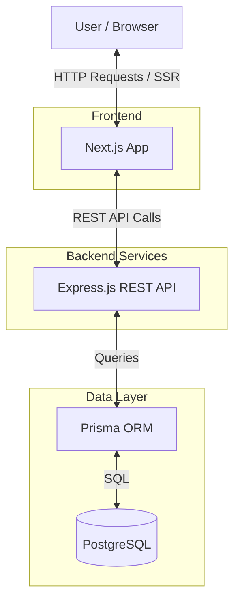
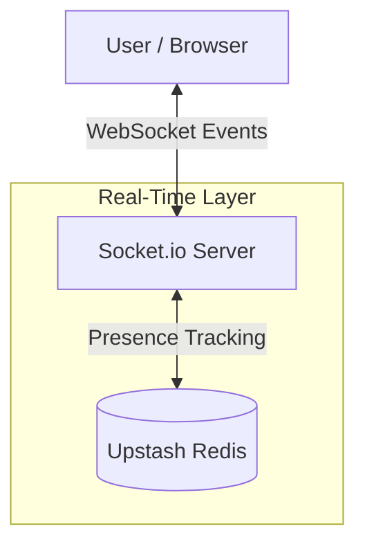
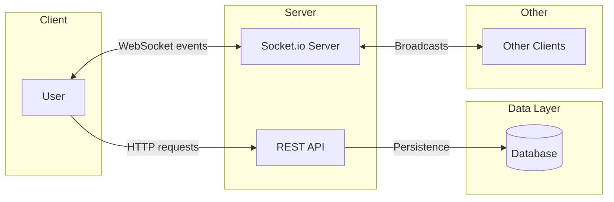

# Nexus — Real-Time Messaging Platform

## Project Overview

Nexus is a real-time messaging and collaboration platform (Slack/Discord-like).

| Phase | Status |
|---|---|
| **Phase 1 — Core Messaging** | ✅ **Complete** — Auth, DMs, real-time messaging, read receipts, presence, message edit/delete, invite system |
| **Phase 2 — Workspaces & Channels** | ✅ **Complete** — Workspace CRUD, public/private channels, member list, role management, socket events |
| **Phase 2 — Notifications** | 🟡 **Partial** — Client UI complete, server backend pending |
| **Phase 3 — Profiles, Settings, UI/UX** | 📋 **Planned** — User profiles, settings pages, UI/UX refinements |
| **Phase 3 — Reactions & Rich Text** | 📋 **Planned** — Emoji reactions, rich text formatting |
| **v3 — Search, Files, Scaling** | 📋 **Future** — Full-text search, file uploads, infrastructure scaling |

**Branch:** `feat/workspaces` — ready for merge to staging.

## Tech Stack

| Technology | Purpose |
| :--- | :--- |
| **Frontend** | |
| Next.js | Provides the core React framework with Server-Side Rendering (SSR) for optimal performance and routing. |
| TypeScript | Ensures robust type safety across the application, enhancing maintainability and reducing runtime errors. |
| Tailwind CSS | Enables rapid UI development through a utility-first styling approach for consistent, responsive designs. |
| TanStack Query | Manages asynchronous state, data fetching, caching, and background updates seamlessly. |
| Zustand | Handles global client-side UI state that doesn't require server persistence in a lightweight manner. |
| **Backend** | |
| Express.js | Serves as the robust, minimalist API framework for handling core HTTP requests and middleware logic. |
| TypeScript | Maintains type consistency between the frontend and backend to streamline full-stack development. |
| Socket.io | Powers the real-time communication layer, enabling instant bi-directional messaging and events. |
| **Database & Auth** | |
| Supabase PostgreSQL | Acts as the primary relational database, supporting complex queries and structured data models. |
| Supabase Auth | Provides a secure, ready-to-use authentication system integrated directly with the database. Session lifecycle, token storage, and refresh handling are delegated entirely to Supabase Auth. Server-side token verification uses ES256 JWKS local crypto for zero network overhead. |
| Prisma ORM | Simplifies database interactions and schema migrations through a type-safe, intuitive client. |
| **Infrastructure** | |
| Upstash Redis | Manages user presence tracking for real-time online/offline status. |
| Render | Hosts the Express.js backend server (manual web service). |
| Vercel | Hosts the Next.js client application (git integration). |


## High-Level Architecture

Nexus employs a decoupled architecture separating the client application from the core API and real-time services.

### Request Flow



### Real-Time & Presence



## API Overview

Nexus follows a hybrid architecture, utilizing REST APIs for persistence and resource management, and Socket.io for real-time event delivery.

| Endpoint Group | Purpose | Phase |
| :--- | :--- | :--- |
| /auth | Authentication | Phase 1 |
| /conversations | DMs (Phase 1), Channels (Phase 2+) | Phase 1 |
| /messages | Message CRUD | Phase 1 |
| /workspaces | Workspace management | Phase 2 |
| /members | Membership management | Phase 2 |
| /reactions | Emoji reactions | Phase 3 (planned) |
| /notifications | Notification preferences | 🟡 Client UI done, server pending |
| /workspaces/:id/members | Member management | Phase 2 ✅ |
| /workspaces/:id/channels/:channelId | Channel rename/delete | Phase 2 ✅ |
| /workspaces/:id/members/:userId/role | Role management | Phase 2 ✅ |

### REST vs Socket.io Responsibilities

**REST:**
* Create resources
* Read history
* Update resources
* Delete resources

**Socket.io:**
* New message events
* Presence updates
* Reaction updates
* Read receipts

### Rate Limiting

Rate limiting is a **hard requirement**, not optional. All limits are keyed per authenticated user ID, not per IP.

| Scope | Rule |
| :--- | :--- |
| REST — General | 100 requests / minute per user |
| REST — `POST /conversations/:id/messages` | 20 requests / 10 seconds per user |
| Socket.io — Message events | 20 events / 10 seconds per socket connection |

* The stricter message-send limit applies both at the REST layer and the Socket.io layer independently.
* Requests exceeding the limit must receive a `429 Too Many Requests` response (REST) or an error event (Socket.io).

### Message Pagination

All message list endpoints use **cursor-based pagination**. Offset-based pagination (`page=1`, `page=2`) is explicitly forbidden — new messages arriving mid-scroll shift offsets and produce duplicates.

**Endpoint:** `GET /conversations/:id/messages?cursor=<messageId>&limit=50&direction=before`

* `cursor` — a `messageId` (UUIDv7). Returns messages older than this ID when `direction=before`.
* `limit` — maximum number of messages to return (default 50).
* `direction` — currently `before` only; reserved for future bidirectional scroll support.

**Response shape:**
```json
{ "messages": [...], "nextCursor": "<messageId | null>", "hasMore": true }
```

* The server fetches `limit + 1` rows to determine `hasMore`, then trims the extra row before responding.
* This must be implemented from day one, not added later.



### Socket.io Event Design

Nexus uses **15+ socket events** across three room patterns: conversation rooms (`conversation:{id}`), user rooms (`user:{userId}`), and workspace rooms (`workspace:{workspaceId}`).

**Client → Server:**
* `message:send` — Send a message via WebSocket (primary path)
* `workspace:join` — Join workspace room on navigation

**Server → Client:**
* `message:new` — New message broadcast to conversation room
* `message:update` — Edited message broadcast to conversation room
* `message:delete` — Soft-deleted message broadcast to room
* `message:read` — Read receipt broadcast to conversation room
* `user:online` — User came online (first socket opened)
* `user:offline` — User went offline (all sockets closed)
* `presence:initial` — Snapshot of all online users, sent on connect
* `conversation:new` — New conversation created (DM or invite accepted)
* `conversation:update` — Conversation metadata changed (latestMessage, updatedAt)
* `channel:update` — Channel created/renamed/deleted (Phase 2)
* `member:update` — Workspace role changed (Phase 2)
* `workspace:update` — Workspace metadata changed (Phase 2)
* `notification:new` — New notification (client handles, server not yet emitting)

For complete documentation including sequence diagrams, see `.docs/socket.md`.

### Socket Room Strategy

Three room patterns:

| Room Pattern | Format | Purpose |
|---|---|---|
| **Conversation Room** | `conversation:{id}` | Broadcasting messages, read receipts, metadata updates |
| **User Room** | `user:{userId}` | Targeted notifications (new conversations, notifications) |
| **Workspace Room** | `workspace:{workspaceId}` | Broadcasting channel/member/workspace updates (Phase 2) |

**Room joining on connect:** The server auto-joins sockets to:
- All conversations the user is a member of (from `ConversationMember`)
- The user's personal room (`user:{userId}`)
- All workspaces the user belongs to (from `WorkspaceMember`) — **fixed: private channels filtered by access**

**Layer 2 authorization:** `verifyChannelAccess(userId, channelId)` checks:
- DM → `ConversationMember` required
- Public Channel → `WorkspaceMember` required
- Private Channel → `ConversationMember` required

**Example Flow:**
1. User A connects → server queries memberships, joins conversation + workspace rooms
2. User A sends `message:send` via WebSocket
3. Server persists message via Prisma `$transaction` (atomic message + conversation update)
4. Server emits `message:new` + `conversation:update` to conversation room
5. Receiving clients update TanStack Query cache in-place (no refetch)

## Core Features

### ✅ Phase 1: Core Foundation — Complete

*   **Authentication**: ✅ Secure user registration and login utilizing Supabase Auth, supporting email/password and OAuth providers. Session management via Next.js Edge middleware. API routes verify JWTs locally using cached ES256 JWKS public keys (zero network overhead).

*   **Direct Messages**: ✅ Private one-to-one conversations. `dmPair` deduplication strategy prevents duplicate DMs. DB trigger enforces 2-member limit.

*   **Real-time Messaging**: ✅ Instant delivery via Socket.io. Dual path: primary WebSocket (`message:send`) + REST fallback (`POST /messages`). 15+ events across conversation, user, and workspace rooms.

*   **Message History**: ✅ Paginated via cursor-based UUIDv7 ordering. `id: "desc"` for monotonic-safe pagination. Soft-delete filtering.

*   **Message Editing & Deletion**: ✅ `PATCH` / `DELETE` endpoints with socket broadcasts (`message:update`, `message:delete`). Race condition in `deleteMessage` fixed (transactional `nextLatestMessageId`). ⚠️ `editMessage` still has non-transactional reads.

*   **Read Receipts**: ✅ Tracked using `ConversationMember.lastReadMessageId`. Broadcasts `message:read` via socket. ⚠️ Read receipts for channels not yet showing (partner undefined for non-DM conversations).

*   **Presence System**: ✅ Redis-backed dual-write presence store with in-memory fallback. Multi-tab support via socket ID sets. `PresenceIndicator` component.

*   **Invite System**: ✅ Secure deep-linked invites for USER, CONVERSATION, WORKSPACE types. 24h active link rotation, atomic consumption via raw SQL, polymorphic domain resolvers.

### ✅ Phase 2: Workspaces & Channels — Complete

*   **Workspaces**: ✅ Full CRUD with auto-generated slugs and auto-created `#general` channel.
*   **Workspace Roles**: ✅ Role-based access control (OWNER, ADMIN, MEMBER). Promote/demote endpoints. `#general` is protected (cannot be deleted/renamed).
*   **Public Channels**: ✅ Open communication spaces accessible to all workspace members. Auto-join on creation.
*   **Private Channels**: ✅ Restricted to selected members. Socket room filtering prevents unauthorized access (security fix applied).
*   **Channel Management**: ✅ Rename, delete with context menu. Delete requires OWNER/ADMIN role.
*   **Member List Panel**: ✅ Discord-style right panel with presence indicators and role badges.
*   **Socket Events**: ✅ `channel:update`, `member:update`, `workspace:update` with targeted cache updates.
*   **Backward Compatibility**: ✅ Additive migration with idempotent SQL. `ConversationMember` PK kept as `@id` + `@@unique` to avoid destructive migration.

### 🟡 Phase 2: In-App Notifications — Partial

*   **Client UI**: ✅ BellPopover with unread badge, notifications page, settings page, socket handler
*   **Database**: ✅ `Notification` + `PushSubscription` tables exist (from migration)
*   **Server Backend**: ❌ No notification module, no API endpoints, no server-side event emission

### 📋 Phase 3: Next Up

*   **Notifications (Server)**: Build notification module — controller, service, repository, routes. Wire invite/channel creation to create notification records. Emit `notification:new` via socket.
*   **User Profiles**: Profile pages, avatar upload, status/message settings, display name editing.
*   **Settings**: User preferences, notification toggles (server-side), theme persistence, account management.
*   **UI/UX Improvements**: Responsive design polish, loading skeletons, empty states, transitions/animations, better mobile experience, message read receipt fix for channels.

### 🚀 Future (v3)

*   **Message Reactions**: Emoji reaction system with real-time updates
*   **Rich Text Formatting**: Bold, italic, code blocks, lists via markdown rendering
*   **Full-Text Search**: PostgreSQL-based search across messages, channels, users
*   **File Uploads**: Drag-and-drop, image preview, file type icons
*   **Typing Indicators**: `typing:start` / `typing:stop` events (constants defined, not implemented)
*   **Channel Categories**: Grouping channels into categories (like Discord)
*   **Infrastructure Scaling**: Redis Pub/Sub adapter for Socket.io horizontal scaling, BullMQ for background jobs
*   **WebRTC**: Voice/video calls and screen sharing

## Core Database Schema

The database is designed around a normalized relational model to ensure data integrity and support complex querying.

```mermaid
erDiagram
    USER ||--o{ WORKSPACE_MEMBER : has
    USER ||--o{ CONVERSATION_MEMBER : has
    USER ||--o{ MESSAGE : sends
    USER ||--o{ REACTION : creates
    USER ||--o{ NOTIFICATION : receives
    USER ||--o{ PUSH_SUBSCRIPTION : has
    USER ||--o{ WORKSPACE : owns
    
    WORKSPACE ||--o{ WORKSPACE_MEMBER : contains
    WORKSPACE ||--o{ CONVERSATION : contains
    
    CONVERSATION ||--o{ CONVERSATION_MEMBER : includes
    CONVERSATION ||--o{ MESSAGE : contains
    
    MESSAGE ||--o{ REACTION : receives
    MESSAGE ||--o{ CONVERSATION_MEMBER : "lastReadMessageId"
    
    USER {
        string id PK "UUIDv7"
        string email
        string username
        string avatar_url
        datetime created_at
    }
    
    WORKSPACE {
        string id PK "UUIDv7"
        string name
        string slug UNIQUE
        string owner_id FK
        datetime created_at
    }
    
    WORKSPACE_MEMBER {
        string workspace_id PK "composite"
        string user_id PK "composite"
        enum role "OWNER, ADMIN, MEMBER"
        datetime joined_at
    }
    
    CONVERSATION {
        string id PK "UUIDv7"
        string workspace_id FK "nullable for DMs"
        string name "nullable for DMs"
        enum type "CHANNEL, DM"
        enum visibility "PUBLIC, PRIVATE"
        string created_by FK "nullable"
        string dm_pair "nullable, DM only, unique"
        string latest_message_id FK "nullable"
        datetime created_at
        datetime updated_at
    }
    
    CONVERSATION_MEMBER {
        string id PK
        string conversation_id FK
        string user_id FK
        string lastReadMessageId FK "nullable"
        datetime joined_at
    }
    
    MESSAGE {
        string id PK "UUIDv7"
        string content
        string conversation_id FK
        string user_id FK
        boolean is_edited
        datetime deleted_at "nullable, soft-delete"
        datetime created_at "display only"
        datetime updated_at
    }
    
    NOTIFICATION {
        string id PK
        string user_id FK
        enum type "INVITE_RECEIVED, INVITE_ACCEPTED, MEMBER_JOINED, CHANNEL_CREATED"
        string title
        string body "nullable"
        string link "nullable"
        string image_url "nullable"
        boolean read
        json metadata "nullable"
        datetime created_at
    }
    
    PUSH_SUBSCRIPTION {
        string id PK
        string user_id FK
        string endpoint UNIQUE
        string p256dh
        string auth
        string user_agent "nullable"
        datetime created_at
    }
    
    REACTION {
        string id PK
        string emoji
        string message_id FK
        string user_id FK
    }
```

### Entity Details

#### Phase 1 Core Entities

The following entities are the Phase 1 implementation focus:
*   **User**: Represents an authenticated individual using the platform. Key fields include `id`, `email`, and `name`.
*   **Conversation**: The central entity for any communication stream. In Phase 1, this strictly handles Direct Messages (`type = DM`). **Constraint:** DM conversations must have exactly 2 members.
    *   **`dm_pair`** (nullable String): Only populated when `type = 'DM'`. Value is the two member user IDs sorted alphabetically and joined with a colon (e.g., `"uuid-a:uuid-b"`). A unique index on this field enforces the one-DM-per-pair constraint at the database level.


*   **ConversationMember**: A junction table defining which users are participants in a specific conversation. It tracks read receipts via `lastReadMessageId` (nullable FK to `Message.id`).
    *   *Indexes (both required):*
        *   `@@unique([conversationId, userId])` — prevents duplicate memberships and serves as the index for "get members of a conversation".
        *   `@@index([userId, conversationId])` — required for "get all conversations for a user" (sidebar/inbox query). **This index was missing from the original spec.**
*   **Message**: A single piece of communication sent by a user within a conversation. `Message.id` uses **UUIDv7** (generated in the application layer using the `uuidv7` npm package), which is both globally unique and monotonically sortable. Messages are ordered by `id` ascending. `created_at` is retained for display purposes only (e.g., "sent 2 mins ago") and must never be used for ordering or cursor comparison.
    *   *Index:* `@@index([conversationId, id])`

#### Phase 2+ Entities

| Entity | Status | Description |
|---|---|---|
| **Workspace** | ✅ **Implemented** | Logical container for a team. Contains members and channels. Full CRUD with slug, ownerId. |
| **WorkspaceMember** | ✅ **Implemented** | Junction table for workspace membership with role (OWNER, ADMIN, MEMBER). `@@id([workspaceId, userId])` composite PK. |
| **Notification** | 🟡 **Schema done, server pending** | Activity feed items for invites, joins, channel events. Created in workspace migration. |
| **PushSubscription** | 🟡 **Schema done, implementation pending** | For push notifications (Phase 3). Table exists, no API. |
| **Reaction** | 📋 **Planned** | Junction table for emoji reactions. Schema designed, not migrated. |

## Frontend Architecture

### State Management

There is a strict boundary between TanStack Query and Zustand. Mixing these responsibilities is not permitted.

| Library | Owns |
| :--- | :--- |
| **TanStack Query** | Anything that originates from the server: messages, conversations, user profiles, read receipts, presence snapshots |
| **Zustand** | Purely local UI state with no server equivalent |

**What lives in Zustand:**
* `activeConversationId` — the currently open conversation.
* Per-conversation draft text — stored as a `Map<conversationId, string>` so drafts survive conversation switching.
* `socketStatus: 'connecting' | 'connected' | 'disconnected'` — current socket connection state.
* Emoji picker open state and target `messageId`.

### TanStack Query + Socket.io Integration

Socket.io events mutate the TanStack Query cache **directly**. They must not trigger refetches.

* Incoming `message:new` events are **injected** into the paginated message cache for the relevant conversation via `queryClient.setQueryData`.
* Incoming `message:read` events **update** the receipt cache for the relevant conversation via `queryClient.setQueryData`.
* Query keys must be defined centrally (e.g., `messageKeys`, `conversationKeys`) and shared across all hooks. Ad-hoc inline key strings are not allowed.

### Optimistic Updates

Messages must feel instant. The following lifecycle applies to every send:

**Message status field:** `'pending' | 'sent' | 'delivered' | 'read' | 'failed'`

1. **On send (`onMutate`):** A temporary message is added to the TanStack Query cache immediately with a `localId` (UUIDv7, generated client-side) and `status: 'pending'`. The UI renders it at once.
2. **On server ack (`onSuccess`):** The temporary entry is replaced with the real server message (real `id`, `status: 'sent'`). The pending message is removed.
3. **On failure (`onError`):** `status` is set to `'failed'`. A retry option is displayed to the user. The previous cache snapshot (captured in `onMutate`) is restored for all other state.

TanStack Query's `onMutate` / `onSuccess` / `onError` mutation lifecycle handles this entirely.

## Architectural Decisions

### Unified Conversation Model

Nexus prioritizes **Direct Messages as the first implementation (Phase 1)** to establish a robust, real-time messaging foundation. 

We use a single `Conversation` entity instead of separate `Channel` and `DirectMessage` tables. This unified model is crucial because it allows us to build and perfect the core messaging mechanics (sending, real-time delivery, read receipts, persistence) on a simple 1-on-1 level first. 

**Channels are simply another Conversation type built later.** When we expand to Workspaces in Phase 2, a "Channel" is just a Conversation with `type = CHANNEL` and a linked `workspaceId`. By using this unified model, all the complex messaging logic built for Phase 1 instantly applies to channels without rewriting any core infrastructure. This approach significantly reduces schema complexity and allows the application to share messaging logic across all chat types.

#### Why Direct Messages First?

* Direct Messages are the simplest form of conversation.
* They allow messaging, persistence, presence, socket architecture, and read receipts to be validated with minimal complexity.
* Once these systems are proven, Channels become a natural extension because they reuse the same Conversation abstraction.
* This reduces implementation risk and allows incremental delivery of features.

### Junction Tables

We explicitly model many-to-many relationships using junction tables:
*   `WorkspaceMember` connects users to workspaces while holding role data.
*   `ConversationMember` connects users to conversations while holding read receipts.
*   `Reaction` connects users to messages with specific emojis.

This ensures strict data normalization, prevents redundant data, and allows us to store contextual metadata alongside the relationship itself.

### Prisma ORM

Prisma was selected for its robust type safety and excellent TypeScript support. It provides an intuitive schema definition language that makes migration management straightforward. The auto-generated Prisma Client significantly boosts developer productivity by catching query errors at compile time rather than runtime.

### Supabase Auth

Supabase Auth provides tight integration with our PostgreSQL database, offering built-in authentication flows that drastically reduce operational complexity. It supports email/password, OAuth providers, and MFA out of the box, ensuring secure session management without reinventing the wheel.

**Authentication Session Ownership:**
* Authentication sessions are managed by Supabase Auth.
* Session lifecycle, token storage, refresh handling, and security are delegated to Supabase Auth.
* Application-specific data remains managed through Prisma and PostgreSQL.
* Authentication session tables are intentionally omitted from the application ER diagram because they are owned and managed by Supabase.


### Socket.io

Socket.io was chosen over long polling or native WebSockets because it provides robust bi-directional communication with low latency. It supports real-time events, automatic reconnections, and multiplexing (namespaces/rooms), which results in a significantly better user experience when delivering instant messages and presence updates.


### Redis

Redis is utilized exclusively for our real-time presence system, enabling fast presence tracking to show who is online or offline.

#### Redis Presence Model

The presence model uses a **Redis Set of socket IDs** per user, replacing the previous counter approach.

```text
Key:   user:presence:{userId}   (Redis Set)
Value: { socketId1, socketId2, ... }
TTL:   24 hours (reset on every SADD)
```

**Lifecycle:**
* **On connect:** `SADD user:presence:{userId} {socketId}` + reset TTL. Broadcast `user:online` if the Set size transitions from 0 to 1.
* **On disconnect:** `SREM user:presence:{userId} {socketId}`. If the Set is now empty, broadcast `user:offline`.
* **On server startup:** Flush all `user:presence:*` keys before accepting connections. Clients reconnect automatically and re-establish their presence entries.


## Development Roadmap

### ✅ Phase 1: Core Messaging — Complete

All Phase 1 features are implemented, tested, and deployed:

| Feature | Status | Details |
|---|---|---|
| Authentication | ✅ | Email/password + GitHub OAuth. Supabase Auth with local ES256 JWKS verification. |
| Direct Messages | ✅ | `dmPair` deduplication, DB trigger enforces 2-member limit. |
| Real-time Messaging | ✅ | Socket.io with 15+ events, auth + rate limiting middleware. |
| Message History | ✅ | Cursor-based pagination via UUIDv7 ordering. |
| Message Edit/Delete | ✅ | REST endpoints + socket broadcasts. Race condition fixed. |
| Read Receipts | ✅ | `lastReadMessageId` tracking + socket broadcast. |
| Presence System | ✅ | Redis dual-write with in-memory fallback. Multi-tab support. |
| Invite System | ✅ | Deep-linked invites, atomic consumption, 24h rotation. |
| Rate Limiting | ✅ | REST + Socket.io rate limiters with configurable env vars. |
| Environment Config | ✅ | All env vars centralized in `config/env.ts`. |

### ✅ Phase 2: Workspaces & Channels — Complete

| Feature | Status | Details |
|---|---|---|
| Workspace CRUD | ✅ | Create, list, view with auto-generated slugs. |
| Role Management | ✅ | OWNER, ADMIN, MEMBER roles. Promote/demote endpoints. |
| Public Channels | ✅ | Auto-join all members on creation. |
| Private Channels | ✅ | Restricted to selected members. Socket filtering. |
| Channel Management | ✅ | Rename, delete. Context menu. #general protection. |
| Member List Panel | ✅ | Discord-style right panel with presence + role badges. |
| Socket Events | ✅ | `channel:update`, `member:update`, `workspace:update`. |
| Backward Compatible Migration | ✅ | Idempotent SQL, non-destructive schema changes. |
| Security Fixes | ✅ | Private channel socket room filtering (2 fixes). |

### 🟡 Phase 2: In-App Notifications — Client UI Done

| Component | Status |
|---|---|
| BellPopover (bell icon + dropdown) | ✅ |
| Notifications page (`/notifications`) | ✅ |
| Notification settings page | ✅ |
| Socket handler (`notification:new`) | ✅ |
| API client + React Query hooks | ✅ |
| Notification + PushSubscription tables | ✅ (DB) |
| Server-side notification module | ❌ |
| Server-side `notification:new` emission | ❌ |

### 📋 Phase 3: Next Up

#### 1. Notifications (Server)
- Build `server/src/modules/notifications/` with controller, service, repository, routes
- Wire invite creation → `INVITE_RECEIVED` notification
- Wire channel creation → `CHANNEL_CREATED` / `MEMBER_JOINED` notification
- Wire invite acceptance → `INVITE_ACCEPTED` notification
- Emit `notification:new` via socket to `user:{userId}` rooms

#### 2. User Profiles
- Profile page (`/users/:id`) showing avatar, username, status, workspace memberships
- Avatar upload (file upload infrastructure)
- Status/message settings (online, away, busy, invisible)
- Display name editing

#### 3. Settings
- User preferences page (`/settings/profile`)
- Notification toggles (server-side, currently client-only)
- Account management (email, password change)
- Theme persistence (dark/light/system)

#### 4. UI/UX Improvements
- **Read receipts for channels** — Show "read by N" indicator for channel messages
- **Loading skeletons** — Replace basic spinners with skeleton screens
- **Empty states** — Better empty states with illustrations and CTAs
- **Transitions & animations** — Page transitions, message enter/exit animations
- **Mobile responsiveness** — Better touch targets, bottom sheets, swipe gestures
- **Command palette** — Cmd+K search across workspaces, channels, users

### 🚀 Future (v3+)

| Feature | Description | Priority |
|---|---|---|
| Message Reactions | Emoji reaction system with real-time updates | Medium |
| Rich Text Formatting | Markdown rendering for messages | Medium |
| Typing Indicators | `typing:start` / `typing:stop` (constants defined) | Low |
| Channel Categories | Discord-style channel grouping | Low |
| Full-Text Search | PostgreSQL-based search across messages | Low |
| File Uploads | Drag-and-drop, image preview | Low |
| Redis Pub/Sub | Socket.io horizontal scaling | Low |
| BullMQ | Background job processing | Low |
| WebRTC | Voice/video calls | Very Low |
